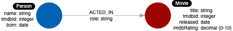
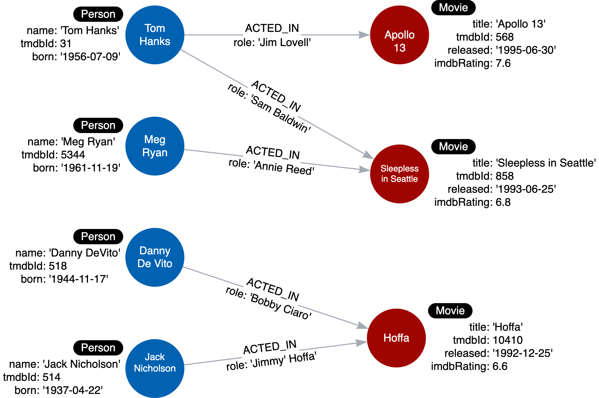

= Purpose of the Model
:type: video
:order: 3

[.video]
video::0rutKWQloZg[youtube,width=560,height=315]

[.transcript]
== Types of models

When performing the graph data modeling process for an application, you will need at least two types of models:

* Data model
* Instance model

=== Data model

The data model describes the labels, relationships, and properties for the graph.
It does not have specific data that will be created in the graph.

Here is an example of a data model:

There is nothing that uniquely identifies a node with a given label.
A graph data model, however is important because it defines the names that will be used for labels, relationship types, and properties when the graph is created and used by the application.

=== Style guidelines for modeling

As you begin the graph data modeling process, it is important that you agree upon how labels, relationship types, and property keys are named.
Labels, relationship types, and property keys are case-sensitive, unlike Cypher keywords which are case-insensitive.

A Neo4j best practice is to use the following when you name the elements of the graph, but you are free to use any convention for your application.

* A label is a single identifier that begins with a capital letter and can be https://en.wikipedia.org/wiki/Camel_case[CamelCase^].
** Examples: Person, Company, GitHubRepo
* A relationship type is a single identifier that is in all capital letters with the underscore character.
** Examples: FOLLOWS, MARRIED_TO
* A property key for a node or a relationship is a single identifier that begins with a lower-case letter and can be https://en.wikipedia.org/wiki/Camel_case[camelCase^].
** Examples: deptId, firstName

*Note*: Property key names need not be unique. For example, a _Person_ node and a _Movie_ node, each can have the property key of _tmdbId_.

=== Instance model

An important part of the graph data modeling process is to test the model against the use cases.
To do this, you need to have a set of sample data that you can use to see if the use cases can be answered with the model.

Here is an example of an instance model:

In this instance model, we have created some instances of Person and Movie nodes, as well as their relationships.
Having this type of instance model will help us to test our use cases.

[.quiz]
== Check your understanding

include::questions/1-purpose.adoc[leveloffset=+2]

[.summary]
== Summary

In this lesson, you learned the difference between a graph data model and an instance model and why each are important as you develop the graph that will be used for the application.
In the next module, you will learn about modeling entities in your domain as nodes.