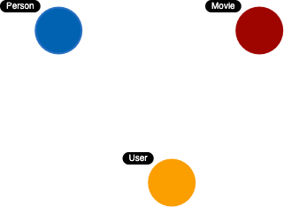
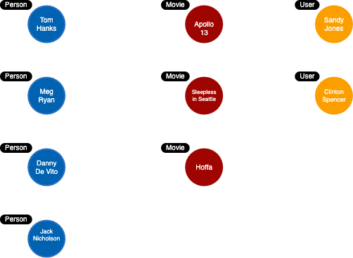

= Purpose of the Model
:type: quiz
:order: 4

[.video]
video::xxxx[youtube,width=560,height=315]

[.transcript]
== Types of models

When performing the modeling process for an application, you will need at least two types of models:

* Data model
* Instance model

As you will learn, graph data modeling is an iterative process.

=== Data model

The data model describes the node labels, relationships, and properties for the graph.
It does not have specific data that will be created in the graph.

Here is an example of a data model:

There is nothing that uniquely identifies a node with a given label. A graph data model, however is important because it defines the names that will be used when the graph is created and used by the application.

==== Instance model

An important part of the graph data modeling process is to test the model against the questions for the use cases.
To do this, you need to have a set of sample data that you can use to see if the questions can be answered with the model.

Here is our first example of the instance model for the data model thus far:

In this instance model, we have identified some instances of Person, User, and Movie nodes.
Having this type of instance model will help use to test our questions for our use cases.

Thus far, we only have identified nodes. In the next module, you will learn how to identify relationships.

== Check your understanding

include::questions/1-purpose.adoc[]

[.summary]
== Summary

In this lesson, you learned the difference between a graph data model and an instance model and why each are important as you develop the graph that will be used for the application.
In the next module, you will learn about modeling relationships.