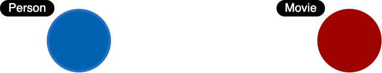
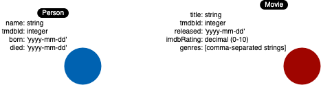
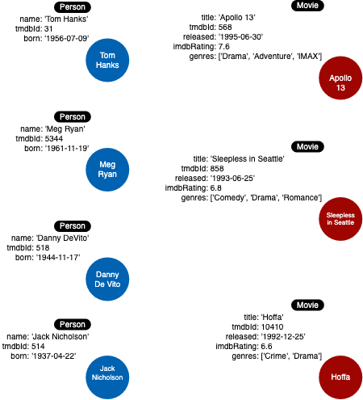

= Modeling Nodes
:type: video
:order: 1
:updated-at: 2022-04-25 T 15:08:45 Z

[.video]
video::KULZmqpuDqo[youtube,width=560,height=315]

[.transcript]

== Defining labels

Entities are the dominant nouns in your application use cases:

. What *ingredients* are used in a *recipe*?
. Who is married to this *person*?

The entities of your use cases will be the labeled nodes in the graph data model.

In the Movie domain, we use the *nouns* in our use cases to define the labels, for example:

. What *people* acted in a *movie*?
. What *person* directed a *movie*?
. What *movies* did a *person* act in?

Here are some of the labeled nodes that we will start with.

Notice here that we use CamelCase for the names for labels.

=== Node properties

Node properties are used to:

* Uniquely identify a node.
* Answer specific details of the use cases for the application.
* Return data.

For example, in a Cypher statement, properties are used to:

* Anchor (where to begin the query).
** `MATCH (p:Person {name: 'Tom Hanks'})-[:ACTED_IN]-(m:Movie) RETURN m`
* Traverse the graph (navigation).
** `MATCH (p:Person)-[:ACTED_IN]-(m:Movie {title: 'Apollo 13'})-[:RATED]-(u:User)  RETURN p,u`
* Return data from the query.
** `MATCH (p:Person {name: 'Tom Hanks'})-[:ACTED_IN]-(m:Movie) RETURN m.title, m.released`

=== Unique identifiers in the Movie graph

In the _Movie_ graph, we use the following properties to uniquely identify our nodes:

* Person.tmdbId
* Movie.tmdbId

=== Properties for nodes

In addition to the _tmdbId_ that is used to uniquely identify a node, we must revisit the use cases to determine the types of data a node must hold.

Here is a list of our use cases specific to _Person_ and _Movie_ nodes that we will focus on.
These use cases inform us about the data we need in _Movie_ and _Person_ nodes.

[cols="a,a", options="header"]
|====
|*Use case*
|*Steps required*
|1: What people acted in a movie?
|a. Retrieve a movie by its *title*. +
b. Return the *names* of the actors.
|2: What person directed a movie?
|a. Retrieve a movie by its *title*. +
b. Return the *name* of the director.
| 3: What movies did a person act in?
|a. Retrieve a person by their *name*. +
b. Return the *titles* of the movies.
|5: Who was the youngest person to act in a movie?
|a. Retrieve a movie by its *title*. +
b. Evaluate the *ages* of the actors. +
c. Return the *name* of the actor.
| 7:  What is the highest rated movie in a particular year according to imDB?
|a. Retrieve all movies *released* in a particular year. +
b. Evaluate the *imDB ratings*. +
c. Return the movie *title*.
| 8: What drama movies did an actor act in?
|a. Retrieve the actor by *name*. +
b. Evaluate the *genres* for the movies the actor acted in. +
c. Return the movie *titles*.
|====

Given the details of the steps of these use cases, here are the properties we will define for the _Movie_ nodes:

* Movie.title (string)
* Movie.released (date)
* Movie.imdbRating (decimal between 0-10)
* Movie.genres (list of strings)

Here are the properties we will define for the _Person_ nodes:

* Person.name (string)
* Person.born (date)
* Person.died (date)

Note: The _died_ property will be optional.

Here is the initial data model:

And here is the initial instance model you will be creating:

[.quiz]
== Check your understanding

include::questions/1-labels.adoc[leveloffset=+2]

include::questions/2-properties.adoc[leveloffset=+2]

[.summary]
== Summary

In this lesson, you learned that a good starting point for your data modeling is to come up with a set of use cases and identify the entities from the use cases.
In the next challenge, you will create the first nodes in our initial instance model.