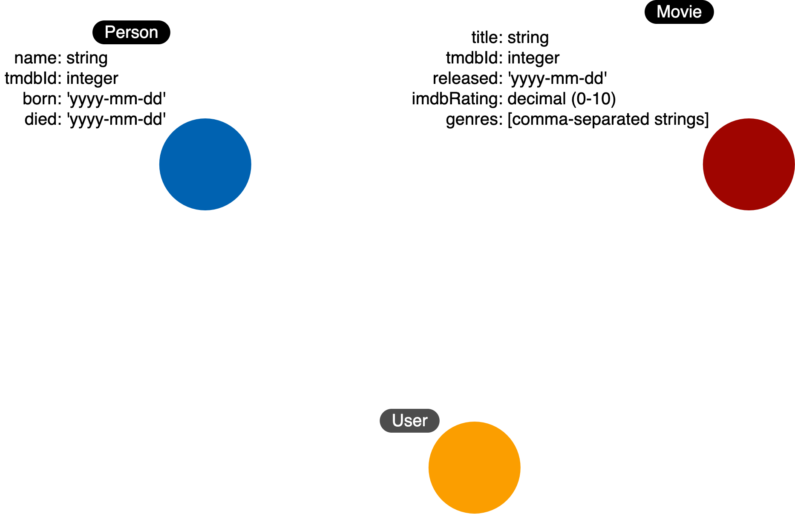

= Identifying a New Label
:order: 3
:type: challenge
:updated-at: 2022-04-25 T 21:00:00 Z

Now for a challenge.

[TIP]
--
We need to refactor the model for a new use case:

**Use case #4: How many users rated a movie?**
--

We have already identified the _Person_ and _Movie_ nodes for our use cases:

* What *people* acted in a *movie*?
* What *person* directed a *movie*?
* What *movies* did a *person* act in?

Here is our current graph data model:

image::images/before-challenge1-data-model.png[Model thus far,width=400,align=center]

We have an additional use case that we must model for.
We need to be able to differentiate rating website users from other types of people who are actors and directors.

*Note*: As you go through this course, you can use any technique you want to for drawing out the graph data model.
Most people just use pen and paper.

include::./questions/verify.adoc[leveloffset=+2]

[.summary]
== Summary

In this challenge, you demonstrated your skills in identifying an additional label for the graph data model.

The new data model is now:

In the next challenge, you will demonstrate that you can create a node with the new label and properties in the graph.
