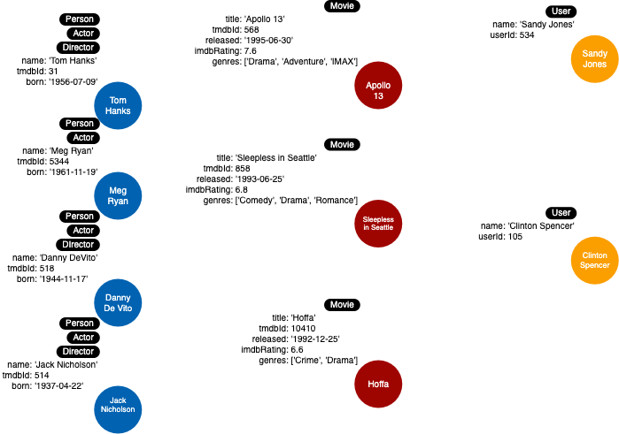

= Creating More Nodes
:type: challenge
:order: 4
:sandbox: true

We want to add a couple of _User_ nodes to the graph so we can do some testing of our model.

The properties that a _User_ node will have are:

* userId (integer)
* name (string)

Use the sandbox window to the right to:

. Create two  User nodes for:
.. [copy]#'Sandy Jones'# with the [copy]#userId# of [copy]#534#
.. [copy]#'Clinton Spencer'# with the [copy]#userId# of [copy]#105#

[TIP]
--
Use `MERGE` to create these two nodes.

--

include::./questions/verify.adoc[]

[.summary]
== Summary

In this challenge, you demonstrated that you can create some nodes to support your instance model.

Your instance model should now look like this:

In the next module, you will learn how to add relationships to your model.
