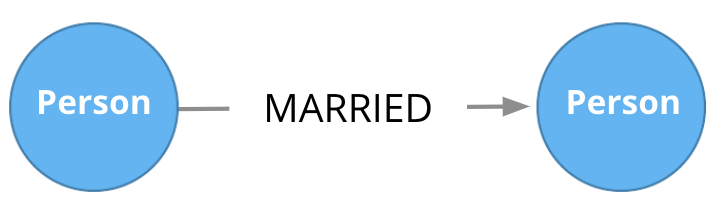
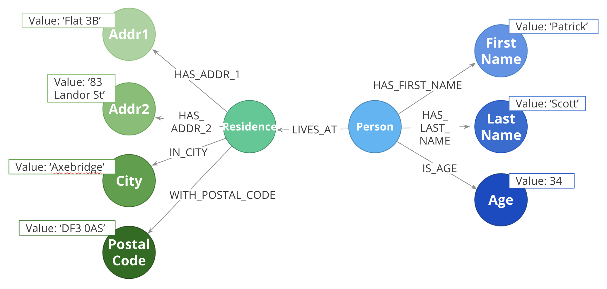
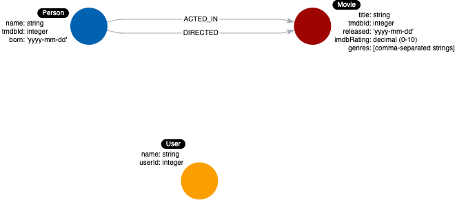
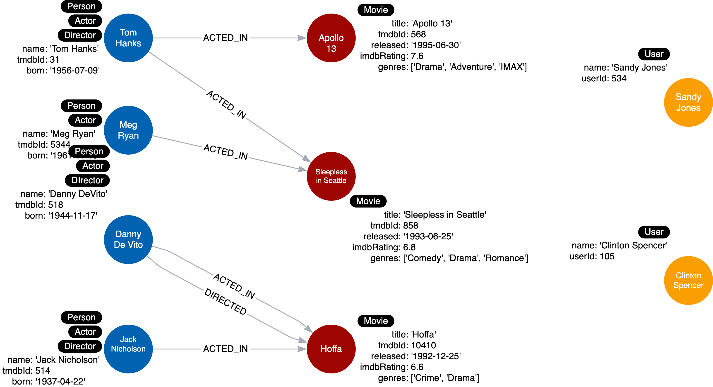
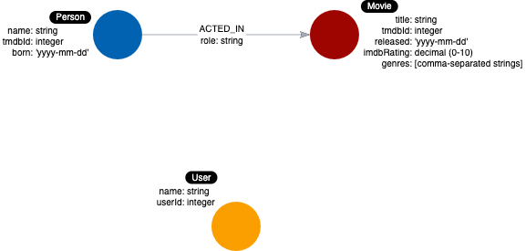

= Modeling Relationships
:type: quiz
:order: 1

[.video]
video::zJrI7QAzzGQ[youtube,width=560,height=315]

[.transcript]
== Relationships are connections between entities

Connections are the *verbs* in your use cases:

* What ingredients are *used* in a recipe?
* Who is *married* to this person?

At a glance, connections are straightforward things, but their micro- and macro-design are arguably the most critical factors in graph performance.
Using “connections are verbs” is a fine shorthand to get started, but there are other important considerations that you will learn about later in this course.

=== Naming relationships

Choosing good names (types) for the relationships in the graph is important.
Relationship types need to be something that is intuitive to stakeholders and developers alike.
Relationship types cannot be confused with an entity name.

So in our example use cases, we could define these relationship types:

* USES
* MARRIED

=== Relationship direction

When you create a relationship in Neo4j, a direction must either be specified explicitly or inferred by the left-to-right direction in the pattern specified.
At runtime, during a query, direction is typically not required.

In our example use cases shown above, the *USES* relationship must be created to go from a Recipe node to an Ingredient node.

image::images/uses.png[Uses relationship,width=400,align=center]

The *MARRIED* relationship could be created to start in either node since this type of relationship is symmetric.

=== Fanout

Here, we have entities (Person, Residence) represented not as a single node, but as a network or linked nodes.

This is an extreme example of fanout, and is almost certainly overkill for any real-life solution, but some amount of fanout can be very useful.

For example, splitting last names onto separate nodes helps answer the question, “Who has the last name Scott?”.
Similarly, having cities as separate nodes assists with the question, “Who lives in the same city as Patrick Scott?”.

The main risk about fanout is that it can lead to very dense nodes, or supernodes. These are nodes that have hundreds of thousands of incoming or outgoing relationships Supernodes need to be handled carefully.

=== Relationships in the Movie graph

Now let's look at identifying the relationships for these use cases:

. What people *acted* in a movie?
. What person *directed* a movie?
. What movies did a person *act* in?

Given these use cases, we name the relationships:

* ACTED_IN
* DIRECTED

Furthermore, both of these relationship types start at _Person_ nodes and end in _Movie_ nodes.

Here is the supporting graph data model:

And here is the instance model to support this graph data model:

Tom Hanks acted in two movies. Meg Ryan and Jack Nicholson each acted in one movie. Danny DeVito both acted in and directed the same movie.
Exploring relationships with this instance model we see that the movie Apollo 13 has a single actor in the graph, but the other two movies have two actors each.

=== Properties for relationships

Properties for a relationship are used to enrich how two nodes are related.
When you define a property for a relationship, it is because your use cases ask a specific question about how two nodes are related, not just that they are related.

For example, we saw in the _Neo4j Fundamentals_ course that properties can be added to a relationship to further describe it.

image::images/relationship-properties.jpg[Loves strength,width=400,align=center]

Here we see that we have a _date_ property on the _MARRIED_ relationship to further describe the relationship between Michael and Sarah.
Additionally, we have a _roles_ property on the _WORKS_AT_ relationship to describe the roles that Michael has or had when he worked at Graph Inc.

These properties are specific to the relationship between two nodes.

=== Relationship properties in the Movie graph

Just like you analyze the use cases for naming labels, relationship types, and node properties, you use the use cases to come up with properties for relationships.

Here is a use case:

[start=6]
. *What role did a person play in a movie?*

The runtime operations for this use case are:

. Retrieve the name of the person.
. Follow the ACTED_IN relationships to movies.
. Filter the movie by its title.
. Return the *role* from the ACTED_IN relationship between the two nodes.

We know that the _role_ for a particular _ACTED_IN_ relationship will be necessary for this use case.
So we add the _role_ property to this relationship.
Here is the data model:

And here is the instance model you will be creating:

image::images/before-challenge1-instance-model.png[Instance model,width=400,align=center]

Each _ACTED_IN_ relationship here has a different value for the _role_ property.

== Check your understanding

include::questions/1-connections.adoc[]

include::questions/2-relationships.adoc[]

[.summary]
== Summary

In this lesson, you learned how to identify the relationships (and their properties) that will be added to your graph data model based upon your use cases.
In the next challenge, you will create the initial relationships for our instance model.