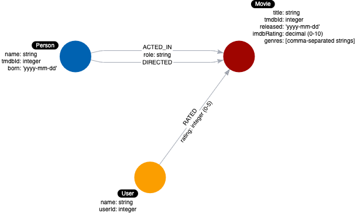

= Identifying a New Relationship
:order: 3
:type: challenge

Now for another challenge.

[TIP]
--
We need to model for a new use case:

  9: What users gave a movie a rating of 5?
--

We have already identified the _Person_ and _Movie_ nodes  and the _ACTED_IN_ and _DIRECTED_ relationships for our use cases:

. What people *acted* in a movie?
. What person *directed* a movie?
. What movies did a person *act* in?

image::images/before-challenge1-data-model.png[Model thus far,width=400,align=center]

We have an additional use case that we must model for asking a question about users who rated movies.
We have defined the _User_ label to represent users who reviewed or rated movies.

include::./questions/verify.adoc[leveloffset=+1]

[.summary]
== Summary

Here is what your data model should now look like:

In this challenge, you demonstrated your skills in identifying the connections between the entities of the domain and defining the relationships for the graph data model.
In the next challenge, you will create new relationships in the graph for our instance model.
