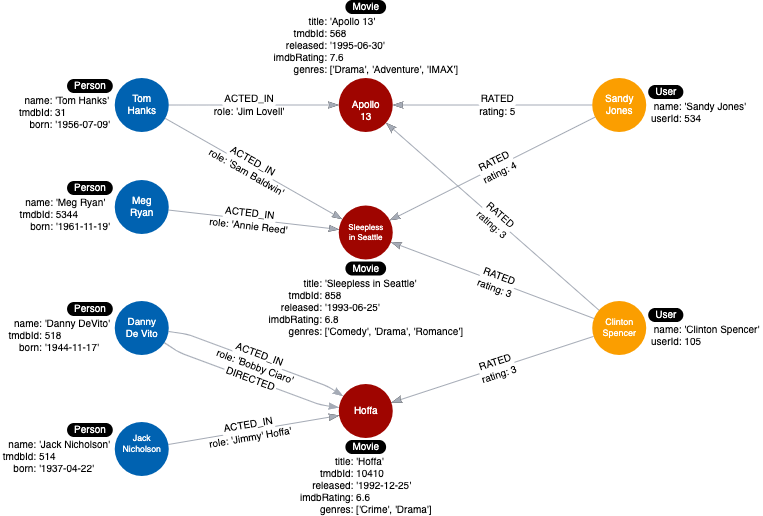

= Creating More Relationships
:type: challenge
:order: 4
:sandbox: true
:updated-at: 2022-04-25 T 21:00:00 Z

We want to add some relationships between _User_ nodes and _Movie_ nodes so we can test our model.

In this challenge, you will create _RATED_ relationships that include the _rating_ property.

This Cypher creates one relationship between Sandy Jones and Apollo 13 with a rating of 5. 

[source, cypher]
----
include::sandbox.cypher[]
----

Add additional `MERGE` clauses to create the remaining 4 relationships as per the table below:

*Note*: The first relationship is already created for you.

[cols="35,15,10,40", options="header"]
|====
|*User.name*
|*Relationship*
|*rating*
|*Movie.title*
|[copy]#'Sandy Jones'#
|[copy]#RATED#
|[copy]#5#
|[copy]#'Apollo 13'#
|[copy]#'Sandy Jones'#
|[copy]#RATED#
|[copy]#4#
|[copy]#'Sleepless in Seattle'#
|[copy]#'Clinton Spencer'#
|[copy]#RATED#
|[copy]#3#
|[copy]#'Apollo 13'#
|[copy]#'Clinton Spencer'#
|[copy]#RATED#
|[copy]#3#
|[copy]#'Sleepless in Seattle'#
|[copy]#'Clinton Spencer'#
|[copy]#RATED#
|[copy]#3#
|[copy]#'Hoffa'#
|====

[TIP]
--
Use `MATCH` to find the _User_ and _Movie_ nodes, then use `MERGE` to create the relationships between the two nodes.

Remember that you must specify or infer(left-to-right) a direction when you create a relationship.

You should create a total of 5 _RATED_ relationships in the graph, each with a property, _rating_.
--

include::./questions/verify.adoc[leveloffset=+2]

[.summary]
== Summary

In this challenge, you demonstrated that you can create some relationships to support your instance model.

Your instance model should now look like this:

In the next module, you will learn why and how to refactor your data model.
