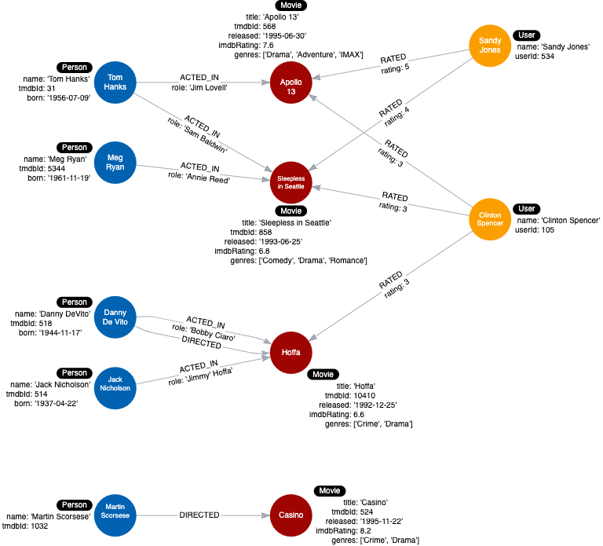

= Testing
:type: quiz
:order: 1
:usecase: blank-sandbox
:sandbox: true

[.video]
video::xxxx[youtube,width=560,height=315]

[.transcript]
== Why test?

Thus far you have see that you design the data model on paper, whiteboard, or with a tool like arrows app.
You use the use cases to design the data model that includes labels, relationship types and direction, and properties for the nodes and relationships.

You have also populated the graph to implement the data model with a small set of test data.
To ensure that the graph can satisfy every use case, you must test the use cases against the graph.

=== Testing the data model

Here is the instance model that should now be in our graph:

image::images/after-challenge2-instance-model.png[Current instance model,width=400,align=center]

Next we will test each use case against the graph by executing Cypher queries.
The query values will be specific to the data we know is in the graph, but you can imagine that a fully-populated graph would satisfy a broader range of query parameters.

==== 1. What people acted in a movie?

Run this Cypher code to test this use case using the movie, Sleepless in Seattle.

[source,cypher]
----
MATCH (p:Person)-[:ACTED_IN]-(m:Movie)
WHERE m.title = 'Sleepless in Seattle'
RETURN p.name AS Actor
----

It should return two names of actors, Tom Hanks, and Meg Ryan.

==== 2. What person directed a movie?

Run this Cypher code to test this use case using the movie, Hoffa.

[source,cypher]
----
MATCH (p:Person)-[:DIRECTED]-(m:Movie)
WHERE m.title = 'Hoffa'
RETURN  p.name AS Director
----

It should return Danny DeVito.

==== 3. What movies did a person act in?

Run this Cypher code to test this use case using the person, Tom Hanks.

[source,cypher]
----
MATCH (p:Person)-[:ACTED_IN]-(m:Movie)
WHERE p.name = 'Tom Hanks'
RETURN m.title AS Movie
----

It should return the movies Apollo 13 and Sleepless in Seattle.

==== 4. How many users rated a movie?

Run this Cypher code to test this use case using the movie, Apollo 13.

[source,cypher]
----
MATCH (u:User)-[:RATED]-(m:Movie)
WHERE m.title = 'Apollo 13'
RETURN count(*) AS `Number of reviewers`
----

It should return 2.

==== 5. Who was the youngest person to act in a movie?

Run this Cypher code to test this use case using the movie, Hoffa.

[source,cypher]
----
MATCH (p:Person)-[:ACTED_IN]-(m:Movie)
WHERE m.title = 'Hoffa'
RETURN  p.name AS Actor, p.born as `Year Born` ORDER BY p.born DESC LIMIT 1
----

It should return Danny DeVito with his birth year.

==== 6. What role did a person play in a movie?

Run this Cypher code to test this use case using the movie, Sleepless in Seattle and the person, Meg Ryan.

[source,cypher]
----
MATCH (p:Person)-[r:ACTED_IN]-(m:Movie)
WHERE m.title = 'Sleepless in Seattle' AND
p.name = 'Meg Ryan'
RETURN  r.role AS Role
----

It should return Annie Reed.

==== 7. What is the highest rated movie in a particular year according to imDB?

Run this Cypher code to test this use case using movies in the year 1995.

[source,cypher]
----
MATCH (m:Movie)
WHERE m.released STARTS WITH '1995'
RETURN  m.title as Movie, m.imdbRating as Rating ORDER BY m.imdbRating DESC LIMIT 1
----

Our test data has only one movie released in 1995, but if you were to add another movie to the graph that was released in 1995, this query would be answered correctly.
In this case, you must add more data to the graph to fully test this query.

Run the Cypher code to add another _Movie_ node  and its director to the graph:

[source,cypher]
----
MERGE (casino:Movie {title: 'Casino', tmdbId: 524, released: '1995-11-22', imdbRating: 8.2, genres: ['Drama','Crime']})
MERGE (martin:Person {name: 'Martin Scorsese', tmdbId: 1032})
MERGE (martin)-[:DIRECTED]->(casino)
----

You can rerun the query above to test the use case and receive a different result.

The new instance model for this graph is now:

==== 8. What drama movies did an actor act in?

Run this Cypher code to test this use case using the person, Tom Hanks.

[source,cypher]
----
MATCH (p:Person)-[:ACTED_IN]-(m:Movie)
WHERE p.name = 'Tom Hanks' AND
'Drama' IN m.genres
RETURN m.title AS Movie
----

If you were to change 'Drama' to 'Comedy' in this query, it would return a different result.

==== 9. What reviewers gave a movie a rating of 5?

Run this Cypher code to test this use case using the movie, Apollo 13.

[source,cypher]
----
MATCH (u:User)-[r:RATED]-(m:Movie)
WHERE m.title = 'Apollo 13' AND
r.rating = 5
RETURN u.name as Reviewer
----

It should return Sandy Jones.

=== More testing?

As you go through the use cases, you may think of more data that you want to add to the graph to round out the testing.

The Cypher code used to test the use cases needs to be carefully reviewed for correctness.
In addition, you must understand that if and when the graph is refactored (next module), the Cypher code for these use cases may need to be modified.

The basic testing to ensure that the use cases can be answered by the data model is the first step of testing.

A really important factor with testing the graph is *scalability*.
How will these queries perform if the graph has millions of nodes or relationships?
This is where you need to work with the Cypher developers to test the performance of the queries when the graph grows.

In the next module, you will learn how refactoring is necessary for a graph when performance is a factor.

== Check your understanding

include::questions/1-graph-numbers.adoc[]

[.summary]
== Summary

In this lesson, you learned that you must test your data model against the use cases.
In the next module, you will learn about modifying the data model and graph (refactoring).