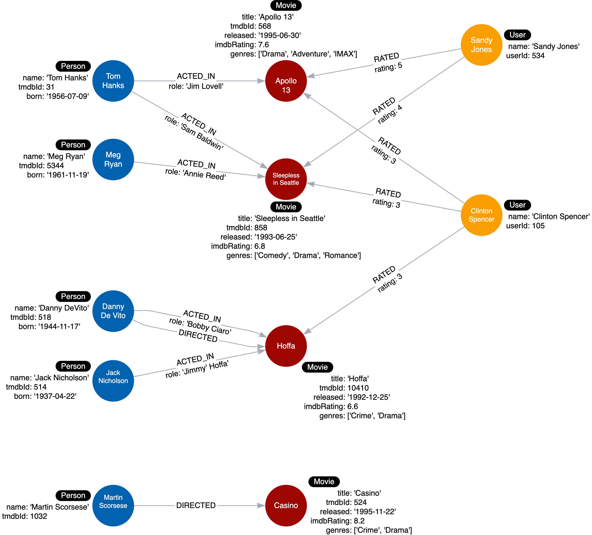

= Testing with Instance Model
:type: challenge
:order: 2
:sandbox: true
:updated-at: 2022-04-25 T 21:00:00 Z

Here is the instance model that should now be in our graph:

image::images/after-challenge2-instance-model.png[Current instance model,width=400,align=center]

In this challenge, you will test each use case against the graph by executing Cypher queries.
The query values will be specific to the data we know is in the graph, but you can imagine that a fully-populated graph would satisfy a broader range of query parameters.

Follow the instructions below to test each use case for our application.

== Use case #1: What people acted in a movie?

Run this Cypher code to test this use case using the movie, Sleepless in Seattle.

[source,cypher]
----
MATCH (p:Person)-[:ACTED_IN]-(m:Movie)
WHERE m.title = 'Sleepless in Seattle'
RETURN p.name AS Actor
----

It should return two names of actors, Tom Hanks, and Meg Ryan.

== Use case #2: What person directed a movie?

Run this Cypher code to test this use case using the movie, Hoffa.

[source,cypher]
----
MATCH (p:Person)-[:DIRECTED]-(m:Movie)
WHERE m.title = 'Hoffa'
RETURN  p.name AS Director
----

It should return Danny DeVito.

== Use case #3: What movies did a person act in?

Run this Cypher code to test this use case using the person, Tom Hanks.

[source,cypher]
----
MATCH (p:Person)-[:ACTED_IN]-(m:Movie)
WHERE p.name = 'Tom Hanks'
RETURN m.title AS Movie
----

It should return the movies Apollo 13 and Sleepless in Seattle.

== Use case #4: How many users rated a movie?

Run this Cypher code to test this use case using the movie, Apollo 13.

[source,cypher]
----
MATCH (u:User)-[:RATED]-(m:Movie)
WHERE m.title = 'Apollo 13'
RETURN count(*) AS `Number of reviewers`
----

It should return 2.

== Use case #5: Who was the youngest person to act in a movie?

Run this Cypher code to test this use case using the movie, Hoffa.

[source,cypher]
----
MATCH (p:Person)-[:ACTED_IN]-(m:Movie)
WHERE m.title = 'Hoffa'
RETURN  p.name AS Actor, p.born as `Year Born` ORDER BY p.born DESC LIMIT 1
----

It should return Danny DeVito with his birth year.

== Use case #6: What role did a person play in a movie?

Run this Cypher code to test this use case using the movie, Sleepless in Seattle and the person, Meg Ryan.

[source,cypher]
----
MATCH (p:Person)-[r:ACTED_IN]-(m:Movie)
WHERE m.title = 'Sleepless in Seattle' AND
p.name = 'Meg Ryan'
RETURN  r.role AS Role
----

It should return Annie Reed.

== Use case #7: What is the highest rated movie in a particular year according to imDB?

Run this Cypher code to test this use case using movies in the year 1995.

[source,cypher]
----
MATCH (m:Movie)
WHERE m.released STARTS WITH '1995'
RETURN  m.title as Movie, m.imdbRating as Rating ORDER BY m.imdbRating DESC LIMIT 1
----

Our test data has only one movie released in 1995, but if you were to add another movie to the graph that was released in 1995, this query would be answered correctly.
In this case, you must add more data to the graph to fully test this query.

Run the Cypher code to add another _Movie_ node  and its director to the graph:

[source,cypher]
----
MERGE (casino:Movie {title: 'Casino', tmdbId: 524, released: '1995-11-22', imdbRating: 8.2, genres: ['Drama','Crime']})
MERGE (martin:Person {name: 'Martin Scorsese', tmdbId: 1032})
MERGE (martin)-[:DIRECTED]->(casino)
----

You can rerun the query above to test the use case and receive a different result.

The new instance model for this graph is now:

== Use case #8: What drama movies did an actor act in?

Run this Cypher code to test this use case using the person, Tom Hanks.

[source,cypher]
----
MATCH (p:Person)-[:ACTED_IN]-(m:Movie)
WHERE p.name = 'Tom Hanks' AND
'Drama' IN m.genres
RETURN m.title AS Movie
----

If you were to change 'Drama' to 'Comedy' in this query, it would return a different result.

== Use case #9: What users gave a movie a rating of 5?

Run this Cypher code to test this use case using the movie, Apollo 13.

[source,cypher]
----
MATCH (u:User)-[r:RATED]-(m:Movie)
WHERE m.title = 'Apollo 13' AND
r.rating = 5
RETURN u.name as Reviewer
----

It should return Sandy Jones.

When you have tested all the use cases, continue to next module.

read::Continue[]

[.summary]
== Summary

In this challenge, you tested the use cases against your instance model, and proved that the graph can answer the questions.

In the next module, you will learn why and how to refactor your data model.
