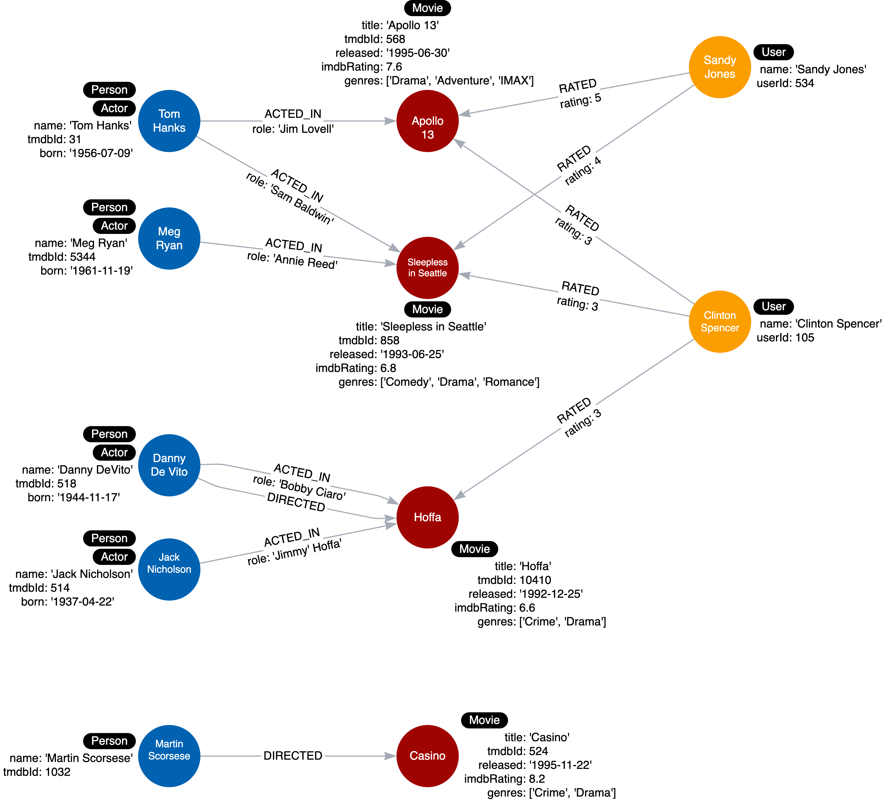

= Adding the Actor Label
:type: challenge
:order: 3
:sandbox: true
:updated-at: 2022-05-02 T 13:00:00 Z

Here is the refactored instance model we will create in the graph where we add an _Actor_ label to some of the _Person_ nodes:

== Refactor the graph

With Cypher, you can easily transform the graph to add Actor labels.

There are 5 _Person_ nodes in the graph, but only 4 have an `:ACTED_IN` relationship.

Update and execute the following Cypher code to: 

. Find all _Person_ nodes that have an `:ACTED_IN` relationship.
. Set the _Actor_ label to the appropriate nodes.

.Add Actor Labels
[source,cypher]
----
include::sandbox.cypher[]
----

== Check the results

Once you have added the `Actor` labels and refactored the graph, you can check the results by running the following query:

[source,cypher]
----
MATCH (p:Actor)
RETURN p
----

You should see 4 nodes with the _Actor_ label.

include::./questions/verify.adoc[leveloffset=+1]

[.summary]
== Summary

In this challenge, you demonstrated that you can refactor the graph to add additional labels to nodes.

In the next lesson, you will learn that you must retest your use cases after you refactor.
