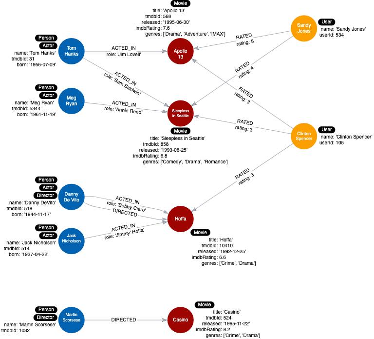

= Adding a label
:type: challenge
:order: 3
:usecase: blank-sandbox
:sandbox: true
:cypher: MATCH (p:Person) WHERE exists ((p)-[:ACTED_IN]-()) SET p:Actor
:verify:  MATCH (d:Director) WHERE d.name = 'Danny DeVito' OR d.name = 'Martin Scorsese' RETURN count (*) = 2 as outcome

In the previous lesson, you added the _Actor_ label to the nodes in the graph.

Modify the query in the sandbox query pane to label the _Person_ nodes that have the outgoing relationship of _DIRECTED_ to be labeled _Director_.

[TIP]
--
The new label will be _Director_. Your code should add 2 labels to the graph.
--

include::questions/verify.adoc[]

[.summary]
== Summary

In this challenge, you demonstrated that you can refactor the graph to add a label to some of its nodes.

Your instance model should now look like this:

In the next module, you will learn some more refactoring tips to eliminate duplicate data.
