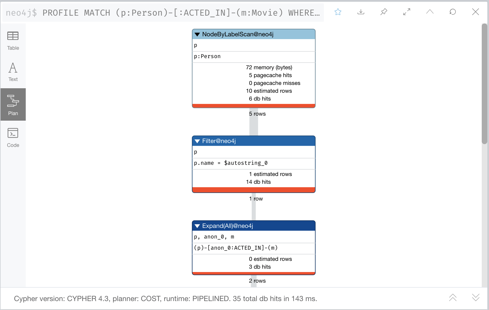

= Retesting After Refactoring
:type: video
:order: 4
:updated-at: 2022-04-25 T 21:00:00 Z

[.video]
video::QisAdQ68aDs[youtube,width=560,height=315]

[.transcript]

== Retesting after refactoring

After you have refactored the graph, you should revisit all queries for your use cases.

You should first determine if any of the queries need to be rewritten to take advantage of the refactoring.

Next, we rewrite some of our queries to take advantage of the refactoring.

During your testing on your real application and especially with a fully-scaled graph, you can also profile the new queries to see if it improves performance.
On the small instance model we are using, you will not see significant improvements, but you may see differences in the number of rows retrieved.

=== Use case #1: What people acted in a movie?

We rewrite this query to use the _Actor_ label.

Original code:

[source,cypher,role=nocopy noplay]
----
MATCH (p:Person)-[:ACTED_IN]-(m:Movie)
WHERE m.title = 'Sleepless in Seattle'
RETURN p.name AS Actor
----

New code:

[source,cypher,role=nocopy noplay]
----
MATCH (p:Actor)-[:ACTED_IN]-(m:Movie)
WHERE m.title = 'Sleepless in Seattle'
RETURN p.name AS Actor
----

=== Profiling Queries

For the query that uses the _Person_ label we see this result that first retrieves the 5 _Person_ nodes:

For the query that uses the _Actor_ label we see this result that first retrieves the 4 _Actor_ nodes, a slight improvement for this small graph:

image::images/profile-retrieve-actor.png[Example Query Plan,width=400,align=center]

=== Use case #3: What movies did a person act in?

We rewrite this query to use the _Actor_ label.

Original code:

[source,cypher,role=nocopy noplay]
----
MATCH (p:Person)-[:ACTED_IN]-(m:Movie)
WHERE p.name = 'Tom Hanks'
RETURN m.title AS Movie
----

New code:

[source,cypher,role=nocopy noplay]
----
MATCH (p:Actor)-[:ACTED_IN]-(m:Movie)
WHERE p.name = 'Tom Hanks'
RETURN m.title AS Movie
----

=== Use case #5: Who was the youngest person to act in a movie?

We rewrite this query to use the _Actor_ label.

Original code:

[source,cypher,role=nocopy noplay]
----
MATCH (p:Person)-[:ACTED_IN]-(m:Movie)
WHERE m.title = 'Hoffa'
RETURN  p.name AS Actor, p.born as `Year Born` ORDER BY p.born DESC LIMIT 1
----

New code:

[source,cypher,role=nocopy noplay]
----
MATCH (p:Actor)-[:ACTED_IN]-(m:Movie)
WHERE m.title = 'Hoffa'
RETURN  p.name AS Actor, p.born as `Year Born` ORDER BY p.born DESC LIMIT 1
----

=== Use case #6: What role did a person play in a movie?

We rewrite this query to use the _Actor_ label.

Original code:

[source,cypher,role=nocopy noplay]
----
MATCH (p:Person)-[r:ACTED_IN]-(m:Movie)
WHERE m.title = 'Sleepless in Seattle' AND
p.name = 'Meg Ryan'
RETURN  r.role AS Role
----

New code:

[source,cypher,role=nocopy noplay]
----
MATCH (p:Actor)-[r:ACTED_IN]-(m:Movie)
WHERE m.title = 'Sleepless in Seattle' AND
p.name = 'Meg Ryan'
RETURN  r.role AS Role
----

=== Use case #8: What drama movies did an actor act in?

We rewrite this query to use the _Actor_ label.

Original code:

[source,cypher,role=nocopy noplay]
----
MATCH (p:Person)-[:ACTED_IN]-(m:Movie)
WHERE p.name = 'Tom Hanks' AND
'Drama' IN m.genres
RETURN m.title AS Movie
----

New code:

[source,cypher,role=nocopy noplay]
----
MATCH (p:Actor)-[:ACTED_IN]-(m:Movie)
WHERE p.name = 'Tom Hanks' AND
'Drama' IN m.genres
RETURN m.title AS Movie
----

=== Use case #10: What actors were born before 1950?

For completeness of our testing, we add this new use case.

We rewrite this query to use the _Actor_ label.

Original code:

[source,cypher,role=nocopy noplay]
----
MATCH (p:Person)
WHERE p.born < '1950'
RETURN p.name
----

New code:

[source,cypher,role=nocopy noplay]
----
MATCH (p:Actor)
WHERE p.born < '1950'
RETURN p.name
----

=== Profile queries

If you have a scaled graph (with more nodes/relationships than what we have been using in this course), you should also use the `PROFILE` keyword to compare the performance of the queries after the refactoring.

[.quiz]
== Check your understanding

include::questions/1-retest.adoc[leveloffset=+2]

[.summary]
== Summary

In this lesson, you learned that you may need to rewrite your Cypher that supports your use cases before you retest after refactoring.
In the next challenge, you will retest all use cases because you have added the _Actor_ label to the graph.