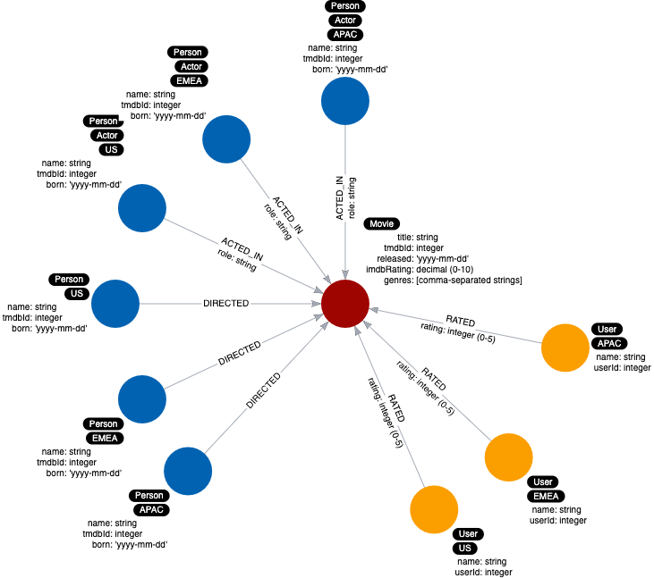
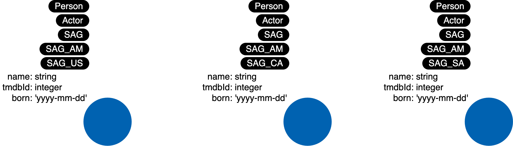
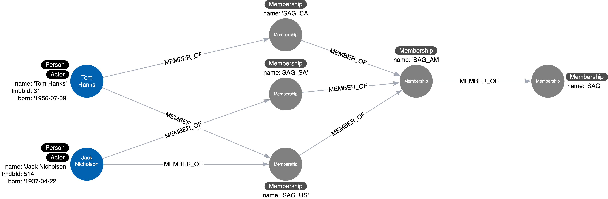

= Avoid These Labels
:type: quiz
:order: 7

[.video]
video::b5hJ6L60yTM[youtube,width=560,height=315]

[.transcript]

== Semantically orthogonal labels

“Semantically orthogonal” is a fancy term that means that labels should have nothing to do with one another.
You should be careful not to use the same type of label in different contexts.
For example, using the region for all types of nodes is not useful for most queries.

Here is an example where both _Person_ nodes and _User_ nodes are labeled with regions.
If there are no use cases where the region is significant for both types of nodes,
it is not helpful to use these same labels for _Person_ nodes and _User_ nodes.

Don't do this:

=== Representing class hierarchies

You also want to avoid labeling your nodes to represent hierarchies.

Suppose we have this hierarchy of Screen Actors Guild memberships:

image::images/SAG-hierarchy.jpg[Hierarchy of labels,width=400,align=center]

This is often called “inheritance” or “IS-A” relationships.
You should not do this where nodes have multiple labels that represent a hierarchy such as this:

Instead, you should do this:

== Check your understanding

include::questions/1-avoid.adoc[leveloffset=+1]

[.summary]
== Summary

In this lesson, you learned some ways of using labels that you should avoid in your model.
In the next module, you learn about refactoring to eliminate duplicate data.