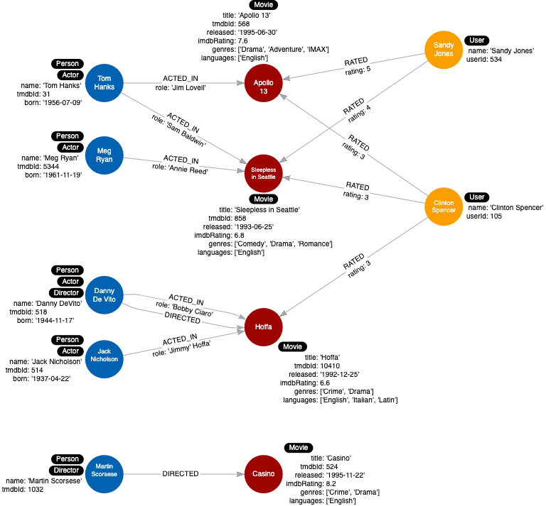

= Eliminating Duplicate Data
:type: quiz
:order: 1

[.video]
video::2JiFIfre2wM[youtube,width=560,height=315]

[.transcript]
== Duplicate data

You should take care to avoid duplicating data in your graph.
Where some databases require a form of denormalization to improve the speed of a set of queries, this is not always the case with a graph database.
De-duplicating data gives you the added benefit of allowing you to query through a node - for example, finding other customers who have purchased a particular product, or finding similar movies based on the rating of other users.

In addition, duplicating data in the graph increases the size of the graph and the amount of data that may need to be retrieved for a query.

=== New use case

We have a new use case that we must account for.

*Use case #11: What movies are available in a particular language?*

Our current instance model looks like this:

image::images/instance-model-thus-far.png[Instance model thus fars,width=400,align=center]

As you can see we do not account for languages in the data model so we will have to add this data.

=== Duplicate data example

Suppose we add a property to each _Movie_ node in the graph named _languages_ that represents the languages in which a movie is available.

Here is what the instance model would look like:

Here we see that all _Movie_ nodes have English in the list of languages.
This is duplicate data and for a scaled database, would represent a lot of duplication.

== Check your understanding

include::questions/1-why-eliminate-duplication.adoc[leveloffset=+1]

[.summary]
== Summary

In this lesson, you learned why it is important to eliminate duplication of data in the graph.
In the next challenge, you will add more data to your instance model as duplicate data so you can test the new use case.