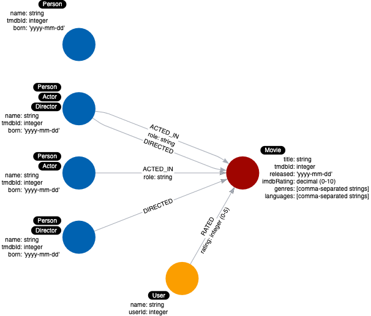
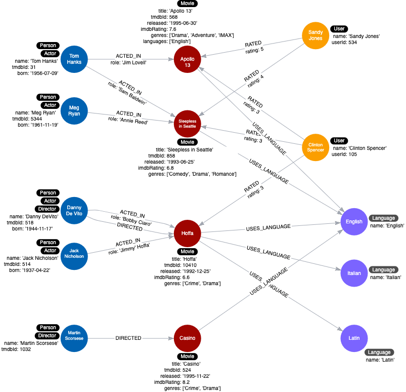

= Eliminating Duplicate Data
:type: quiz
:order: 1
:sandbox: true

[.video]
video::xxxx[youtube,width=560,height=315]

[.transcript]
== Duplicate data

Duplicating data is not something that you should do in your graph.
This is in contrast to denormalized data in an RDBMS where data is duplicated so that it can be related in different tables for SQL access.
In Neo4j, you should strive to not duplicate data because it takes up space in the graph and it is typically not the fastest way to query the data.

=== New use case

We have a new use case that we must account for.

*11. What movies are available in a particular language?*

=== Duplicate data example

Here is an example.
Suppose we add a property to each _Movie_ node in the graph named _languages_ that represents the languages in which movie is available.

Here is the data model:

Execute this Cypher code to populate the movies with their associated languages:

[source,cypher]
----
MATCH (apollo:Movie {title: 'Apollo 13', tmdbId: 568, released: '1995-06-30', imdbRating: 7.6, genres: ['Drama', 'Adventure', 'IMAX']})
MATCH (sleep:Movie {title: 'Sleepless in Seattle', tmdbId: 858, released: '1993-06-25', imdbRating: 6.8, genres: ['Comedy', 'Drama', 'Romance']})
MATCH (hoffa:Movie {title: 'Hoffa', tmdbId: 10410, released: '1992-12-25', imdbRating: 6.6, genres: ['Crime', 'Drama']})
MATCH (casino:Movie {title: 'Casino', tmdbId: 524, released: '1995-11-22', imdbRating: 8.2, genres: ['Drama','Crime']})
SET apollo.languages = ['English']
SET sleep.languages =  ['English']
SET hoffa.languages =  ['English', 'Italian', 'Latin']
SET casino.languages =  ['English']
----

And here is the associated instance model:

image::images/languages-property-instance-model.png[Instance model with languages,width=400,align=center]

=== Example: Querying languages

So we now have a query to support our new use case:

*11. What movies are available in a particular language?*

Suppose we had a query where we want to find all movies in _Italian_.

Execute this query.

[source,cypher]
----
MATCH (m:Movie)
WHERE 'Italian' IN m.languages
RETURN m.title
----

What this query does is retrieve all _Movie_ nodes and then test whether the languages property contains _Italian_.
There are two issues with the data model, especially if the graph scales:

. The name of the language is duplicated in many _Movie_ nodes.
. In order to perform the query, all _Movie_ nodes must be retrieved.

A solution here is to model properties as nodes.

=== Refactor properties as nodes

Here are the steps we will use to refactor:

. We take the property values for each _Movie_ node and create a _Language_ node.
. Then we create the relationship between that _Movie_ node and the _Language_ node.
. Finally, we remove the languages property from the _Movie_ node.

This is what the instance model will look like after the refactoring:

There will only be one node with the language value of _English_ and we remove the languages property from all _Movie_ nodes.
This eliminates a lot of duplication in the graph.

Execute this code to refactor the graph to turn the property values into nodes:

[source,cypher]
----
MATCH (m:Movie)
UNWIND m.languages AS language
WITH  language, collect(m) AS movies
MERGE (l:Language {name:language})
WITH l, movies
UNWIND movies AS m
WITH l,m
MERGE (m)-[:IN_LANGUAGE]->(l);
MATCH (m:Movie)
SET m.languages = null
----

The previous query can be rewritten as follows.

Execute this code:

[source,cypher]
----
MATCH (m:Movie)-[:IN_LANGUAGE]-(l:Language)
WHERE  l.name = 'Italian'
RETURN m.title
----

This is the only use case that deals with languages so we need not retest all of our queries after the refactor.

== Check your understanding

include::questions/1-why-eliminate-duplication.adoc[]

[.summary]
== Summary

In this lesson, you learned why it is important to eliminate duplication of data in the graph.
In the next challenge, you perform a refactoring that eliminates more duplication in the graph and test it.