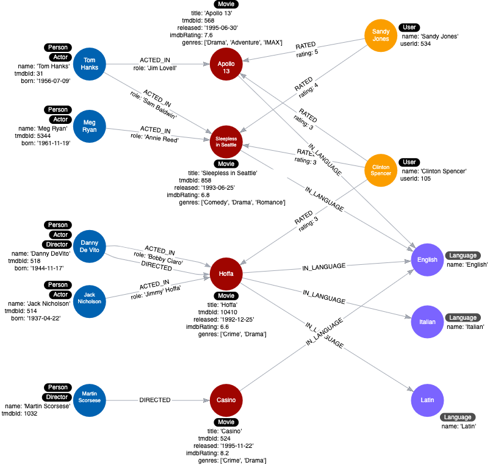

= Refactoring Duplicate Data
:type: quiz
:order: 3

[.video]
video::xxxx[youtube,width=560,height=315]

[.transcript]

== Querying duplicate data

Our current instance model is the following:

image::images/languages-property-instance-model.png[Instance model with languages,width=400,align=center]

For our latest use case:

*11. What movies are available in a particular language?*

This query finds all movies in _Italian_:

[source,cypher, role=noplay nocopy]
----
MATCH (m:Movie)
WHERE 'Italian' IN m.languages
RETURN m.title
----

What this query does is retrieve all _Movie_ nodes and then test whether the languages property contains _Italian_.
There are two issues with the data model, especially if the graph scales:

. The name of the language is duplicated in many _Movie_ nodes.
. In order to perform the query, all _Movie_ nodes must be retrieved.

A solution here is to model properties as nodes.

=== Refactor properties as nodes

Here are the steps we use to refactor:

. We take the property values for each _Movie_ node and create a _Language_ node.
. Then we create the _IN_LANGUAGE_ relationship between that _Movie_ node and the _Language_ node.
. Finally, we remove the languages property from the _Movie_ node.

This is what the instance model looks like after the refactoring:

There will only be one node with the language value of _English_ and we remove the languages property from all _Movie_ nodes.
This eliminates a lot of duplication in the graph.

This is the code to refactor the graph to turn the property values into nodes:

[source,cypher, role=noplay nocopy]
----
MATCH (m:Movie)
UNWIND m.languages AS language
WITH  language, collect(m) AS movies
MERGE (l:Language {name:language})
WITH l, movies
UNWIND movies AS m
WITH l,m
MERGE (m)-[:IN_LANGUAGE]->(l);
MATCH (m:Movie)
SET m.languages = null
----

This code iterates through all _Movie_ nodes and creates a _Language_ node for each language it finds and then creates the relationship between the _Movie_ node and _Language_ node using the _IN_LANGUAGE_ relationship.
It uses the Cypher `UNWIND` clause to separate each element of the _languages_ property list into a separate row value that is processed later in the query.

== Check your understanding

include::questions/1-unwind.adoc[]

[.summary]
== Summary

In this lesson, you learned how to create nodes from properties containing lists of values to eliminate duplication.
In the next challenge, you perform a refactoring that creates _Language_ nodes from the _languages_ properties.