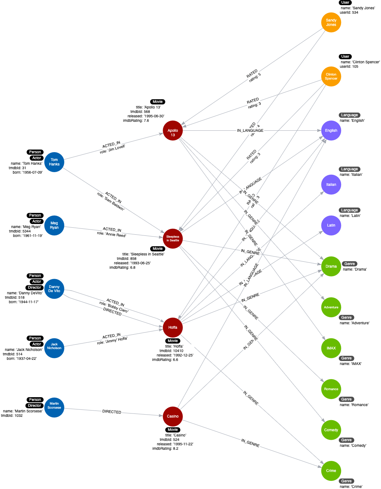

= Adding Genre nodes
:type: challenge
:order: 5
:sandbox: true
:updated-at: 2022-05-02 T 13:00:00 Z

In the previous Challenge, you eliminated duplication by taking the data in the _languages_ property and creating _Language_ nodes that are related to movies.

The `Movie` nodes have a `genres` property that contains a list of genres for each movie.

[source, cypher]
----
MATCH (m:Movie)
RETURN m.title, m.genres
----

Your challenge is to refactor the graph to create _Genre_ nodes and connect them to the _Movie_ nodes using an _IN_GENRE_ relationship.

Modify and execute the query from the previous challenge to:

. Use the data in the _genres_ property for the _Movie_ nodes to create _Genre_ nodes using the _IN_GENRE_ relationship to connect _Movie_ nodes to _Genre_ nodes.
. Delete the _genres_ property from the _Movie_ nodes.

[source, cypher]
.Cypher to create Language nodes
----
MATCH (m:Movie)
UNWIND m.languages AS language
MERGE (l:Language {name:language})
MERGE (m)-[:IN_LANGUAGE]->(l)
SET m.languages = null
----

You can check the outcome of the refactoring by running this query:

[source,cypher]
----
MATCH (m:Movie-[:IN_GENRE]->(g:Genre)
RETURN m.title, g.name
----

Your 2nd challenge, is to rewrite this query, that uses the `genres` property, to use the newly created `Genre` nodes and `IN_GENRE` relationship.

[source,cypher, role=noplay]
----
MATCH (p:Actor)-[:ACTED_IN]-(m:Movie)
WHERE p.name = 'Tom Hanks' 
  AND 'Drama' IN m.genres
RETURN m.title AS Movie
----

It should return the movies Apollo 13 and Sleepless in Seattle.

include::./questions/verify.adoc[leveloffset=+1]

[.summary]
== Summary

In this challenge, you demonstrated that you can refactor the graph to add nodes to replace duplication in properties.

Your instance model should now look like this:

In the next lesson, you will learn some more refactoring tips to eliminate duplicate data that is complex.
