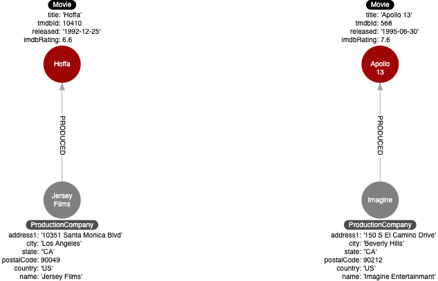

= Eliminating Complex Data in Nodes
:type: video
:order: 6
:updated-at: 2022-04-25 T 21:00:00 Z

[.video]
video::M-C36v-ayJg[youtube,width=560,height=315]

[.transcript]
== Example: Complex data

Since nodes are used to store data about specific entities, you may have initially modeled, for example, a _Production_ node to contain the details of the address for the production company.

Storing complex data in the nodes like this may not be beneficial for a couple of reasons:

. Duplicate data. Many nodes may have production companies in a particular location and the data is repeated in many nodes.
. Queries related to the information in the nodes require that all nodes be retrieved.

=== Refactoring complex data

If there is a high amount of duplicate data in the nodes or if key questions of your use cases would perform better if all nodes need not be retrieved to get at the complex data, then you might consider refactoring the graph as shown here.

image::images/add-nodes-for-complex-data.png[Complex data their own nodes,width=400,align=center]

In this refactoring, if there are queries that need to filter production companies by their state, then it will be faster to query based upon the _State.name_ value, rather than evaluating all of the _state_ properties for the _Production_ nodes.

How you refactor your graph to handle complex data will depend upon the performance of the queries when your graph scales.

== Check your understanding

include::questions/1-complex-data.adoc[leveloffset=+2]

[.summary]
== Summary

In this lesson, you learned why it is important to model complex data to eliminate duplication and also improve query performance.
In the next module, you will learn about refactoring to create specific relationships.