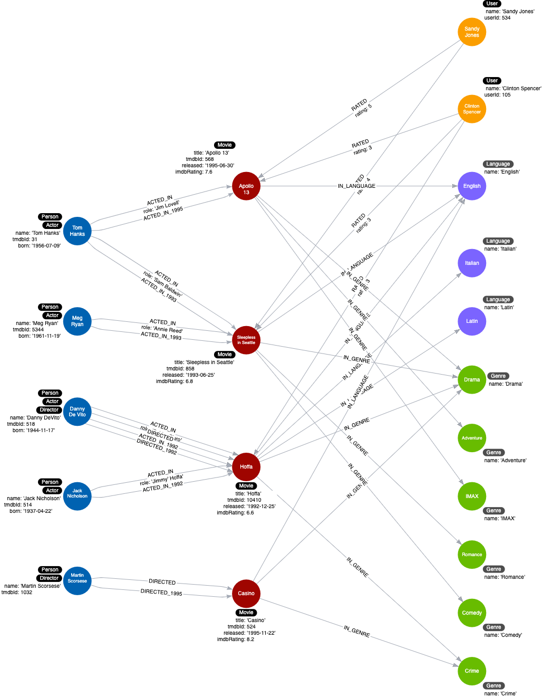

= Specific Relationships
:type: quiz
:order: 1
:usecase: blank-sandbox
:sandbox: true

[.video]
video::xxxx[youtube,width=560,height=315]

[.transcript]
== Relationships in the graph

Neo4j as a native graph database is implemented to traverse relationships quickly.
In some cases, it is more performant to query the graph based upon relationship types, rather than properties in the nodes.

Let's look at a new domain question:

*12. What movies did an actor act in for a particular year?*

You can execute the query with the current graph:

[source,cypher]
----
MATCH (p:Actor)-[:ACTED_IN]-(m:Movie)
WHERE p.name = 'Tom Hanks' AND
m.released STARTS WITH '1995'
RETURN m.title AS Movie
----

It should return the movie, Apollo 13.

What if Tom Hanks acted in 50 movies in the year 1995?
The query would need to retrieve _all_ movies that Tom Hanks acted in and then check the value of the _released_ property.
What if Tom Hanks acted in a total of 1000 movies?
All of these _Movie_ nodes would need to be evaluated.

And here is another new domain question:

*13. What actors or directors worked in a particular year?*

You can execute the query with the current graph:

[source,cypher]
----
MATCH (p:Person)--(m:Movie)
WHERE  m.released STARTS WITH '1995'
RETURN p.name as `Actor or Director`
----

It should return Tom Hanks and Martin Scorsese.

This query is even worse for performance because in order to return results, it must retrieve *all* _Movie_ nodes.
You can imagine, if the graph contained millions of movies, it would be a very expensive query.

=== Refactoring to specialize relationships

Relationships are fast to traverse and they do not take up a lot of space in the graph.
In the previous two queries, the data model would benefit from having specialized relationships between the nodes.

So, for example, in addition to the ACTED_IN and DIRECTED relationships, we add relationships that have year information.

ACTED_IN_1992
ACTED_IN_1993
ACTED_IN_1995
DIRECTED_1992
DIRECTED_1995

At first, it seems like a lot of relationships for a large, scaled movie graph, but if the latest two new queries are important use cases, it is worth it.

This is what our instance model will now look like:

In most cases where we specialize relationships, we keep the original generic relationships as existing queries still need to use them.

The code to refactor the graph to add these specialized relationships uses the APOC library.
It has a `apoc.create.relationships` procedure that allows you to dynamically create relationships in the graph.

Execute this code to refactor the _ACTED_IN_ relationships in the graph:

[source,cypher]
----
MATCH (n:Actor)-[r:ACTED_IN]->(m:Movie)
CALL apoc.create.relationship(startNode(r),
                              'ACTED_IN_' + left(m.released,4),
                              {},
                              endNode(r) ) YIELD rel
RETURN COUNT(*) AS `Number of relationships added`
----

It should add 5 relationships.

Execute this code to refactor the _DIRECTED_ relationships in the graph:

[source,cypher]
----
MATCH (n:Director)-[r:DIRECTED]->(m:Movie)
CALL apoc.create.relationship(startNode(r),
                              'DIRECTED_' + left(m.released,4),
                              {},
                              endNode(r) ) YIELD rel
RETURN COUNT(*) AS `Number of relationships added`
----

It should add 2 relationships.

With the refactoring of the graph, we rewrite the above 2 queries for our domain.

*12. What movies did an actor act in for a particular year?*

You can execute the query with the refactored graph:

[source,cypher]
----
MATCH (p:Actor)-[:ACTED_IN_1995]-(m:Movie)
WHERE p.name = 'Tom Hanks'
RETURN m.title AS Movie
----

It should return the movie, Apollo 13.

*13. What actors or directors worked in a particular year?*

You can execute the query with the refactored graph:

[source,cypher]
----
MATCH (p:Person)-[:ACTED_IN_1995|DIRECTED_1995]-()
RETURN p.name as `Actor or Director`
----

It should return Tom Hanks and Martin Scorsese.

This last question is one where we don't even need to retrieve any Movie nodes to answer the question which is a huge performance improvement for a large graph.

== Check your understanding

include::questions/1-why-specialize-relationships.adoc[]
include::questions/2-dynamic-relationship-creation.adoc[]

[.summary]
== Summary

In this lesson, you learned why it may improve query performance if you specialize relationships in the graph.
In the next challenge, you perform a refactoring that specializes the _RATED_ relationships in the graph.