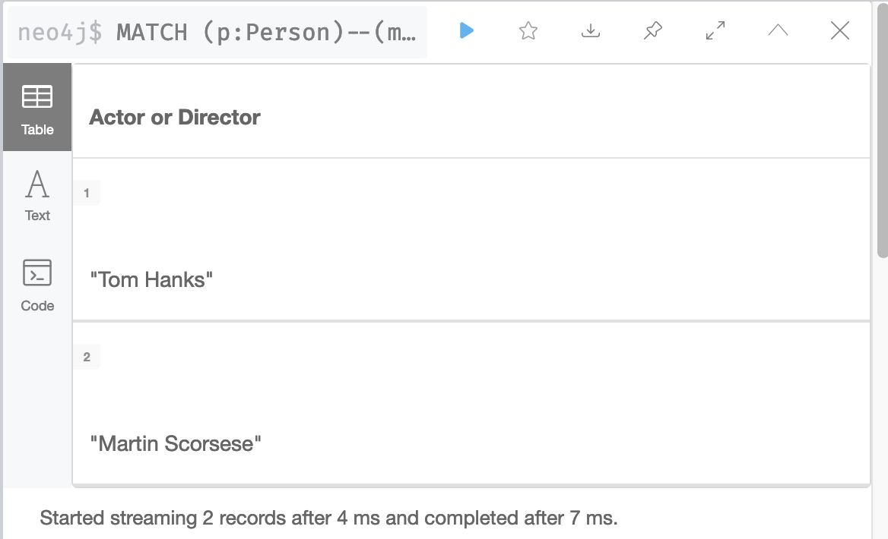
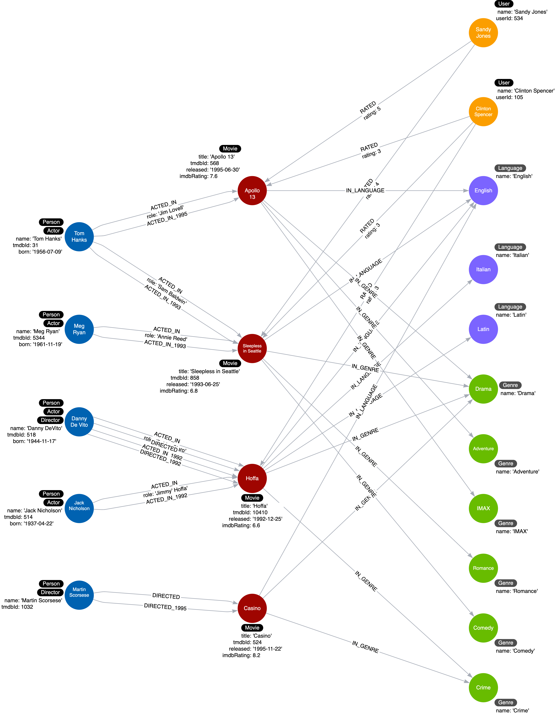

= Specific Relationships
:type: video
:order: 1
:updated-at: 2022-04-25 T 21:00:00 Z

[.video]
video::lv4W7030rkU[youtube,width=560,height=315]

[.transcript]
== Relationships in the graph

Neo4j as a native graph database is implemented to traverse relationships quickly.
In some cases, it is more performant to query the graph based upon relationship types, rather than properties in the nodes.

Let's look at a new use case:

*Use case #12: What movies did an actor act in for a particular year?*

We can execute this query with the current graph:

[source,cypher, role=noplay nocopy]
----
MATCH (p:Actor)-[:ACTED_IN]-(m:Movie)
WHERE p.name = 'Tom Hanks' AND
m.released STARTS WITH '1995'
RETURN m.title AS Movie
----

It returns the movie, Apollo 13:

image::images/tom-acted-1995.png[Tom Hanks acted in 1995,width=400,align=center]

What if Tom Hanks acted in 50 movies in the year 1995?
The query would need to retrieve _all_ movies that Tom Hanks acted in and then check the value of the _released_ property.
What if Tom Hanks acted in a total of 1000 movies?
All of these _Movie_ nodes would need to be evaluated.

And here is another new use case:

*Use case #13: What actors or directors worked in a particular year?*

Again, we can execute this query with the current graph:

[source,cypher, role=noplay nocopy]
----
MATCH (p:Person)--(m:Movie)
WHERE  m.released STARTS WITH '1995'
RETURN DISTINCT p.name as `Actor or Director`
----

It returns Tom Hanks and Martin Scorsese:

This query is even worse for performance because in order to return results, it must retrieve *all* _Movie_ nodes.
You can imagine, if the graph contained millions of movies, it would be a very expensive query.

=== Refactoring to specialize relationships

Relationships are fast to traverse and they do not take up a lot of space in the graph.
In the previous two queries, the data model would benefit from having specialized relationships between the nodes.

So, for example, in addition to the ACTED_IN and DIRECTED relationships, we add relationships that have year information.

* ACTED_IN_1992
* ACTED_IN_1993
* ACTED_IN_1995
* DIRECTED_1992
* DIRECTED_1995

At first, it seems like a lot of relationships for a large, scaled movie graph, but if the latest two new queries are important use cases, it is worth it.

This is what our instance model will now look like:

In most cases where we specialize relationships, we keep the original generic relationships as existing queries still need to use them.

The code to refactor the graph to add these specialized relationships uses the APOC library.

This is the code to refactor the _ACTED_IN_ relationships in the graph that you will execute in the next Challenge:

[source,cypher, role=noplay nocopy]
----
MATCH (n:Actor)-[:ACTED_IN]->(m:Movie)
CALL apoc.merge.relationship(n,
  'ACTED_IN_' + left(m.released,4),
  {},
  {},
  m ,
  {}
) YIELD rel
RETURN count(*) AS `Number of relationships merged`;
----

It has a `apoc.merge.relationship` procedure that allows you to dynamically create relationships in the graph.
It uses the 4 leftmost characters of the _released_ property for a _Movie_ node to create the name of the relationship.

As a result of the refactoring, the previous two queries can be rewritten and will definitely perform better for a large graph:

Here is the rewrite of the first query:

[source,cypher, role=noplay nocopy]
----
MATCH (p:Actor)-[:ACTED_IN_1995]-(m:Movie)
WHERE p.name = 'Tom Hanks'
RETURN m.title AS Movie
----

For this query the specific relationship is traversed, but fewer Movie nodes are retrieved.

And here is how we rewrite the second query:

[source,cypher, role=noplay nocopy]
----
MATCH (p:Person)-[:ACTED_IN_1995|DIRECTED_1995]-()
RETURN p.name as `Actor or Director`
----

For this query, because the year is in the relationship type, we do not have to retrieve any _Movie_ nodes.

== Check your understanding

include::questions/1-why-specialize-relationships.adoc[leveloffset=+2]
include::questions/2-dynamic-relationship-creation.adoc[leveloffset=+2]

[.summary]
== Summary

In this lesson, you learned why it may improve query performance if you specialize relationships in the graph.
In the next challenge, you perform a refactoring that specializes the _ACTED_IN_ and _DIRECTED_ relationships in the graph.