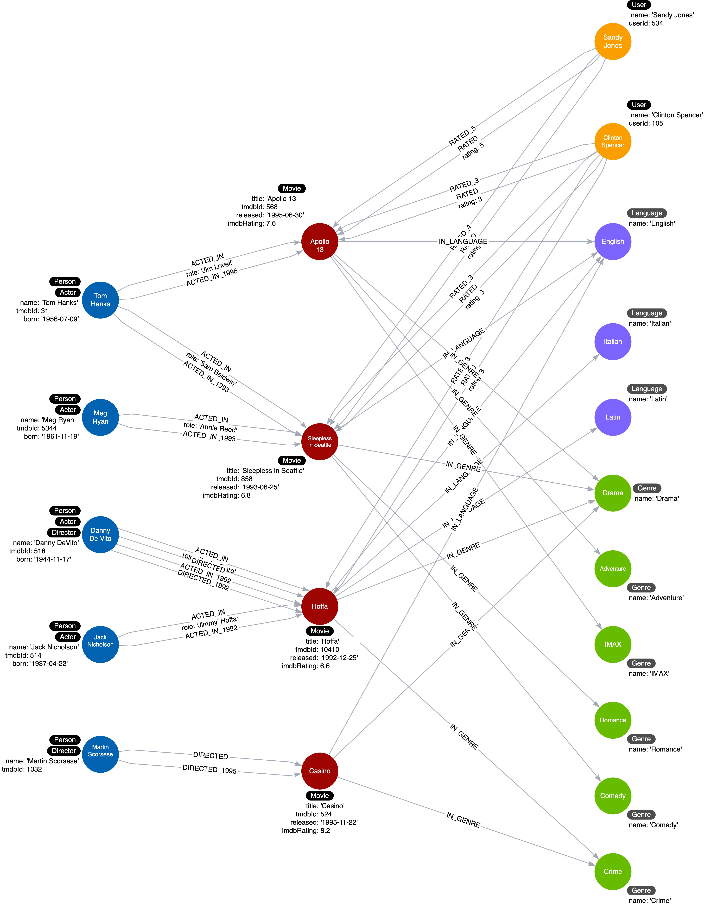
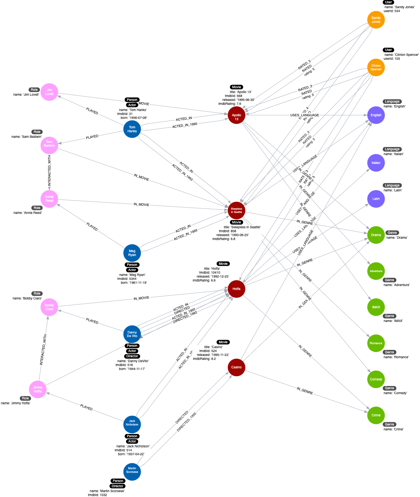

= Adding an Intermediate Node
:type: challenge
:order: 2
:usecase: blank-sandbox
:sandbox: true
:verify: MATCH (a:Actor)-[r:ACTED_IN]-(m:Movie) WHERE r.role IS NOT NULL WITH count(r) AS removedCount MATCH (x:Role) WHERE x.name IN ['Jim Lovell','Sam Baldwin','Annie Reed','Bobby Ciaro','Jimmy Hoffa'] WITH removedCount, count(x) AS countRoles MATCH (a)-[r1:PLAYED]->(x) WITH removedCount, countRoles, count(r1) as countPlayed WITH removedCount, countRoles, countPlayed MATCH (x)-[r2:IN_MOVIE]->(m) WITH removedCount, countRoles, countPlayed, count(r2) AS countInMovie RETURN (removedCount + countRoles + countPlayed + countInMovie) = 15 AS outcome

We want to infer more from the roles that an actor played in a movie.
The same role could be repeated in multiple movies.
Furthermore, we might want to add how different roles interact with each other in the same movie or between movies.

Given the current instance model:

How would you refactor the graph to add an intermediate node representing the _role_ property of the _ACTED_IN_ relationship?

Here is the proposed instance model:

We add a _Role_ node using the _role_ property from the _ACTED_IN_ relationship.

In this instance model we also show that some _Role_ nodes could be related to each other with the _INTERACTED_WITH_ relationship, but we will not implement it.

Write and run refactor code to:

. Find an actor that acted in a Movie (`MATCH (a:Actor)-[r:ACTED_IN]-(m:Movie)`)
. Create (using `MERGE`) a _Role_ node setting it's name to the role in the _ACTED_IN_ relationship.
. Create (using `MERGE`) the _PLAYED_ relationship between the _Actor_ and the _Role_ nodes.
. Create (using `MERGE`) the _IN_MOVIE_ relationship between the _Role_ and the _Movie_ nodes.
. Remove the _role_ property from the _ACTED_IN_ relationship (set it to null)

////
MATCH (a:Actor)-[r:ACTED_IN]-(m:Movie)
MERGE (x:Role {name: r.role})
MERGE (a)-[:PLAYED]->(x)
MERGE (x)-[:IN_MOVIE]->(m)
SET r.role = null
////

It should create 5 nodes and 10 relationships.

include::questions/verify.adoc[]

[.summary]
== Summary

In this challenge, you demonstrated that you can refactor the graph to add an intermediate node.

Congratulations! You have completed this course.
