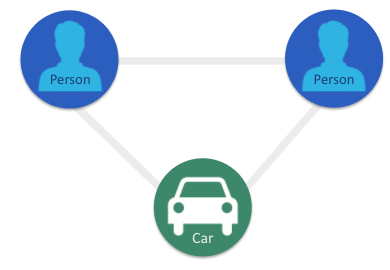
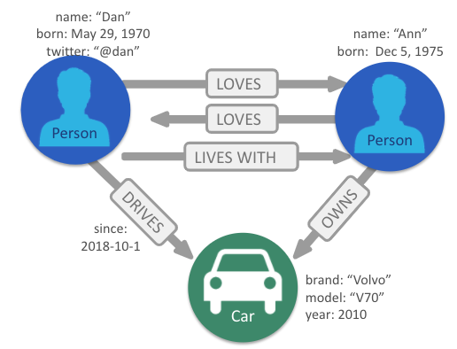

= Neo4j Property Graph Model
:type: quiz
:order: 2

== Neo4j's property graph

The components of A Neo4j graph include:

[square]
* Nodes
* Relationships
* Labels
* Properties

=== Graph terminology and Neo4j's property graph

[square]
* Node = Vertex
* Relationship = Edge

image::images/EdgeVertex.png[EdgeVertex,width=300,align=center]

ifndef::env-slides[]
Let’s start by defining the terms vertex and edge.
A vertex is an object in a graph.
An edge is a connection between two vertices which could be an ordered pair of vertices

Node and Relationship are the Neo4j terms for vertex and edge.

We use these nodes and relationships in Neo4j since we find them more intuitive in representing and communicating -
how vertices and edges are used in a property graph.

=== Nodes

[square]
* Represent objects or entities.
* Can be labeled.

There are two kinds of data that can be associated a node,
labels and properties.

Labels provide categorical information.
For example, here we have two Person nodes and one Car node.

These labels categorizes these nodes, as a Person or a Car,
but they don’t provide any specific information about a given node.

Specific information for a node is represented as a properties which you will learn about soon.

=== Node properties

image::images/PropertyGraphNodesWithProperties.png[PropertyGraphNodesWithProperties,width=400,align=center]

[square]
* Represent objects or entities.
* Can be labeled.
* May have properties.

Properties are used to associate specific information with individual nodes.

As shown here, the Person nodes now each have _name_ property,
One node has a name property with a value, Dan, and the other Person node has a name property with a value, Ann.
The name property provides a way to differentiate the nodes.
And the Car node has several properties providing details about this particular car.

Nodes do not need to have a label or any properties.
However, in practice, a node almost always has at least one label and one or more properties.

This is why we call Neo4j a property graph since it associates data with nodes.
As we’ll see, having properties in the graph provides value to our application.
endif::[]

=== Relationships

image::images/PropertyGraphRelationships.png[PropertyGraphRelationships,width=400,align=center]

[square]
* Must have a type.
* Must have a direction.

Next, let’s talk about relationships. Relationships must have both a type and a direction.

Types are similar to labels since types provide a general category for each relationship.

For example, as we see here, the relationships have the types - DRIVES, OWNS, and LOVES.
Each of these types captures how a relationship is used to relate two nodes.

Again, along with a type, each Neo4j relationship must have a direction.

Following the direction shown in this graph we see that “Ann owns a Volvo”.
If the relationship direction were reversed, it relays a VERY different concept,
which is “The Volvo owns Ann.”

=== Relationship properties

image::images/PropertyGraphRelationshipProperties.png[PropertyGraphRelationshipProperties,width=400,align=center]

[square]
* Must have a type.
* Must have a direction.
* May have properties.

ifndef::env-slides[]
Just like nodes, relationships can have properties that express specific attributes.

Here we see the property ‘since’ - for the DRIVES relationship.
This indicates how long Dan has been driving this particular car.

=== Multiple relationships

image::images/PropertyGraphMultiRelationships.png[PropertyGraphMultiRelationships,width=400,align=center]

[square]
* Must have a type.
* Must have a direction.
* May have properties.
* Nodes can share multiple relationships.

Because relationships are specific, each node can have many relationships with other nodes to fully capture their context.

This is a good thing, otherwise Ann would love Dan, but not vice versa!

=== A property graph model

[square]
* Nodes
** Represent objects or entities.
** Can be labeled.
** May have properties.
* Relationships
** Must have a type.
** Must have a direction.
** May have properties.
* Nodes can share multiple relationships.

Here’s complete, although very simple,
property graph for this example.

Mathematically, a node is defined as “a point where two or more edges (relationships) meet.”

This is not at all intuitive!
However, it does provide an important insight into how graphs are used.

Since the entire point of modeling data as a graph is to traverse a chain of linked nodes.
One useful way of thinking about nodes is that they are waypoints along the traversal route.
They contain the information needed to decide which links are good ones to follow, and which can be ignored.
Relationships are those links.

The support for properties on both nodes and relationships is what makes Neo4j a property graph.
This provides a flexible way of defining varying amounts of data.

== Check your understanding

//include::questions/1-read-clause.adoc[]

//include::questions/2-valid-clauses.adoc[]

//include::questions/3-complete-query.adoc[]

[.summary]
== Summary

In this lesson, you learned the terminology for the property graph that Neo4j supports.
