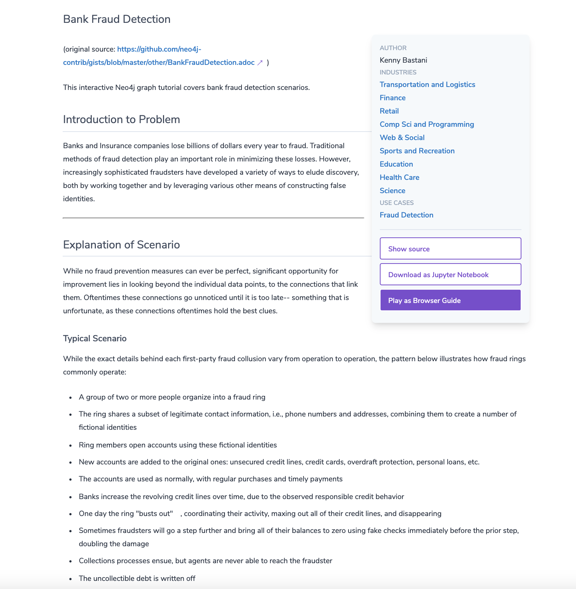

= Use Cases
:type: quiz
:order: 4

== Use cases for graph databases

The biggest value that graphs bring to an application is their ability to store relationships and connections as first-class entities.

For instance, the early adopters of graph technology built their businesses around the value of data relationships.
These companies have now become industry leaders: LinkedIn, Google, Facebook, and PayPal.

There are many uses for graph databases in an enterprise.
Here are some of them:

image::images/UseCases.png[UseCases,width=800,align=center]

You can read more about how customers are using Neo4j https://neo4j.com/use-cases[here].
endif::[]

== Exploring graphgists

As a developer just learning Neo4j and Cypher, you will use the very simple Movies graph data model.
If, however, you are curious about how other developers have created graph data models for Neo4j, you can explore the https://neo4j.com/graphgists/[graphgists page].

image::images/graphgists1.png[Graphgists1,width=500,align=center]

Graphgists are developed by a wide range of developers from Neo4j and from the Neo4j user community.
You can explore this site to see how other applications have modeled their data and get an appreciation for what can be done in Neo4j.

=== Example graphgist

For example, here is the _Exploring a Conference_ graphgist that has a description of the model, how to load the sample data, and how to query the data.

As you gain experience with Cypher and think about modeling your application, check out some of these graphgists for ideas for how to model your data.
We recommend that you take our training course, _Graph Data Modeling for Neo4j_, which introduces you to the best practices for modeling data and implementing graph data models in Neo4j.

== Check your understanding

//include::questions/1-read-clause.adoc[]

//include::questions/2-valid-clauses.adoc[]

//include::questions/3-complete-query.adoc[]

[.summary]
== Summary

In this lesson, you learned how an application traverses the graph.
