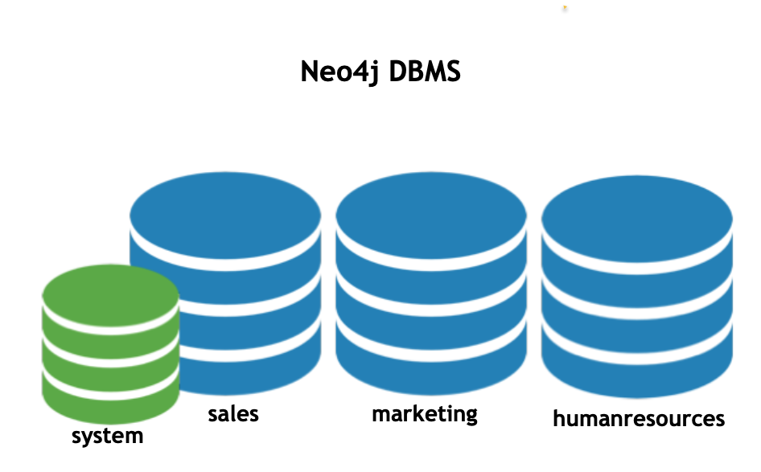

= Neo4j DBMS
:type: quiz
:order: 1

== Neo4j DBMS

The heart of the Neo4j Graph Platform is the Neo4j DBMS.
The Neo4j Graph Platform includes processes and resources needed to manage a single Neo4j DBMS instance or a set of Neo4j DBMS instances that form a cluster.
A Neo4j DBMS instance, at a minimum contains two databases, the system database and the default database, neo4j.

image::images/Neo4jDBMS.png[Neo4jDBMS,width=300,align=center]

The *system* database stores metadata about the databases for the installation, as well as security configuration.
The *default* database (named neo4j by default) is the "user" database where you implement your graph data model.

== Neo4j DBMS instance

A Neo4j DBMS instance is a single java process that runs server code to:

[square]
* Accept connections from clients of many types.
* Execute Cypher code to update or query the graph.
* Execute specialized library procedures used by the application.
* Return data to clients.

Here is an example DBMS instance:

These three "user" databases hold different types of application data
[square]
* One that contains information we're going to use for sales.
* One that contains information we use mastering marketing questions.
* And one that we use for answering HR questions.

The system database stores the metadata and security configuration for all of the user databases.

== Neo4j Editions

Neo4j DBMS comes in two editions:

[squuare]
* *Community Edition* which is open source and free to use.
* *Enterprise Edition* which requires a license and supports deployment features such as:
** Online backups.
** Role-based access control.
** Fabric.
** 24x7 availability and scalability using clustering.
** Multiple user databases.

You can read about the differences between Editions https://neo4j.com/docs/operations-manual/current/introduction/#edition-details[here].

== Check your understanding

//include::questions/1-read-clause.adoc[]

//include::questions/2-valid-clauses.adoc[]

//include::questions/3-complete-query.adoc[]

[.summary]
== Summary

In this lesson, you learned what the Neo4j DBMS is.
