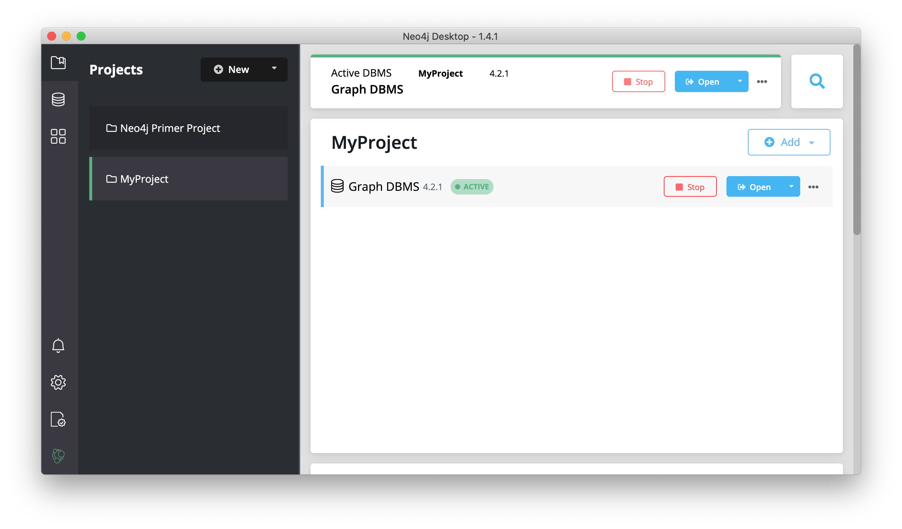

= Neo4j Desktop
:type: quiz
:order: 4

== Neo4j Desktop

Neo4j Desktop is intended for developers who want to develop a Neo4j application and test it on their local machine.
It is free to use.
Neo4j Desktop is a UI that enables you to create projects, each with their own Neo4j DBMS instances where you can easily add or remove graph applications and libraries for use with your Neo4j DBMS.
It includes an application called  Neo4j Browser which is the UI you use to access the started database using Cypher queries.

Here you can find a https://neo4j.com/docs/desktop-manual/current/visual-tour/[visual tour] of Neo4j Desktop.

The Neo4j Desktop runs on OS X, Linux, and Windows. You can download it from our https://neo4j.com/download[download page].

== Check your understanding

//include::questions/1-read-clause.adoc[]

//include::questions/2-valid-clauses.adoc[]

//include::questions/3-complete-query.adoc[]

[.summary]
== Summary

In this lesson, you learned what Neo4j Desktop is.
