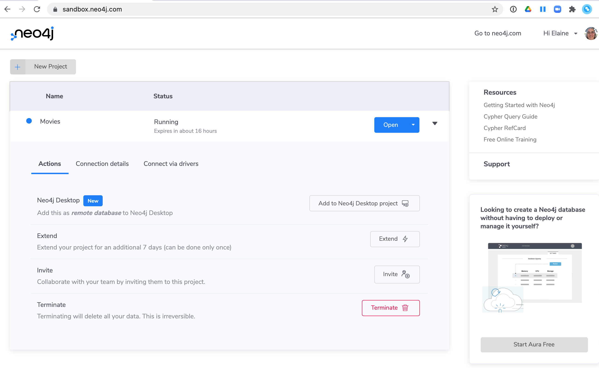

= Neo4j in the Cloud
:type: quiz
:order: 5

== Using Neo4j in the cloud

Neo4j has some options for you to access a Neo4j DBMS instance in the cloud:

* Neo4j Sandbox
* Neo4j Aura Free
* Neo4j Aura Professional or Enterprise

With each of these options, keep in mind that you will not have access to the filesystem or configuration for these instances like you do for instances that you manage yourself.

=== Neo4j Sandbox

The Neo4j Sandbox is a way that you can begin development with Neo4j or simply play with the data in a graph.

It is a free, temporary, and cloud-based instance of a Neo4j DBMS  with  a single database that you can access from any Web browser.
The database in a Sandbox may be empty or it may be pre-populated.
It is started automatically for you when you create the Sandbox project.

By default, the Neo4j Sandbox is available for three days, but you can extend it for up to 10 days.

You create a Sandbox by creating an account at the https://sandbox.neo4j.com/?ref=graph-academy[Neo4j Sandbox site].

Here is a video that shows how to create a Neo4j Sandbox account and a Neo4j Sandbox instance:

video::OSk1ePl2PUM[youtube,width=560,height=315]

=== Neo4j Aura Free

Neo4j Aura Free is a free Neo4j DBMS instance in the cloud that is managed by the Neo4j team and it does not expire like a Neo4j Sandbox does.

Neo4j Aura Free has these limitations:

* Maximum number of nodes is 50K.
* Maximum number of relationships is 175K.
* Graph Data Science Library or GraphQL library not available.

You can learn more about Neo4j Aura https://neo4j.com/aura/[here^]. When you create an Aura account, the Free Tier database is available to you.

Here is a video that shows you how to create a database in Aura Free:

video::1Ee242FDFcc[youtube,width=560,height=315]

=== Neo4j Aura Professional or Aura Enterprise

If you require more data in the cloud, then you can pay a monthly subscription for Neo4j Aura Professional or Aura Enterprise.
The monthly subscription cost depends on the size of the database.
These options where you pay include technical support for your organization.

Here is a video that introduces you to Neo4j Aura:

video::jEEyM6sWDM4[youtube,width=560,height=315]

[NOTE]
At this writing, the Graph Data Science Library is not available in Aura Professional or Aura Enterprise.

== Check your understanding

include::questions/1-cloud.adoc[]

[.summary]
== Summary

In this lesson, you learned the way you can access a Neo4j instance in the cloud.
