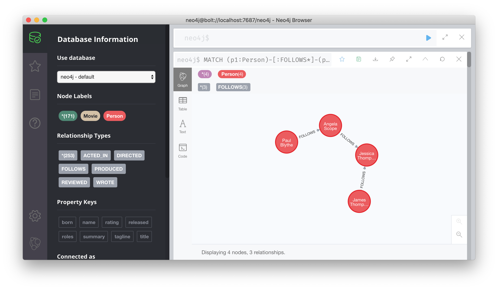
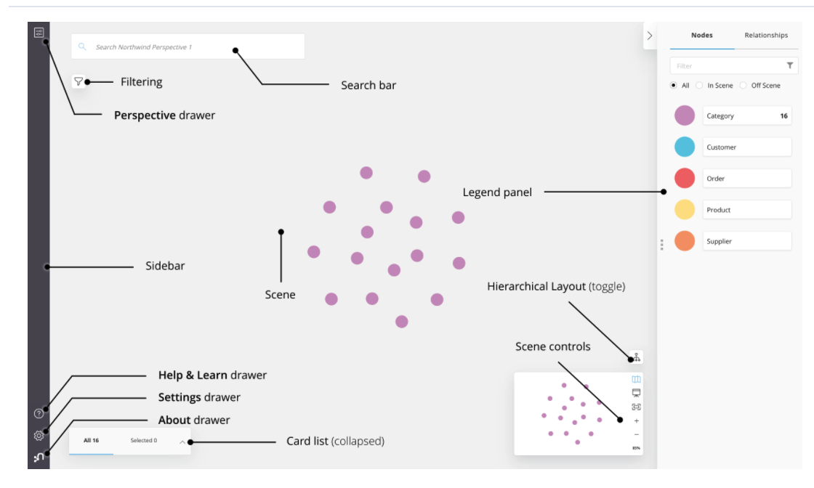
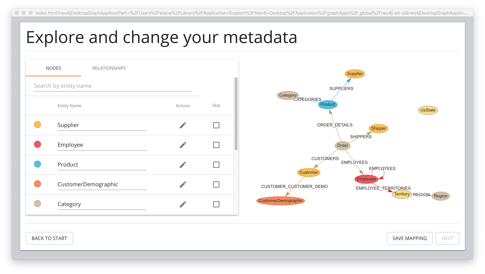
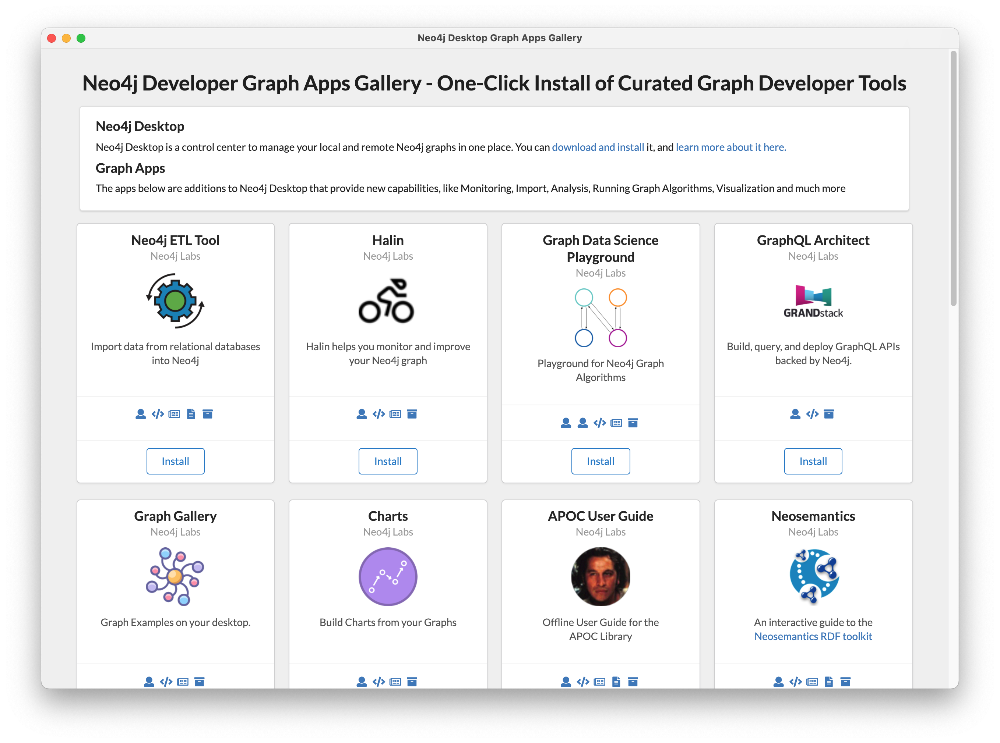

= Neo4j Graph Apps
:type: quiz
:order: 8

== What is a Graph App?

A Graph App is an application that is intended to be used with a Neo4j DBMS instance.
It is a Single Page Application (SPA) built with HTML and JavaScript which interact with Neo4j databases through Neo4j Desktop
There is a wide variety of graph apps available to many types of users.
One thing that all graph apps have in common is that they must establish a connection to a Neo4j DBMS instance.
The instance can be running locally or in the Cloud.

The most common Graph Apps developed by Neo4j and used today are:

* Neo4j Browser
* Neo4j Bloom
* Neo4j ETL Tool

Just like libraries and drivers, there are Neo4j-supported and Community-supported graph apps.
These graph apps can be installed and used from Neo4j Desktop.

=== Neo4j Browser

Neo4j Browser is a Neo4j-supported graph app that enables you to access a Neo4j Database by executing Cypher statements to create or update data in the graph and to query the graph to return data.
The data returned is typically visualized as nodes and relationships in a graph, but can also be displayed as tables.
In addition to executing Cypher statements, you can execute a number of system calls that are related to the database being accessed by the Browser.
For example, you can retrieve the list of queries that are currently running in the server.

Neo4j Browser can be used as a graph app from Neo4j Desktop or from a Web browser.

Here, you can follow a https://neo4j.com/docs/browser-manual/current/visual-tour/[visual tour] of using Neo4j Browser.

=== Neo4j Bloom

Neo4j Bloom is a Neo4j-supported graph app where you can experience:

* Visual presentation of your graph data tangibly reveals non-obvious connections.
* Easy-to-understand visualizations explain data connectedness to every colleague.
* Codeless search tools let you quickly explore your data without technical expertise.
* Browsing tools make it easy for you to discover new insights from your data.

Neo4j Bloom can be used as a graph app from Neo4j Desktop or from a Web browser.

Here you can follow a https://neo4j.com/docs/bloom-user-guide/current/bloom-visual-tour/[visual tour] of Neo4j Bloom.

Another way that you can try Neo4j Bloom is to create a Bloom Visual Discovery Sandbox that you can use for up to 10 days.

=== Neo4j ETL Tool

The Neo4j ETL Tool is used by many folks to import data from a relational database.

* The Neo4j ETL Tool requires that both the source RDBMS and the target DBMS are online.
* It enables you to control how much of the data in an existing RDBMS will be imported into the graph.
* It also enables you to customize how nodes and relationships will be created in the graph.

[IMPORTANT]
The Neo4j ETL Tool can only be used if you are using Neo4j Desktop to access the graph application.
With Neo4j Desktop, you can connect to a Sandbox or a Neo4j Aura instance, but you need Neo4j Desktop to use the Neo4j ETL Tool.

You can read more about using the Neo4j ETL tool https://neo4j.com/developer/neo4j-etl/[here].

=== Graph Apps Gallery

In Neo4j Desktop, you can open the Graph Apps Gallery to view and install other graph apps into your environment.

== Check your understanding

include::questions/1-browser.adoc[]
include::questions/2-bloom.adoc[]

[.summary]
== Summary

In this lesson, you learned about some of the graph apps available to you with Neo4j.
