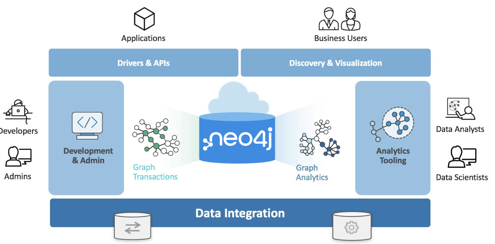

= Neo4j Graph Platform
:order: 2

//Watch this video to learn how Neo4j implements a property graph model.

//video::gYLM1ke6sZg[youtube,width=560,height=315]

////
Script: L: Neo4j is a Property Graph

https://docs.google.com/document/d/1ySystUMjZ4Xz40sHYOJTquxHKP6Ow8TRA--nwH_7Mss/edit?usp=sharing

////

== Neo4j Graph Platform

The Neo4j Graph Platform includes components that enable you to develop your graph-enabled application.

It is used by developers, administrators, data analysts, and data scientists to access application data.
Developers create the data in the graph by either importing it into the graph or using the Cypher language to implement the data model. In addition, developers are responsible for integrating the graph with other systems and database management system (DBMS) installations.
Admins manage the processes and files related to the Neo4j installation.
Data scientists and data analysts typically use a combination Cypher queries, as well as tools to analyze the data.
End-users typically use applications written by developers to access the graph data.

The Neo4j Graph Platform includes these components:

[square]
* Database servers
* Neo4j Desktop
* Cloud instances
* Libraries
* Drivers
* Graph apps
* Command-line tools
* Integration frameworks

These components are used by developers, administrators, architects, and data scientists to implement and support their Neo4j applications.

At the end of this module, you will be able to:
[square]
* Describe the benefits of the Neo4j Graph Platform.
* Describe Neo4j components that are used to support Neo4j
