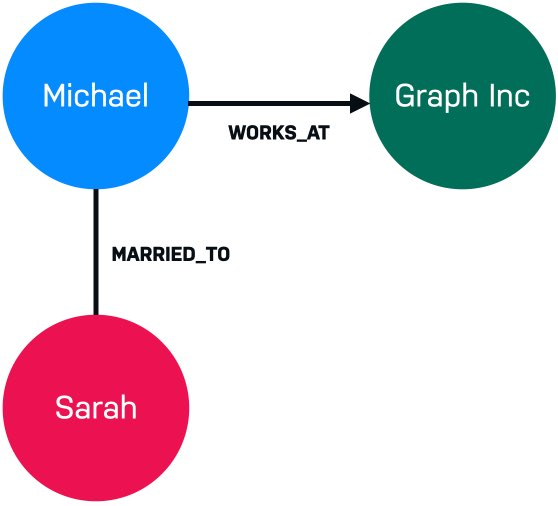

= Graph Elements
:type: video
:order: 2

[.video]
video::0CHdIwuGZqI[youtube,width=560,height=315]

[.transcript]
== Graph elements
Let's take a closer look at the two elements that make up a graph:

* Nodes (also known as vertices)
* Relationships (also known as edges)

image::images/large-social-graph.jpg[A diagram representing nodes and relationships]

=== Nodes

image::images/michael-sarah.jpg[Two nodes representing Michael and Sarah, role=right]

*Nodes* (or vertices) are the circles in a graph.
Nodes commonly represent _objects_, _entities_, or merely _things_.

In the link:../1-seven-bridges/[Seven Bridges of Königsberg^] example in the previous lesson, nodes were used to represent the land masses.

Another example that everyone can relate to is the concept of a social graph.
People interact with each other and form relationships of varying strengths.

The diagram to the right has two nodes which represent two people, **Michael** and **Sarah**.
On their own, these elements are uninspiring.
But when we start to connect these circles together, things start to get interesting.

==== Nodes typically represent things

Examples of entities that could typically be represented as a node are: person, product, event, book or subway station.

=== Relationships

*Relationships* (or _edges_) are used to connect nodes.
We can use relationships to describe how nodes are connected to each other.
For example *Michael* has the *WORKS_AT* relationship to *Graph Inc* because he works there.
*Michael* has the *MARRIED_TO* relationship to *Sarah* because he is married to her.

All of a sudden, we know that we are looking at the beginnings of some sort of _social graph_.

Now, let's introduce a third person, **Hans**, to our Graph.

image::images/michael-knows-hans.jpg[Three nodes representing Michael, Sarah and Hans, role=right]
**Hans** also _works for_ **Graph Inc** along with Michael.
Depending on the size of the company and the properties of the relationship, we may be able to infer that Michael and Hans know each other.

If that is the case, how likely is it that Sarah and Hans know each other?

These are all questions that can be answered using a graph.

==== Relationships are typically verbs.

We could use a relationship to represent a personal or professional connection (_Person *knows* Person, Person *married to* Person_), to state a fact (_Person *lives in* Location_, _Person *owns* Car_, _Person *rated* Movie_), or even to represent a hierarchy (_Parent *parent of* Child, Software *depends on* Library_).

== Check your understanding

include::questions/1-node.adoc[leveloffset=+2]

[.summary]
== Summary

In this lesson you learned about nodes (vertices) and relationships (edges) that make up a graph.
Next, you will learn about graph structure where relationships may have direction or weights.
