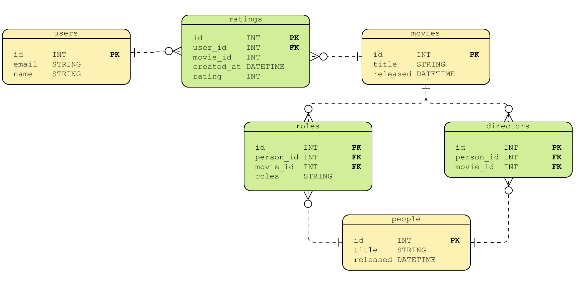

= Thinking in Graphs
:type: video
:order: 1

Have you ever struggled with a complex database schema full of foreign keys and many-to-many relationships that result in unwieldy, poorly performing database queries?

Or do you simply find it difficult to express what you are looking for in your database queries?

Do you deal with hierarchical data or trees, where the answer may lie at an unknown or varying depth?

Or do you need to find a path through an ever-changing dataset with complex requirements?

== Thinking in tables

From early on in our careers, we condition ourselves to think of data in terms of rows and columns, whether in a relational database or even the humble CSV file. Tabular data is a tried-and-tested methodology that works well for most use cases. An ecosystem of tooling even exists to help us work efficiently in this way.

You may not run into any performance issues if the data is small enough.

However, as the amount of data grows or the application or use case becomes more complex, you may run into stumbling blocks.

== Making your data fit

// TODO: Too low-level? Remove?
Let’s take a look at an Entity Relationship diagram that describes the data for a movie recommendation website.

The tables highlighted in yellow represent the main entities: users, people, and movies. The green tables, however, are required to support the many-to-many relationships; for example, a user may rate many movies, and a movie may be rated by many users.

This is an example of complexity added to the database layer to make the use case fit the technology. Not only does it add complexity to the data model, but it may also lead to performance issues.

== The O(n) problem

When querying across tables in a relational database, the joins are computed at read-time, using an underlying index to find the corresponding rows in the target table.  The more data added to the database and subsequently the larger these indexes grow, the slower the response times will become.

This problem is known as the “Big O” or O(n) notation.

Many relational databases support views, subqueries and window functions which can ease the complexity, but these must still be constructed in memory at query time, which is an expensive task.

This problem can be partially resolved by database tuning, partitioning, or denormalizing data to improve response times. At this point, you'll need to become a database expert to comprehend what's happening.

== NoSQL Databases

Over the years, many No-SQL databases have sprung up to handle different scenarios. For example, document stores offer flexibility, wide-column stores offer scalability for large datasets, key-value stores provide simplicity and high performance, and graph databases enable efficient modeling and querying of complex relationships between entities.

== Thinking in Documents

Let’s take a document store as an example, where you store data in nested key-value pairs within collections.  This approach provides flexibility and speed of data ingestion but will also have drawbacks when working with connected datasets.

[source,json]
.An example Movie Document
----
{
  "_id": ObjectId("63da26bc2e002491266b6205"),
  "title": "Toy Story",
  "released": "1996-03-22",
  "directors": ["Tom Lasseter"]
}
----

The document above contains the names of the directors for the movie as an array of strings.
This is an example of data denormalization for the purpose of performance.

A document store can also fall foul of the _O(n) problem_.  What happens when you would like to query across collections?  You can store references to documents in other collections by their unique IDs, but the database will still need to compute these joins at read time.

You could start duplicating data or adding caching in your application layer to improve performance, but you are substituting one style of complexity with another.

== Thinking in Graphs

Enter graph databases.

A graph database yields much faster results for queries across or through entities.  A graph database is a great fit when:

* You need to understand the relationships between entities - for example, how two people are connected
* You have a problem that involves self-referencing between the same type of entity - for example, a hierarchy of employees within a company
* You need to explore relationships of varying or unknown depth - for example, the use of parts within a factory
* You need to calculate a route between two points in a network - for example, finding the most efficient route o public transport

In essence, when the connections between data is as important as the data itself.

Graph databases store data in a structure of nodes and relationships.
Relationships in a graph are treated with the same importance as nodes that connect them.

When you create a relationship between two nodes, the database stores a pointer to the relationship with each node.  So when the time comes to read the data, the database will follow pointers in memory rather than relying on an underlying index.

This means that the query time remains constant to the size of the relationships expanded regardless of the overall size of the data.

You can use a graph database alongside your existing database technology or swap in a graph database as your source of truth.

== Querying Graphs

Graph databases also have their own query language.  Cypher is Neo4j's implementation of GQL, an ISO standard for graph databases.  Cypher allows you to express patterns in data using an ASCII-art-style syntax similar to how you would draw the data model on a whiteboard.

Cypher is a declarative language, meaning that the database is responsible for finding the most optimal way of executing that query.

// TODO:
// == Check Your Understanding

read::Mark as read[]

[.summary]
== Summary

In this lesson, we explored where more traditional databases struggle with connected data and why you may opt to use a graph database instead.

In the next lessons, you will learn about the elements that combine to make a graph.
