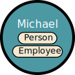
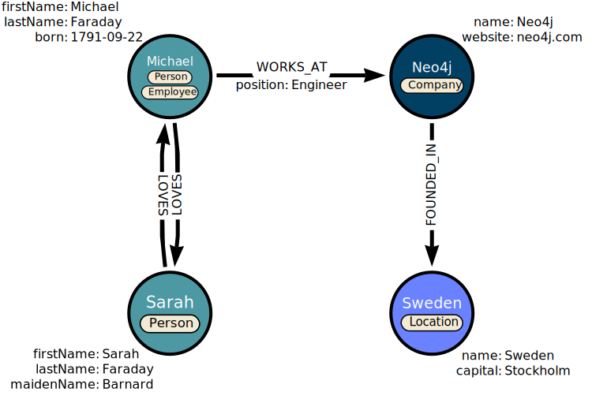

= What is Neo4j?
:type: video
:order: 1

Neo4j is a graph database that stores data in a graph.
Data is stored as nodes and relationships instead of tables or documents.

Graph databases are particularly useful when _the connections between data are as important as the data itself_.

In this lesson, you will learn about graphs and the elements that make up a Neo4j graph database.

== What is a graph

_A graph shows how objects are related to each other._

image:images/large-social-graph.jpg[A large graph showing circles connected to each other by lines]

The objects are referred to as vertices (nodes) connected by edges (relationships).

Neo4j uses the graph structure to store data and is known as a **labelled property graph**.

== Nodes, Relationships, Labels, and Properties

Data within Neo4j is stored and organized using *Nodes*, *Relationships*, *Labels*, and *Properties*.

=== Nodes

*Nodes* are the circles in a graph.
Nodes can represent _objects_, _entities_, or merely _things_.

In a social network, the entities (e.g. people, locations, companies) would be represented by nodes.

Each entity would be would be stored as a separate node in the graph.

=== Labels

Nodes are grouped by or categorized using *labels*. 
Labels describe what the nodes are, for example, `Person`, `Company`, `Location`.

Every node of a type would be given the same label, allowing you to distinguish nodes and filter the graph.

Nodes can have multiple labels, for example, Michael is a `Person` and an `Employee`.

[TIP]
.Use nouns for labels
====
Nodes typically represent things, and should be given a singular noun label. For example, `Product`, `Event`, `Account`.
====

=== Relationships

*Relationships* are the lines in the graph.
Relationships describe how nodes within the graph are connected to each other.

A relationship in Neo4j connects two nodes, referred to as the **start** and **end** nodes.

All relationships have:

* a *type* - `WORKS_AT`, `FOUNDED_IN`.
* a *direction* - Michael `WORKS_AT` Neo4j, Neo4j doesn't work at Michael.

Nodes can have multiple relationships to other nodes.

Multiple relationships can be used to describe bi-directional relationships.

[TIP]
.Use verbs for relationship types
====
You can use a relationship to represent a personal or professional connection (_Person *knows* Person, Person *married to* Person_), to state a fact (_Person *lives in* Location_, _Person *owns* Car_, _Person *rated* Movie_), or even to represent a hierarchy (_Parent *parent of* Child, Software *depends on* Library_).
====

=== Properties

Data can be stored against nodes and relationships as key, value pairs; for example _firstName_, _lastName_, and _position_.

Nodes and relationships can have any number of properties, and do not all have to have the same properties (i.e. Neo4j is schemaless).

== Check your understanding

include::questions/1-what-nodes.adoc[leveloffset=+1]

[.summary]
== Summary

In this lesson, you learned that Neo4j stores and organizes data as a graph using nodes, labels, relationship, and properties.

In the next lesson, you will learn how graph thinking can help you solve problems.

Next, you will learn about some common use cases for graphs.

// TODO: References
