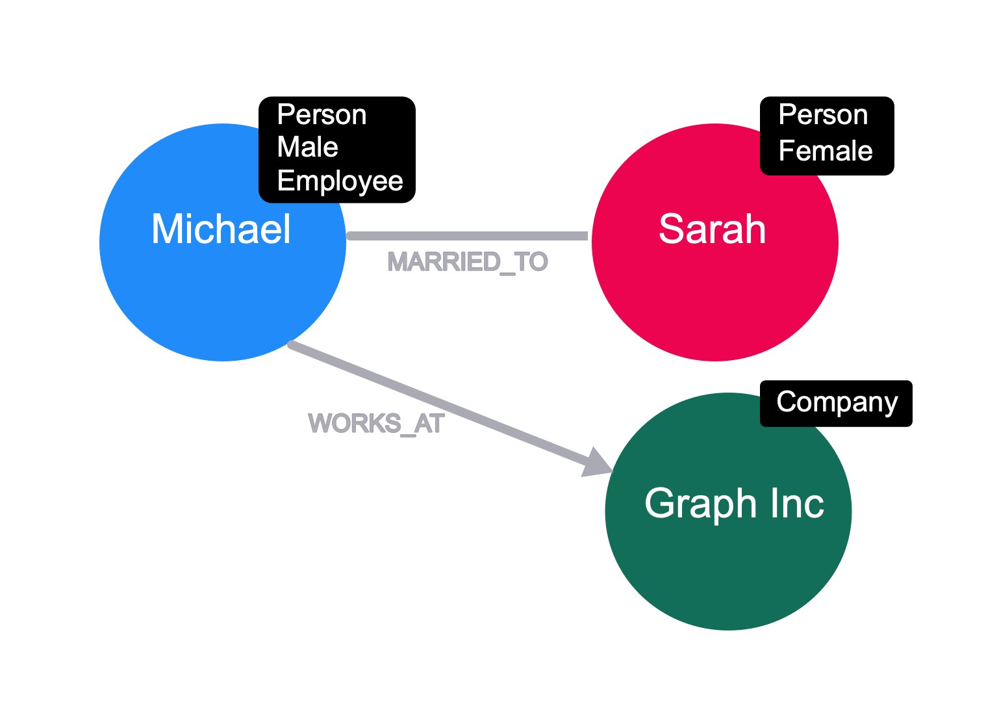
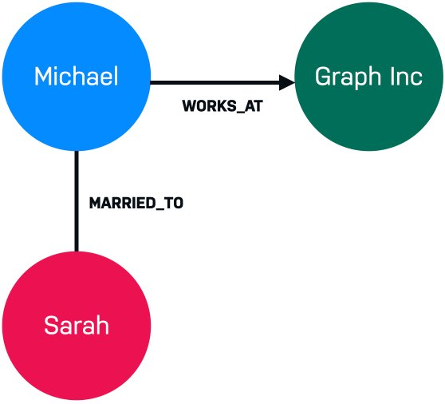

= Graph Elements
:type: video
:order: 2

// [.video]
// video::0CHdIwuGZqI[youtube,width=560,height=315]

[.transcript]
== Graph elements
Let's take a closer look at the two elements that make up a graph and how they relate to Neo4j, an implementation of a **labelled property graph**.

The two elements that make up a graph are:

* Nodes (also known as vertices)
* Relationships (also known as edges)

image::images/large-social-graph.jpg[A diagram representing nodes and relationships]

=== Nodes

*Nodes* (or vertices) are the circles in a graph.
Nodes commonly represent _objects_, _entities_, or merely _things_.

Let's take a social network as an example, where people interact with each other and form relationships of verying strengths.
In a social graph, each **Person** will be stored as a node within the graph.

The diagram to the right has two nodes which represent two people, **Michael** and **Sarah**.
On their own, these elements are uninspiring.
But when we start to connect these circles together, things start to get interesting.

Other examples of nodes in a social graph are Locations, Events, Companies, Products or even Sports Teams.

==== Nodes are grouped by Labels

In Neo4j, nodes can be grouped together using a **Label**.
This is useful for narrowing down on a small subsection of the graph.

In the social graph example, every person will be labelled as a **Person** label to distinguish themselves from nodes of other type, while they may also have additional labels for gender, age group, or labels to group them by their behaviour.

==== Properties

image::images/node-properties.jpg[Nodes with properties]

Nodes hold properties as key, value pairs; for example _firstName_ and _lastName_.

=== Relationships

*Relationships* (or _edges_) are used to describe how nodes within the graph are connected to each other.

==== Weighted & Unweighted Graphs

In theoretical terms a relationships within a graph can be **directed** or **undirected**.

An example of an undirected graph would include the concept of marriage. If *Michael* is married to *Sarah*, then it stands to reason that *Sarah* is also married to *Michael*.

A directed graph adds an additional dimension of information to the graph. Relationships with the same type but in opposing directions carry a different semantic meaning.

For example, although Michael loves Sarah that feeling may not be recipricated, or the strength of the connection may differ in both directions.

In this case, there is a qualifying value attributed to the relationship.
This would be represented with two directed relationships.

Another illustration of the difference would the difference between Facebook's Friends Of Model and Twitter/X's Follower model.

When you add someone as a friend on Facebook, they are also included on your friends list.
When you follow a celebrity on Twitter/X, they may not necessarily follow you back.

==== Relationships in Neo4j

A relationship in Neo4j connects two nodes, referred to as the **start** and **end** nodes.  Each relationship is identified by a **Type** and will also have a **Direction**.

Although the relationship direction exists, it can be omitted from the database query at read-time.

image::images/michael-knows-hans.jpg[Three nodes representing Michael, Sarah and Hans, role=right]

**Michael** works at **Graph Inc**, as denoted by the **WORKS_AT** relationship.  Michael's marriage to **Sarah** is denoted by the *MARRIED_TO* relationship.

All of a sudden, we know that we are looking at the beginnings of some sort of _social graph_.

Now, let's introduce a third person, **Hans**, to our Graph.

**Hans** also _works for_ **Graph Inc** along with Michael.
Depending on the size of the company and the properties of the relationship, we may be able to infer that Michael and Hans know each other.

If that is the case, how likely is it that Sarah and Hans know each other?

These are all questions that can be answered using a graph.

==== Relationships are typically verbs.

We could use a relationship to represent a personal or professional connection (_Person *knows* Person, Person *married to* Person_), to state a fact (_Person *lives in* Location_, _Person *owns* Car_, _Person *rated* Movie_), or even to represent a hierarchy (_Parent *parent of* Child, Software *depends on* Library_).

== Check your understanding

include::questions/1-nodes.adoc[leveloffset=+1]

include::questions/2-relationships.adoc[leveloffset=+1]

[.summary]
== Summary

In this lesson you learned about nodes (vertices) and relationships (edges) that make up a graph.

Next, you will learn about some common use cases for graphs.

// TODO: References
