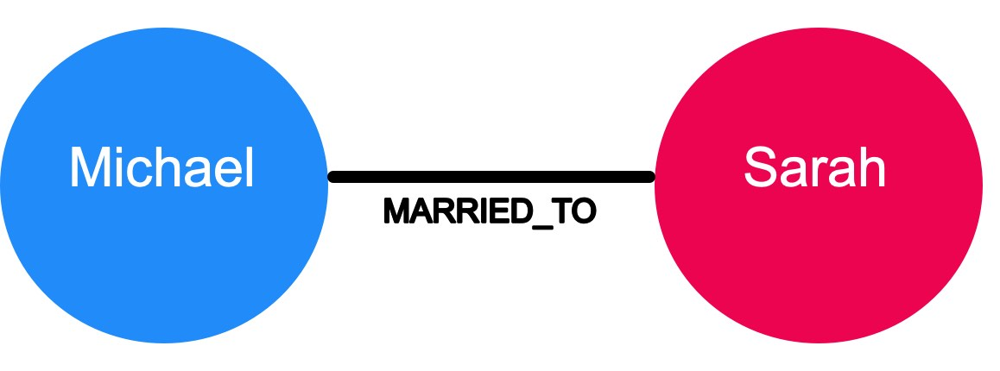
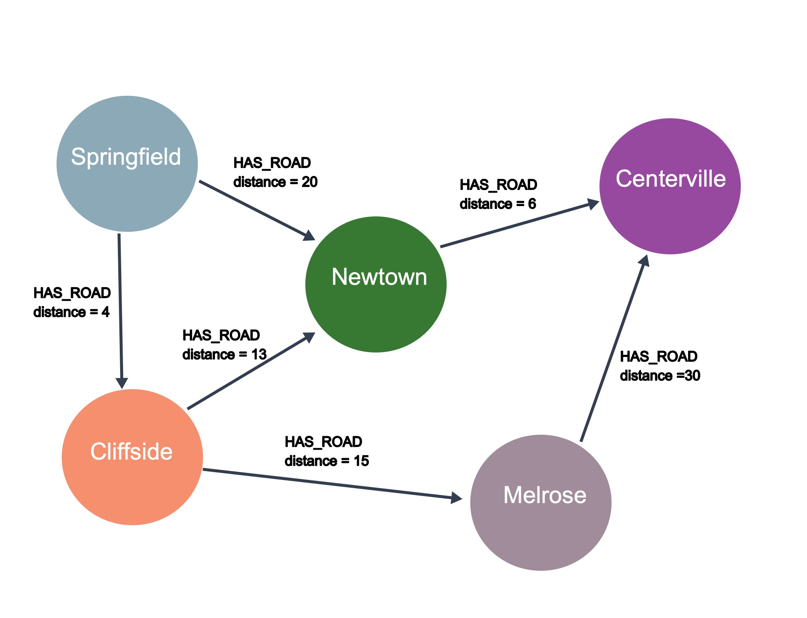

= Graph Structure
:order: 3

[.video]
video::cj8N1VaKtV8[youtube,width=560,height=315]

[.transcript]
== Graph characteristics and traversal

There are a few types of graph characteristics to consider.
In addition, there are many ways that a graph may be traversed to answer a question.

=== Directed vs. undirected graphs

In an undirected graph, relationships are considered to be bi-directional or symmetric.

An example of an undirected graph would include the concept of marriage.
If _Michael_ is married to _Sarah_, then it stands to reason that _Sarah_ is also married to _Michael_.

A directed graph adds an additional dimension of information to the graph.
Relationships with the same type but in opposing directions carry a different semantic meaning.

image::images/michael-sarah-directed.jpg[Michael and Sarah have different strengths of their love, role=left]

For example, if marriage is a symmetrical relationship, then the concept of love is asymmetrical.
Although two people may like or love each other, the amount that they do so may vary drastically.
Directional relationships can often be qualified with some sort of weighting.
Here we see that the strength of the LOVES relationship describes how much one person loves another.

At a larger scale, a large network of social connections may also be used to understand network effects and predict the transfer of information or disease.
Given the strength of connections between people, we can predict how information would spread through a network.

=== Weighted vs. unweighted graphs

The concept of love is also an example of a weighted graph.

In a weighted graph, the relationships between nodes carry a value that represents a variety of measures, for example cost, time, distance or priority.

A basic shortest path algorithm would calculate the shortest distance between two nodes in the graph.
This could be useful for finding the fastest walking route to the local store or working out the most efficient route to travel from city to city.

In this example, the question that we might have for this graph is: What is the shortest drive from Springfield to Centerville?
Using the _HAS_ROAD_ relationships and the distance for these relationships, we can see that the shortest drive will be to start in Springfield, then go to Cliffside, then to Newtown, and finally arrive in Centerville.

More complex shortest path algorithms (for example, Dijkstra's algorithm or A* search algorithm) take a weighting property on the relationship into account when calculating the shortest path.
Say we have to send a package using an international courier, we may prefer to send the package by air so it arrives quickly, in which case the weighting we would take into account is the time it takes to get from one point to the next.

Inversely, if cost is an issue we may prefer to send the package by sea and therefore use a property that represents cost to send the package.

=== Graph traversal

How one answers questions about the data in a graph is typically implemented by traversing the graph.
To find the shortest path between Springfield to Centerville, the application would need to traverse all paths between the two cities to find the shortest one.

* Springfield-Newtown-Centerville = 26
* Springfield-Cliffside-Newtown-Centerville = 23
* Springfield-Cliffside-Melrose-Certerville = 49

Traversal implies that the relationships are followed in the graph.
There are different types of traversals in graph theory that can impact application performance.
For example, can a relationship be traversed multiple times or can a node be visited multiple times?

Neo4j's Cypher query language is optimized for node traversal so that relationships are not traversed multiple times, which is a huge performance win for an application.

== Check your understanding

include::questions/1-traversal.adoc[]

[.summary]
== Summary

In this lesson you learned how graphs are structured where the relationships can have direction and weights.
Next, you will learn about some common use cases for graphs.