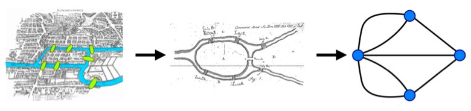
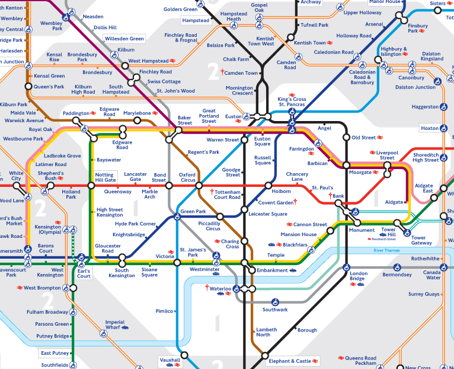

= Graphs Are Everywhere
:type: lesson
:order: 3

== 1736 to the Present Day

Graph databases originate from **graph theory**, a concept created in 1730's Prussia.

The link:https://en.wikipedia.org/wiki/Seven_Bridges_of_K%C3%B6nigsberg[Seven Bridges of Königsberg problem^] asked whether it was possible to walk through the city, crossing each of its seven bridges exactly once without retracing steps.

Euler solved this by representing the landmasses as vertices (nodes) and the bridges as edges (relationships), forming a graph.

He proved that such a path was impossible because the graph required all nodes to have an even number of edges, which was not the case, thus laying the foundation for graph theory.

Graphs allow you to find new information and prove hypothesis.

== Uncover Patterns in your Data

Graphs allow you to uncover patterns in your data, whether that be:

* *Customer*: use customer data, including purchase and engagement history, for recommendations, churn prevention, tailored offers, and targeted ads, enhancing customer retention and revenue growth.
* *Network & Security*: analyze IT asset data to support comprehensive security monitoring and proactive threat response.
* *Employee*: store employee data, including roles, skills, and performance, to support talent development, career management, and resource allocation, helping align workforce capabilities with business needs.
* *Transactions*: capture transactional data to detect illegal activities, supporting anti-money laundering, fraud detection, credit risk assessment, and credit fraud detection by revealing hidden patterns, anomalies, and connections.
* *Product*: centralize product data—such as specifications, sales, customer feedback, and usage—to support personalized recommendations, optimize new product launches, enhance customization, manage inventory, and refine pricing strategies.
* *Suppliers*: store data on supplier performance, inventory, costs, logistics, and compliance to optimize supply chain management, supporting programs like route planning, real-time visibility, inventory planning, and risk analysis.
* *Process*: a graph of process-related data can identify bottlenecks, improve efficiency, automate tasks, and monitor performance by analyzing operational, resource, quality, and cost data.

You can read more link:https://neo4j.com/use-cases/[Neo4j industry and customer uses cases^] at link:https://neo4j.com/use-cases/[neo4j.com/use-cases].

== Knowledge Graphs & Generative AI

Graphs have become an important part in developing Generative AI (GenAI) applications.
GenAI applications need access to the _meaning_ in data, and _knowledge graphs_ can provide this context.

Knowledge graphs provide a structured way to represent entities, their attributes, and their relationships, allowing for a comprehensive and interconnected understanding of the information.

You may not be familiar with the term knowledge graph, but you have probably used one. Search engines typically use knowledge graphs to provide information about people, places, and things.

The following knowledge graph could represent Neo4j:

image::images/neo4j-google-knowledge-graph.svg[An example of a knowledge graph of Neo4j showing the relationships between people, places, and things]

Knowledge graphs can break down sources of information and integrate them, allowing you to see the relationships between the data.

link:https://neo4j.com/generativeai/[There are many use cases for Neo4j and GenAI] including vector search, knowledge graph, and data science.

== Routing

Route planning and transportation is common use case for graphs.

When navigating a public transport network, you are using concepts from graph theory, treating stations or stops as nodes and routes or connections as edges.

By finding the shortest or most efficient paths through this network, you are engaging in problem-solving similar to graph traversal, optimizing your route to reach your destination efficiently.

// TODO: Image

A higher level graph may contain weighted relationships between stops to represent the lines, while a lower level graph may model platforms within stations and services as nodes in the graph.

link:https://neo4j.com/case-studies/transport-for-london/[Transport for London (TfL) use Neo4j to store a digital representation of their transport network^], allowing them to identify bottlenecks and cut congestion in the network.

read::Continue[]

[.summary]
== Summary

In this lesson, you learned about some common use cases for graphs.

In the next module, you will learn how to query a graph database using Cypher.
