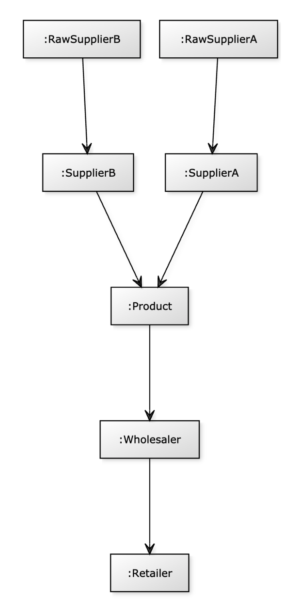

= Graphs Are Everywhere
:order: 4

[.video]
video::dyf8M3NZT8Q[youtube,width=560,height=315]

[.transcript]
== Use cases for graphs
As we discovered previously, the fundamental structure of a graph has applications far beyond mathematics.
In fact, you may have seen the phrase *Graphs are Everywhere* across the link:https://neo4j.com[neo4j.com] website.
It is our hope that you will start to see the connections between things everywhere.

Neo4j hosts a site that contains example graphs (data models) that have been designed by Neo4j engineers and Neo4j Community members.
You can browse the graphgists by use case or industry.
You can also use a graphgist as a starting point for your application's graph.

https://neo4j.com/graphgists/[Explore the Neo4j Graphgists^].

Here are a some commonly-used use cases for Neo4j.

=== E-commerce and real-time recommendations

Many online stores are traditionally built and run on relational databases.
But by adding a graph database, either as a primary data store or as an additional data store, we can start to serve real time recommendations.

The first area that can be improved in e-commerce is the category hierarchy.
To find products in a parent and subsequent child categories can be difficult in a traditional SQL query, or require the duplication of data.
Conversely, this can be represented in a couple of lines of Cypher:

[source,cypher,role=nocopy noplay]
----
MATCH (c:Category)-[:HAS_CHILD|HAS_PRODUCT*1..3]->(p:Product)
RETURN p.id, p.title, collect(c.name) AS categories
----

You may also be familiar with the *People who bought _{Product A}_ also bought...* sections on your favorite online store.
These types of recommendations can be computationally expensive to generate due to the large amount of data that needs to be held in memory.
This creates the need for batch processes to be deployed in order to generate the recommendations.

Where graph databases have the advantage in this use case, is that a much smaller proportion of the graph needs to be traversed in order to generate the recommendation.
You can simply traverse from one Product node, through the users who have purchased that product and onwards to the subsequent products that they have bought.

Given the existing data in the graph about Customers, Orders, and Products, we can infer the rating for a product based upon the number of times the customer ordered a product.

image::images/product-rating-recommendations.png[Product Ratings]

This uses case is described in the Neo4j GraphGist site.
link:https://neo4j.com/graphgists/northwind-recommendation-engine/[View the Northwind Recommendation Engine example GraphGist^,role=more]

=== Investigative journalism

The most prominent user of Neo4j for investigative journalism is the International Consortium of Investigative Journalists (https://icij.org[ICIJ^]).
One such graph that was created by the ICIJ was the Panama Papers.
The purpose of this graph was to identify possible corruption based upon the relationships between people, companies, and most importantly financial institutions.

We have a subset of the Panama Papers investigation in a https://neo4j.com/graphgists/the-panamapapers-example-dataset-president-of-azerbaijan/[Neo4j Graphgist^] representing the family of the Azerbaijan’s President Ilham Aliyev.

image::images/panama-papers-graphgist.png[Panama Papers Graphgist]

The purpose of this graph to enable one to answer these questions:

* What families with the name that contains the string 'aliye' are Officers of Companies?
* How is the family with the name that contains the string 'aliye' related to Companies?
* How are Officers related to each other?
* What are the connections between multiple companies and a family?

Another graph that has been created by the ICIJ  contains information on almost 350,000 offshore entities that are part of the Paradise and Panama Papers and the Offshore Leaks investigations.
The Offshore Leaks data exposes a set of connections between people and offshore entities.
You can play with this graph by creating a https://sandbox.neo4j.com/?usecase=icij-paradise-papers/[Paradise Papers Sandbox^] and querying the data.

=== Network and IT operations

Many enterprises use Neo4j to help them understand how information flows through a system and how components of a network are related.
This is useful for planning, analysis of costs, and also to troubleshoot problems when a problem arises.

One of our Neo4j Community members contributed this sample data model to demonstrate how one might use a graph to identify network dependencies.
Here is the data model:

image::images/network-graphgist.png[Network Dependency Graphgist]

You can use this type of data model to answer:

* What are the direct dependencies of public websites?
* What are the direct dependencies of internal websites?
* What is the most depended-upon component?
* Find the dependency chain for a business critical component.
* What is the impact of removing a server?

https://neo4j.com/graphgists/network-dependency-graph/[View the Network Dependency Graphgist].

=== Transportation and logistics

Here is an example data model contributed by a Neo4j Community member related to supply chain management.
Entities that are modeled include raw suppliers, suppliers, products, wholesalers, and retailers.
All of these entities are located somewhere and there is a distance between them that will impact how quickly products can be transported.

With this graph, one can answer these questions:

* Who is the best wholesaler for each retailer based upon distance?
* Which raw supplier will give a particular retailer the freshest products?
* Which retailer provides locally grown products?
* How can we rate each supply chain?

https://neo4j.com/graphgists/supply-chain-management/[View the Supply Chain Management Graphgist].

== Check your understanding

include::questions/1-use-cases.adoc[]