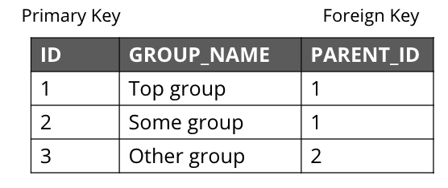

= Benefits of Neo4j Native Graph Database
:order: 2

[.video]
video::xxxx[youtube,width=560,height=315]

[.transcript]
== Neo4j is a native graph database

Neo4j is a native graph database, meaning that everything from the storage of the data to the query language have been designed specifically with traversal in mind.

Where native graph databases stand apart from other databases is the concept of **index-free adjacency**.
When a database transaction is committed, a reference to the relationship is stored with the nodes at both the start and end of the relationship.
As each node is aware of every incoming and outgoing relationship connected to it, the underlying graph engine will simply chase pointers in memory - something that computers are exceptionally good at.

== Index-free adjacency (IFA)

One of the key features that makes Neo4j graph databases different from an RDBMS is that Neo4j implements
*index-free adjacency*.

To better understand the benefit of index-free adjacency, let's look at how a query executes in an RDBMS.
Suppose you have this table in the RDBMS:

You execute this SQL query to find the third-degree parents of the group with the ID of 3:

[source,SQL,role=noplay nocopy]
----
SELECT PARENT_ID
FROM GROUPS
WHERE ID = (SELECT PARENT_ID
    FROM GROUPS
    WHERE ID = (SELECT PARENT_ID
        FROM GROUPS
        WHERE ID = 3))
----

The result of this query is 1, but in order to determine this result, the query engine needed to:

. Locate the innermost clause.
. Build the query plan for the subclause.
. Execute the query plan for the subclause.
. Locate the next innermost clause.
. Repeat Steps 2-4.

Resulting in:

* 3 planning cycles
* 3 index lookups
* 3 DB reads

With index-free adjacency, Neo4j stores nodes and relationships as objects that are linked to each other via pointers.
Conceptually, the graph looks like:

image::images/IFA-1-new.png[IFA-1-new,width=400,align=center]

These nodes and relationships are stored as:

image::images/IFA-2-new.png[IFA-2-new,width=400,align=center]

Suppose we had this query in Cypher:

[source,Cypher,role=noplay nocopy]
----
MATCH (n) <-- (:Group) <-- (:Group) <-- (:Group {id: 3})
RETURN n.id
----

Using IFA, the Neo4j query engine starts with the anchor of the query which is the Group node with the id of 3.
Then it uses the links stored in the relationship and node objects to traverse the graph pattern.

image::images/IFA-3-new.png[IFA-3-new,width=400,align=center]

To perform this query, the Neo4j query engine needed to:

* Plan the query based upon the anchor specified.
* Use an index to retrieve the anchor node.
* Follow pointers to retrieve the desired result node.

The benefits of IFA compared to relational DBMS access, there are:

* Much fewer index lookups or table scans.
* Reduced duplication of foreign keys.
