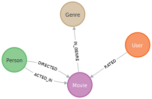
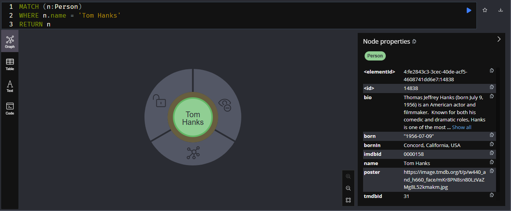
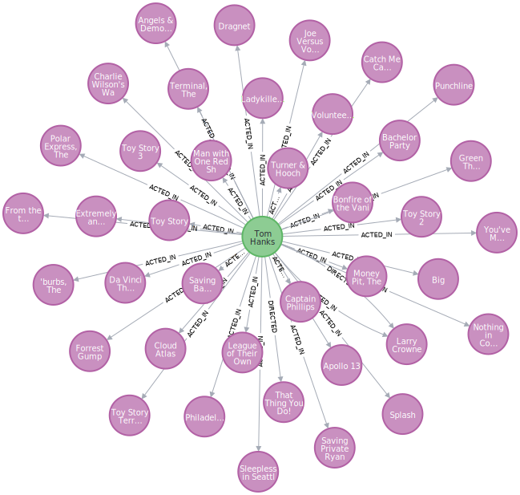
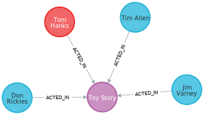
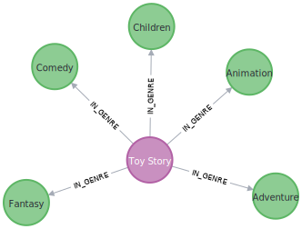
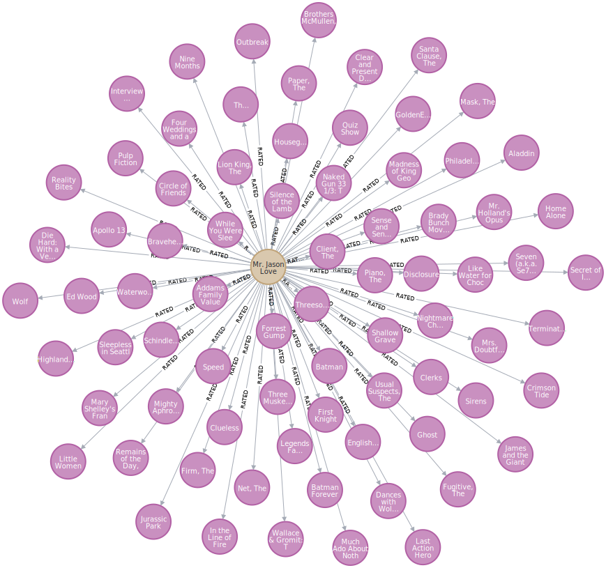

= Reading Graphs
:type: video
:order: 1
:sandbox: true

GraphAcademy has created a link:https://sandbox.neo4j.com[Neo4j database instance^] for you to explore.

The graph database contains: 

* Movies, actors and directors from link:https://www.themoviedb.org/[The Movie Database (TMDB)^].
* Movie ratings by users of the website.

The graph is structure with the following nodes and relationships:

== People

The graph contains 19047 nodes with a `:Person` label.
Each of these may have one or more outgoing `:ACTED_IN` and `:DIRECTED` relationships to a node with a `:Movie` label.

Each `Person` node has an unique `name` property, as well as other properties such as `bio` and `born`.`

Run the following Cypher statement to find a `Person` node with the `name` attribute 'Tom Hanks'.

[source,cypher]
.Tom Hanks
----
MATCH (n:Person)
WHERE n.name = 'Tom Hanks'
RETURN n
----

View the node properties by selecting the node. 

Expand the node's relationships by doubling click the node.

You will see that there are `ACTED_IN` and `DIRECTED` relationships to `Movie` nodes.

== Movies

Each `Movie` node has a unique `title` property, as well as other properties including `plot`, `released` and `url`.

Run the following Cypher statement to find the movie 'Toy Story' and the people who acted in the movie.

[source,cypher]
----
MATCH (m:Movie)<-[r:ACTED_IN]-(p:Person)
WHERE m.title = 'Toy Story'
RETURN m, r, p
----

The query uses the `[ACTED_IN]` relationship to find `Person` nodes who have a connection to the `Movie` node.

Movies are categorized into one or more genres.
For example, Toy Story is categorized as Adventure, Animation, Children, Comedy and Fantasy.

This Cypher statement uses the `[IN_GENRE]` relationship to find related `Genre` nodes.

[source,cypher]
.Movie Genres
----
MATCH (m:Movie)-[r:IN_GENRE]->(g:Genre)
WHERE m.title = 'Toy Story'
RETURN m, r, g
----

Experiment with these queries. Try and find different movies and people, for example, the `Movie` node `Babe` or the `Person` node `Emma Stone`.

== User Ratings

The graph contains 671 users and over 100k ratings.

Review this Cypher statement before running it and predict what graph will be returned.

[source,cypher]
----
MATCH (u:User)-[r:RATED]->(m:Movie)
WHERE u.name = "Mr. Jason Love"
RETURN u, r, m
----

[%collapsible]
.Click here to reveal the result
====
The statement returns all the movies that have been rated by the user "Mr. Jason Love".

====

The **rating** the user has given for the movie is stored as a property on the `RATED` relationship.

You can return tabular data by returning the properties of the nodes.

Run this Cypher statement to return a table of movie ratings:

[source,cypher]
----
MATCH (u:User)-[r:RATED]->(m:Movie)
WHERE u.name = "Mr. Jason Love"
RETURN u.name, r.rating, m.title
----

The properties are defined in the `RETURN`, for example `u.name` will return the `name` property of the `User` node.

[cols="3",options=header]
|===
|u.name|r.rating|m.title
|"Mr. Jason Love"|3.0|"Houseguest"
|"Mr. Jason Love"|3.0|"Ed Wood"
|"Mr. Jason Love"|4.0|"Little Women"
|"Mr. Jason Love"|4.0|"Interview with the Vampire: The Vampire Chronicles"
|"Mr. Jason Love"|5.0|"Circle of Friends"
|===

// Maybe lose
// [TIP]
// ====
// You can view the database schema by running the following Cypher statement in the integrated query window to the right.

// [source,cypher]
// ----
// CALL db.schema.visualization()
// ----

// This is a built-in procedure that examines the database and returns the labels, relationship types and properties held in the database.

// You may notice that the `:Actor` and `:Director` nodes in the visualization have the same relationship types.

// For the purpose of the visualization, these are treated as different nodes but in the context of the database a `Person` can an `Actor`, `Director`, or both.

// This is an example of using multiple labels on a single node.
// ====

== Check Your Understanding

include::./questions/1-nodes.adoc[leveloffset=+1]

[.summary]
== Summary

In this lesson, you learned explored the nodes and relationships in the movie recommendations dataset.

In the next lesson, you will learn how to find patterns in the data using Cypher.
