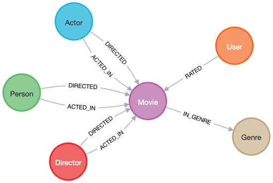

= The Movie Graph
:order: 1
:sandbox: true

GraphAcademy has created a Neo4j sandbox instance for you to play around with.
The graph contains a dataset of movies, actors and directors from link:https://www.themoviedb.org/[The Movie Database (TMDB)^].
The graph also contains ratings that users on the website have given to movies.

You can view the database schema by running the following Cypher statement in the integrated query window to the right.

[source,cypher]
----
CALL db.schema.visualize()
----

This is a built-in procedure that examines the database and returns the labels, relationship types and properties held in the database.

== People

The graph contains 19047 nodes with a `:Person` label.
Each of these may have one or more outgoing `:ACTED_IN` and `:DIRECTED` relationships to a node with the label `:Movie`.

Each `Person` node has a `name` property, which has been indexed to ensure that we can quickly look-up people by name.

Each `Movie` node has a `title` property, and may contain a number of other properties including `plot`, `released` and `url` which contains a link to its page on link:https://www.themoviedb.org/[TMDB^].

The following Cypher statement will find the node for Tom Hanks.

[source,cypher]
.Tom Hanks
----
MATCH (n:Person)
WHERE n.name = 'Tom Hanks'
RETURN n
----

You can double-click the node to view the movies that he has acted in and directed.

[TIP]
.People, Actors and Directors
====
You may have noticed that the `:Actor` and `:Director` nodes in the visualization have the same relationship types.
For the purpose of the visualization, these are treated as different nodes but in the context of the database a person can an actor, director, or both.
This is an example of using labels to identify a subset of the graph to enhance performance.
====

== Movies

Movies are categorised into one or more genres.
For example, Toy Story is categorized as Adventure, Animation, Children, Comedy and Fantasy.

[source,cypher]
.Movie Genres
----
MATCH (m:Movie)-[:IN_GENRE]->(g)
WHERE m.title = 'Toy Story'
RETURN m, g
----

== User Ratings

The graph contains 671 users and over 100k ratings.

The **rating** the user has given for the movie is stored as a property on the relationship.
This is an example of a more natural data modeling mentioned in the previous model.
It is easy for a non-technical user to understand the data model.

// TODO: Re-implement tabs...
[.tab]
.Result
====
image::images/ratings.png[Ratings for Mr Love]
====

[.tab]
.Cypher
====

[source,cypher]
----
MATCH (u:User {name: "Mr. Jason Goodlove"})-[r:RATED]->(m:Movie)
RETURN u, r, m
----

====

== Check Your Understanding

include::./questions/1-nodes.adoc[leveloffset=+1]

[.summary]
== Summary

In this lesson, you learned explored the nodes and relationships in the movie recommendations dataset.

In the next lesson, you will learn how to find patterns in the data using Cypher.
