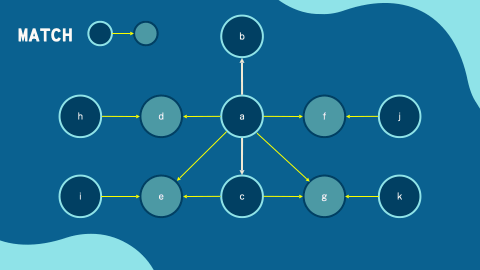

= Pattern Matching
:order: 2

== Graph Traversals

Cypher is a **declarative** query language that allows you to identify **patterns** in your data using an **ASCII-art style syntax** consisting of **brackets**, **dashes** and **arrows**.

Here is an example of a pattern that matches all nodes with a label of `Person`, that have an _outgoing_ `ACTED_IN` relationship to a node wiith a label of `:Movie`.

[source,cypher,rel="nocopy, noplay"]
----
MATCH (a:Person {name: "Tom Hanks"})-[r:ACTED_IN]->(m:Movie)
RETURN a, r, m
----

The statement uses the `MATCH` clause to find the pattern in the database.

Let's break the statement down.

=== Nodes

Nodes in the pattern are expressed with parentheses ( `(` and `)`).
Inside the parentheses you can define information about the node, for example the label(s) or properties the node should contain.

==== Labels

Labels are prefixed a colon (`:`).
The statement contains two nodes `(:Person)` and `(:Movie)`.

=== Relationships

Relationships are drawn with two dashes (`--`) and an arrow to specify the direction (`<` or `>`).

Similar to nodes, relationship information is contained within square brackets (`[` and `]`).
The relationship type is preceded by a colon `:`.

=== Variables

The nodes and relationships in the statement are assigned to variables.
These variables are positioned before the information about the node or relationship.

* `a` - the `:Person` node
* `r` - the `:ACTED_IN` relationship
* `m` - the `:Movie` node

These variables are used to specify the properties returned by the query in the `RETURN` clause.

== How Cypher Works

// Cypher's `MATCH` clause is used to find patterns in the data.

When you specify a pattern, the underlying query engine will use the database schema and database statistics to determine how best to execute the statement.

Once one or more *start nodes* at the start of the pattern are identified, the relationships of the node will be expanded by type and direction.
The underlying datastore saves these relationships as pointers against the the nodes at the start and the end of the relationship, meaning the relationships can be **traversed** without relying on an underlying index.

This is known as **Index-free Adjacency** (**IFA**).
This is what makes Neo4j queries more performant in relation to `JOIN`s in relational databases.

== Pattern `MATCH`-ing

The `MATCH` clause is used to find patterns in the data.
Patterns can be a simple as a single node, or contain multiple relationships.

The following example finds all people who have acted in a movie with Tom Hanks, and uses the `RETURN` clause to define the properties.

[source,cypher]
.Actors who acted with Tom Hanks
----
MATCH (p:Person)-[:ACTED_IN]->(m:Movie)<-[r:ACTED_IN]-(p2:Person)
WHERE p.name = 'Tom Hanks'
RETURN p2.name AS actor, m.title AS movie, r.roles AS roles
----

Here are the equivalent SQL and Cypher statements side-by-side.

[cols="1,1"]
|===
| SQL | Cypher
| SELECT p2.name, r2.roles, m.title +
FROM people p +
INNER JOIN roles r on p.id = r.person_id  +
INNER JOIN movies m on r.movie_id = m.id  +
INNER JOIN roles r2 on m.id = r2.movie_id +
INNER JOIN people p2 on r2.person_id = p2.id
WHERE p.name = 'Tom Hanks'

| MATCH (p:Person)-[r:ACTED_IN]->(m:Movie)  +
WHERE m.title = ‘The Matrix’  +
RETURN p.name, p.born, r.roles  +
|===

== Try it yourself

Emil Eifrem, Neo4j's CEO, has added himself to the graph as an actor in his favorite movie.
Can you find out which movie is his favorite?

include::questions/1-finding-emil.adoc[leveloffset=+1]

[.summary]
== Summary

In this lesson, you learned how to read data from Neo4j.

In the next lesson, you will learn how to create data.
