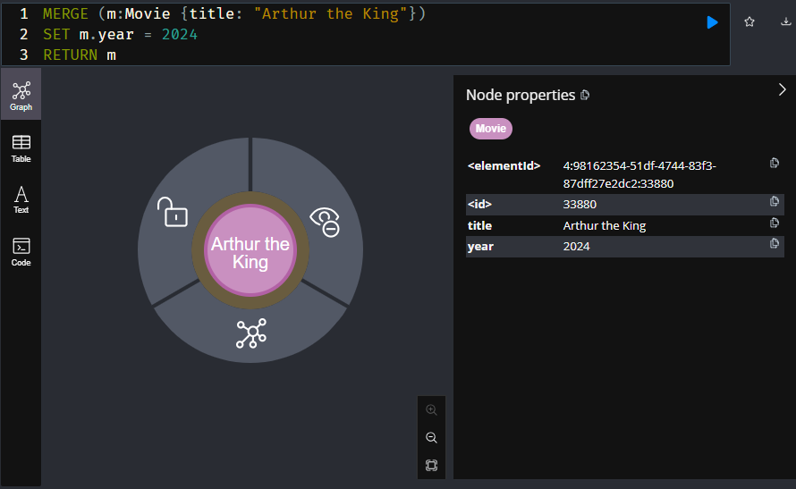
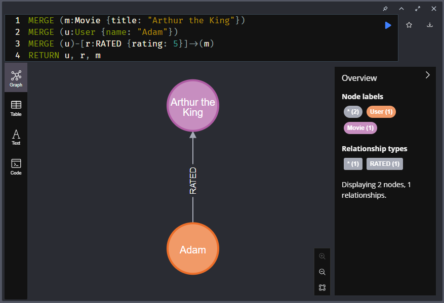

= Creating Graphs
:order: 3
:type: video

You have used the `MATCH` clause to find patterns and read data from Neo4j.

In this lesson, you will learn how to create data.

The database is out of date - the latest movie is link:https://www.themoviedb.org/movie/339527-solace[Solace^] which was released in September 2016.

.Latest Movies
[source,cypher]
----
MATCH (m:Movie)
WHERE m.released IS NOT NULL
RETURN m.title AS title, m.url AS url, m.released AS released
ORDER BY released DESC LIMIT 5
----

[%headers]
|===
|	title |	url |	released

| "Solace"	|  "https://themoviedb.org/movie/339527" | "2016-09-02"
| "Mohenjo Daro" | "https://themoviedb.org/movie/402672" | "2016-08-12"
| "Rustom" | "https://themoviedb.org/movie/392572" | "2016-08-12"
| "Ben-hur" | "https://themoviedb.org/movie/271969" | "2016-08-12"
| "Suicide Squad" | "https://themoviedb.org/movie/297761" | "2016-08-05"

|===

Your challenge is to add your favorite movie to the database.

To create nodes and relationships in the database, you use the `MERGE` clause.

== The `MERGE` Clause

You can use the `MERGE` clause to create a pattern in the database.
`MERGE` will only create the pattern if it doesn't already exist.

=== Create a Movie node

Review this Cypher statement, that uses `MERGE` to create a new node:

[source,cypher]
----
MERGE (m:Movie {title: "Arthur the King"})
SET m.released = date("2024-03-15")
RETURN m
----

You should be able to identify that:

* The `MERGE` clause is used.
* The pattern creates a node with the label `Movie` - `(m:Movie)`
* The `title` is included as part of the pattern - `{title: "Arthur the King"}`
* A single property `released` being set to a `date` - `SET m.released = date("2024-03-15")`

Run the statement to create the new node.

The new node is returned and you can view the set properties.

=== Create a RATED relationship

Relationships are created by expressing a pattern that connects two nodes.

Review this Cypher statement:

[source,cypher]
----
MERGE (m:Movie {title: "Arthur the King"})
MERGE (u:User {name: "Adam"})
MERGE (u)-[r:RATED {rating: 5}]->(m)
RETURN u, r, m
----

The statement creates:

* A `Movie` node
+ 
`MERGE (m:Movie {title: "Arthur the King"})`.
* A `User` node
+
`MERGE (u:User {name: "Adam"})`.
* A `RATED` relationship between them, that has a `rating` property of `5`
+
`MERGE (u)-[r:RATED {rating: 5}]->(m)`.

Run the statement to create the nodes and relationship.

[NOTE]
.Merging
====
The properties included within the pattern are used to identify an existing node or relationship before creating.

Running this query multiple times would only result in the nodes and relationship being created once.
`MERGE` checks to see if the pattern exists before creating it.
====

Experiment with these queries, create your own `Movie` node, add a `User` node for yourself, and `RATED` relationship between them.

// [TIP]
// .Inline Where Clause
// ====
// This statement uses JSON-style syntax to specify the `WHERE` clause as part of the `MATCH` clause:

// [source,cypher,role=noplay nocopy]
// MATCH (m:Movie {title: "Arthur the King"})

// This is identical to using a `WHERE` clause.

// [source,cypher,role=noplay nocopy]
// MATCH (m:Movie)
// WHERE m.title = "Arthur the King"
// ====

// include::questions/verify.adoc[leveloffset=+1]

read::Continue[]

[.summary]
== Summary

In this lesson, you learned how to use the `CREATE` clause to create nodes and relationships.

In the link:/courses/cypher-fundamentals/[Cypher Fundamentals course^] you will learn more about reading and writing data to Neo4j.

In the next module you will learn how to get started with Neo4j and explore the Neo4j ecosystem.
