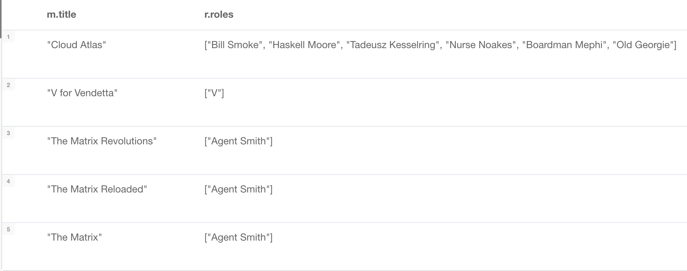

= The Movie Graph
:type: video
:order: 1

[.video]
video::FGFUX4ee9Fg[youtube,width=560,height=315]

[.transcript]
== The Movie graph

Throughout the courses of GraphAcademy, you will use some version of the Movie database to gain experience with Neo4j.
In this lesson you will learn about the data in the "starter" Movie database that is used when you are learning Cypher for the first time.

=== Nodes

The nodes in the Movie database represent people, movies, and in some versions of the Movie database, genres for the movies.

image::images/movie-nodes.png[Nodes in the Movie database, role=left]

The "starter" version of the Movie database contains 171 nodes:

* 38 Movie nodes (nodes with the label Movie)
* 133 Person nodes (nodes with the label Person)

This is the database you use to first learn Cypher.

==== Node properties

image::images/movie-properties.png[Properties of Movie nodes, role=right]

All _Movie_ nodes have a property, _title_ that is used to uniquely identify a movie.
This property exists for all _Movie_ nodes.

Other properties that a _Movie_ node may have are:

* _released_, the year that the movie was released.
* _tagline_, a phrase to describe the movie.

So for example, we see in these two Movie nodes, they both have a _title_ and _released_ property, but only one of them has a _tagline_ property.

image::images/person-properties.png[Properties of Person nodes, role=left]

All _Person_ nodes have a property, _name_ that is used to uniquely identify a person.
Some _Person_ nodes have a property, _born_, but not all of them.

=== Relationships

As you have learned, the most important element of a graph database is its relationships.
A relationship has a type and a direction and represents the relationship between two specific nodes.

Some of the relationships in the "starter" Movie graph include:
////
* _ACTED_IN_: Used to represent that a specific person acted in a specific movie. (172 relationships)
* _DIRECTED_: Used to represent that a specific person directed a specific movie. (44 relationships)
* _WROTE_: Used to represent that a specific person wrote a specific movie. (10 relationships)
* _PRODUCED_: Used to represent that a specific person produced a specific movie. (15 relationships)
////

[cols="25,45,20", options="header"]
|====
|*Relationship type*
|*Description*
|*Number in graph*
|ACTED_IN
|A Person acted in a Movie
|172
|DIRECTED
|A Person directed a Movie
|44
|WROTE
|A Person wrote a Movie
|10
|PRODUCED
|A Person produced a Movie
|15
|====

A person can have multiple relationships to a movie. For example, a person can be both an actor and a director for a particular movie.
In the Movie graph, people are either actors, directors, writers and/or producers given these relationships.

image::images/hoffa.png[width=800,The movie Hoffa]

So, for example, the movie "Hoffa" in the Movie graph has these relationships.
It has four actors and one director. Danny DeVito directed and acted in this movie.
In our "starter" Movie graph, this movie has no writers or producers defined.

Other relationships in the graph include:
////
* _REVIEWED_: Used to represent that a specific person reviewed a specific movie. (9 relationships)
* _FOLLOWS_: Used to represent that a specific person follows another specific person. (3 relationships)
////

[cols="25,45,20", options="header"]
|====
|*Relationship type*
|*Description*
|*Number in graph*
|REVIEWED
|A Person reviewed a Movie
|9
|FOLLOWS
|A Person follows another Person
|3
|====

Using these relationships, people can be reviewers, followers, or followees.
In the Movie graph, people who review movies or follow other people are *not* actors, directors, writers, or producers.

Here are the reviewers in our "starter" Movie graph:

image::images/reviewers.png[Some movie reviewers]

We have three _Person_ nodes here for people who reviewed movies.
All three of these reviewers reviewed the movie, The Replacements.
Two people here are following Jessica Thompson.

==== Relationship properties

The _ACTED_IN_ relationship may have the _roles_ property that represents the roles that an actor had when s/he acted in a specific movie.

For example, in the "starter" Movie database, the actor, Hugo Weaving, has these properties defined for each of his _ACTED_IN_ relationships to these movies:

For movie reviewers, the _REVIEWED_ relationship has the _rating_ and _summary_ properties:

image::images/reviewed-properties.png[Reviewed properties]

== Check your understanding

include::questions/1-nodes.adoc[]
include::questions/2-relationships.adoc[]

[.summary]
== Summary

In this lesson you learned about the data model and data in the Movie graph.
Next, you will review the learning objectives of this course and how to learn more.
