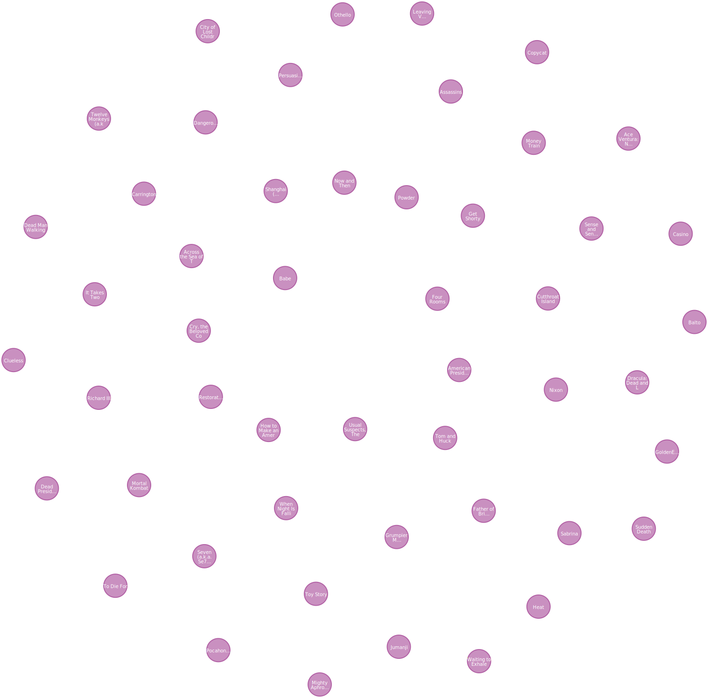

= The Movie Graph
:type: lesson
:order: 1
:sandbox: true

GraphAcademy has created a Neo4j sandbox instance for you.
The graph contains a small dataset of movies and people.

In this lesson, you will explore the graph and use Cypher to query it.

== Nodes

The graph contains nodes labeled `Movie` and `Person`.

Neo4j includes a query language called Cypher that allows you to query the graph.

Run the following Cypher query to return all `Movie` nodes in the graph:

[source,cypher]
----
MATCH (m:Movie) RETURN m
----

You will see all the `Movie` nodes returned as a graph.

You can see a node's properties by clicking on it.
`Movie` nodes have properties like `title`, `released`, and `tagline`.

Try modifying the query to return `Person` nodes instead of `Movie` nodes.

[%collapsible]
.Click to reveal the query
====
The following query would return all the `Person` nodes in the graph.
The query uses `Person` label to filter the nodes.
The variable `p` represents the `Person` nodes in the query.

[source,cypher]
----
MATCH (p:Person) RETURN p
----
====

You can filter the nodes returned by adding a condition to the query.
For example, you can filter `Movie` nodes by the `title` property.

[source,cypher]
----
MATCH (m:Movie {title: 'The Matrix'}) RETURN m
----

== Relationships

The relationships between nodes describe how people are related to movies.
For example, `Person` nodes have `ACTED_IN` and `DIRECTED` relationships with `Movie` nodes.

The movie 'Hoffa' is a `Movie` node with relationships to `Person` nodes who acted in and directed the movie.

image::images/hoffa.png[A graph showing a Movie node titled 'Hoffa' with ACTED_IN and DIRECTED_IN relationships to Person nodes]

Run this Cypher query to return the `Movie` node 'Hoffa' and `Person` nodes with an `ACTED_IN` relationship to the movie:

[source,cypher]
----
MATCH (m:Movie {title: "Hoffa"})<-[r:ACTED_IN]-(p:Person) 
RETURN m, r, p
----

[TIP]
.View relationships
====
You can double-click on nodes to see their relationships with other nodes.
====

Try modifying the query to return the movie "Top Gun".

[%collapsible]
.Click to reveal the query
====
The following query would return the movie node "Top Gun" and the `Person` nodes with an `ACTED_IN` relationship to the movie.
The query uses the `title` property of the `Movie` node to filter the nodes.
The variable `m` represents the "Top Gun" `Movie` node, `r` is the `ACTED_IN` relationship, and `p` is the `Person` nodes.

[source,cypher]
----
MATCH (m:Movie {title: "Top Gun"})<-[r:ACTED_IN]-(p:Person) 
RETURN m, r, p
----
====

== Properties

Nodes and relationships have properties that describe them.
For example, `Person` nodes have properties like `name` and `born`, `Movie` nodes have properties like `title` and `released`.
Relationships in Neo4j can also have properties, the `ACTED_IN` relationship has a `roles` property, storing the role the person played in the movie.

Run the following Cypher to return the movie `title` and person's `name` who acted in the movie "Top Gun":

[source,cypher]
----
MATCH (m:Movie {title: "Top Gun"})<-[r:ACTED_IN]-(p:Person) 
RETURN m.title, p.name
----

Note how the query returns the data as a table, rather than a graph, of the movie title and person's name.

Try modifying the query to return the `roles` property of the `ACTED_IN` relationship.

[%collapsible]
.Click to reveal the query
====
The query includes `r.roles` in the return.
The `r` variable represents the `ACTED_IN` relationship, and `r.roles` returns the `roles` property of the relationship.

[source,cypher]
----
MATCH (m:Movie {title: "Top Gun"})<-[r:ACTED_IN]-(p:Person) 
RETURN m.title, p.name, r.roles
----
====

You can learn more about Cypher in the Neo4j GraphAcademy link:https://graphacademy.neo4j.com/courses/cypher-fundamentals[Cypher Fundamentals^] course.

== Check your understanding

include::questions/1-nodes.adoc[leveloffset=+2]

[.summary]
== Summary

In this lesson, you explored a Neo4j graph containing movies and people.