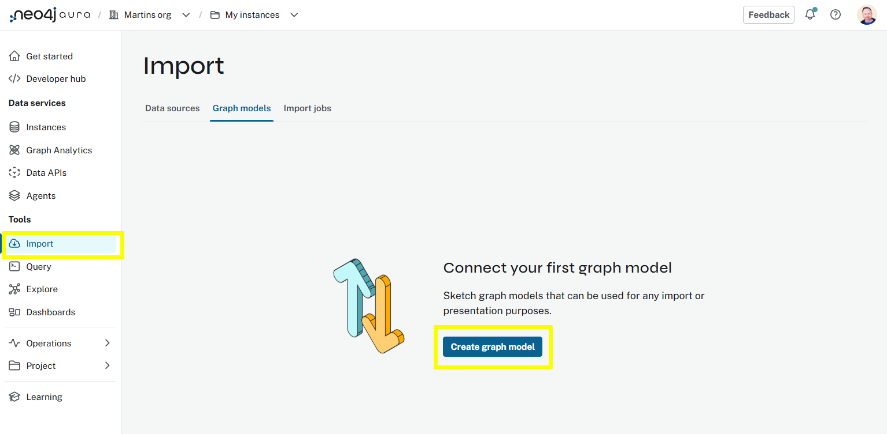
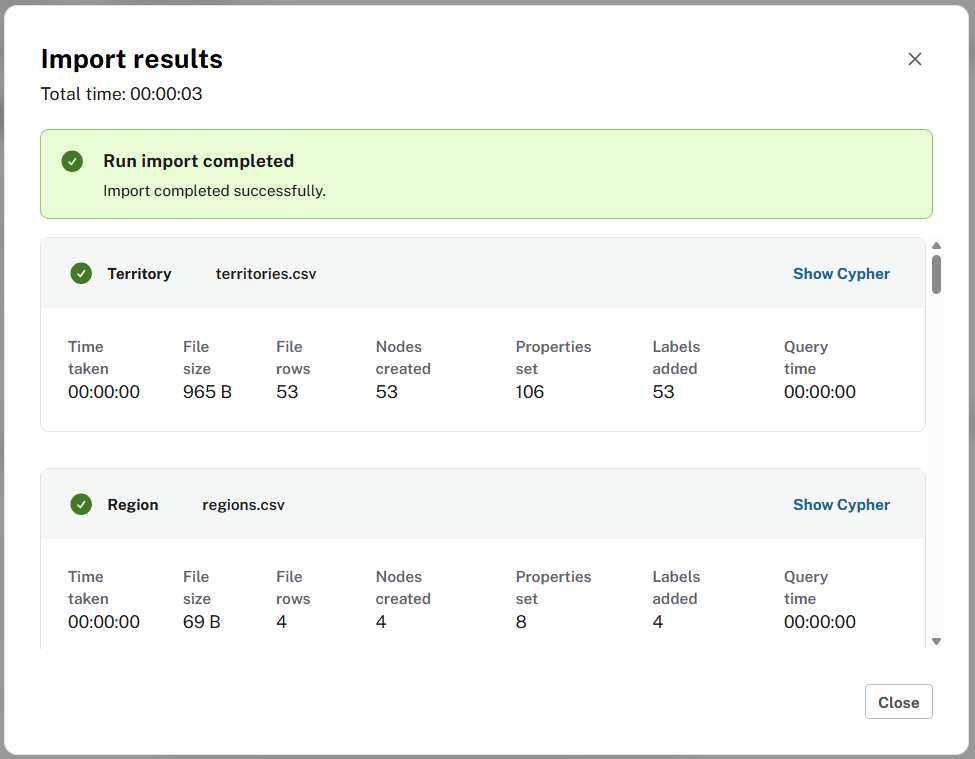
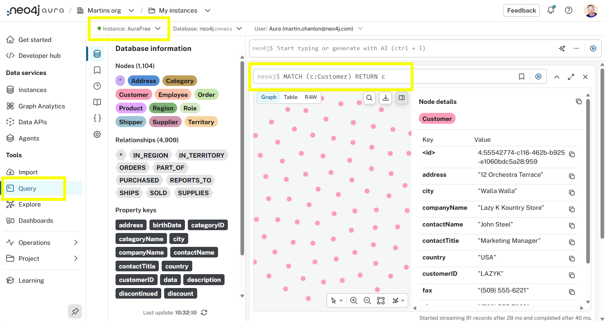

= Open model with data
:type: lesson
:order: 1
:slides: true

[.slide.discrete]
== Introduction

In this lesson, you load the Northwind dataset using **Open model (with data)** so the tables, files, and graph structure arrive together in the Import tool.

You will:

. Download the packaged Northwind graph model.
. Open the Import tool, create a graph model, and open the package with data.
. Run the import into your Aura instance.

[.slide.col-60-40]
== Northwind dataset

[.col]
====
The Northwind dataset describes a fictional company, Northwind Traders, that distributes specialty foods worldwide.

The graph includes Customers, Orders, Products, Categories, Employees, and related nodes and relationships.
====

[.col]
====
[source, mermaid]
.Northwind graph model (high level)
----
include::diagrams/northwind-graph-model.mermaid[]
----
====

[.slide]
== Download the package

link:https://raw.githubusercontent.com/neo4j-graph-examples/northwind/refs/heads/main/import/northwind-complete.zip[Download northwind-complete.zip^]

Complete Northwind graph model with CSV data bundled for import.

[.slide]
== Open the Import tool

. Open the *Import* tool in Aura and select *Graph Models*.
+
console::Open Import Tool[tool=import]

[.slide]
== Create a graph model

Create a *new* graph data model before you attach the file.

[.slide.col-2]
== Open model (with data)

[.col]
====
. Open the `...` menu on the graph model.
. Select *Open model (with data)*.
. Choose the `northwind-complete.zip` file you downloaded.
====

[.col]
image::images/open-model-with-data-annotated.png["Menu with Open model (with data) highlighted"]

[.slide]
== Review the package

Confirm you see the CSV files and the graph model in the Import tool.

image::images/complete-import.png["Import tool showing files and graph model"]

[.slide]
== Run import

Click *Run import* to start loading data into Aura.

[.slide]
== Select your instance

Pick the Aura instance that should receive the graph.

image::images/select-aura-instance.png["Dialog to select the Aura instance"]

[.slide]
== Credentials and summary

Enter credentials if prompted.

When the run finishes, read the import summary.

[.slide.col-2]
== Confirm in Query

[.col]
====
Open the *Query* tool and connect to the same instance.

console::Open Query Tool[tool=query]

[source, cypher, role=noplay]
.Customer sample
----
MATCH (c:Customer)
RETURN c
LIMIT 5
----
====

[.col]

[.next]
== Next

read::Continue[]

[.summary]
== Lesson Summary

In this lesson, you loaded Northwind using **Open model (with data)** and ran the import into Aura.

In the next lesson, you will run short Cypher checks on the graph.
