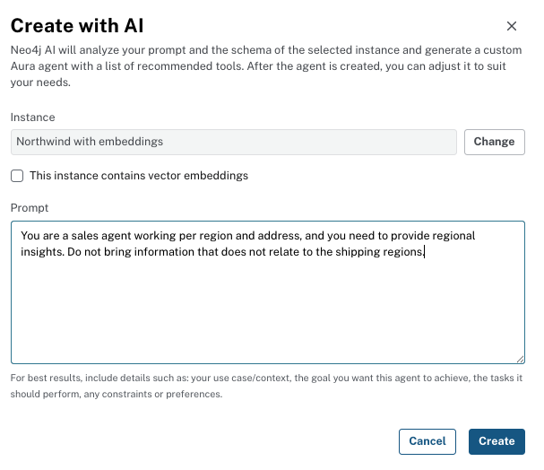
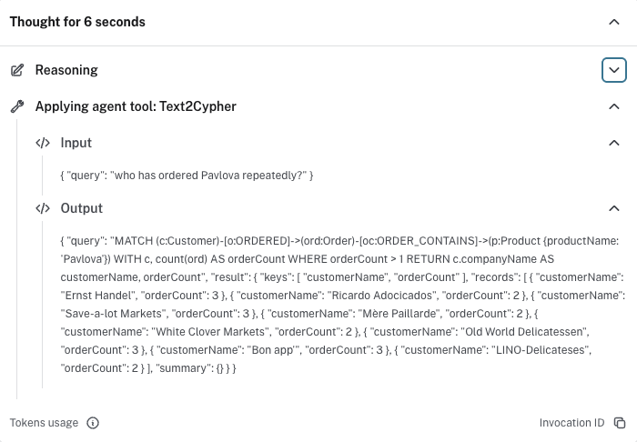

= Create an Aura agent
:type: lesson
:order: 2
:slides: true

[.slide.discrete]
== Introduction

An **AI agent** combines a large language model with **tools** (for example, Cypher against your graph) so users can ask questions in natural language.

In this lesson, you create an agent with **Create with AI** and try it on Northwind.

[.slide.col-2]
== How it fits

[.col]
====
. The agent receives a question.
. It plans which tools to run.
. It returns an answer grounded in your graph (and shows reasoning in the UI when enabled).
====

[.col]
image::images/agent-process.svg["Flow from user input through reasoning and tools to a response", width=90%]

[.slide]
== What you will do

. Open *Agents* and create a new agent with *Create with AI*.
. Paste a role prompt that names Northwind and the kinds of questions you expect.
. Ask two or three test questions and inspect how the agent uses tools.

[.slide]
== Open Agents

Open the *Agents* Data Service, then choose *Create with AI*.

image::images/aura-agent-create-annotated.png["Agents menu and Create with AI"]

[.slide.col-2]
== Prompt the agent

[.col]
====
Describe the assistant’s role so Aura can wire tools to your graph. For example:

[copy]#You are a customer operations assistant for Northwind Traders. Answer questions about customers, orders, products, and employees using the graph.#
====

[.col]

[.slide]
== Save and build

Save or confirm so Aura creates the agent against your graph model.

[.slide]
== Try sample questions

Ask questions such as:

. [copy]#Which customers placed the most orders?#
. [copy]#What product categories appear in recent orders?#

Expand the *Thought* section when you need to see tool use and reasoning.

[.slide]
== Optional: Cypher Template tool

If the agent misses name lookups, add a *Cypher Template* tool for partial customer name search.

. In the agent configuration, choose *Add tool* → *Cypher Template*.
+
image::images/add-tool-annotated.png["Add tool and Cypher Template"]
. Set name, description, a string parameter `name`, and a `MATCH` on `Customer` with `WHERE lower(c.companyName) CONTAINS lower($name)`.
. Save and ask the agent to find a customer by name.

A full walkthrough lives in link:/courses/workshop-zero/[workshop-zero^] and link:/courses/genai-fundamentals/[Neo4j & Generative AI Fundamentals^].

[.next]
== Next

read::Continue[]

[.summary]
== Lesson Summary

In this lesson, you created an Aura agent with **Create with AI** and tested it on Northwind.

In the next module, you will use snapshots, logs, and access controls in the Aura console.
