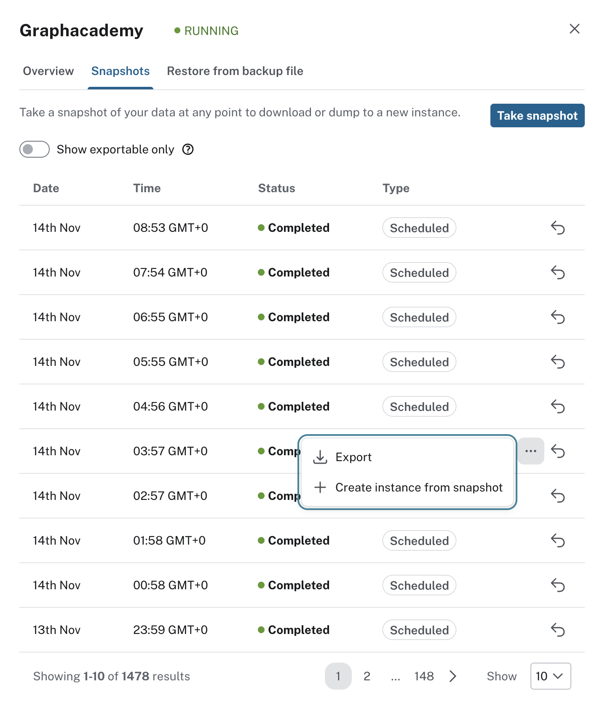
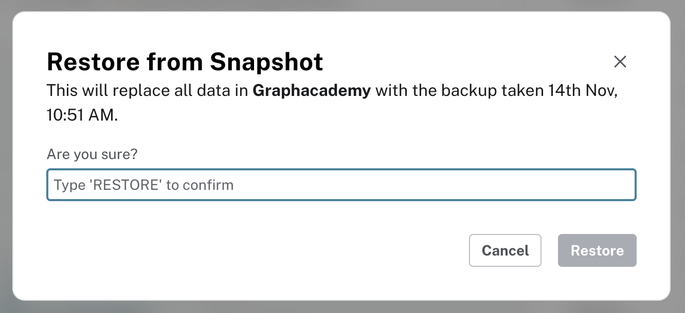
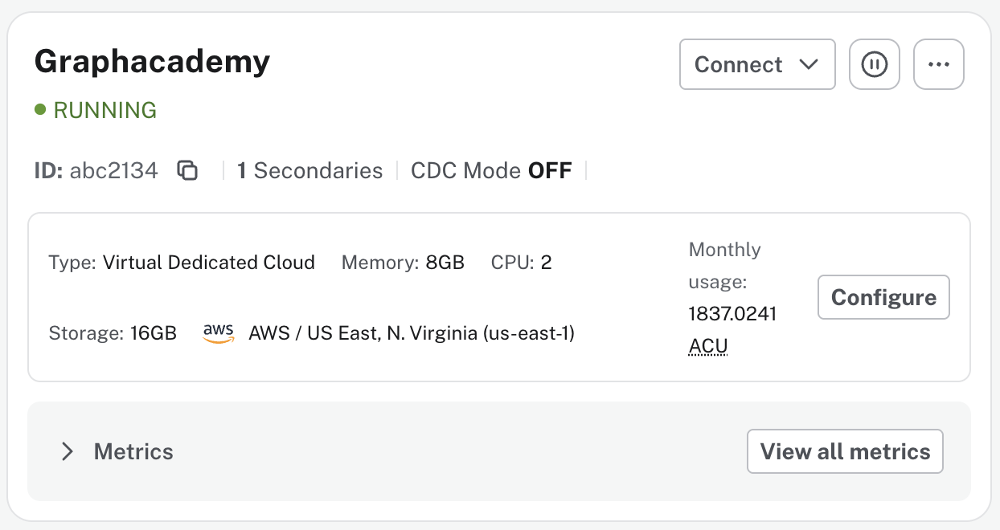
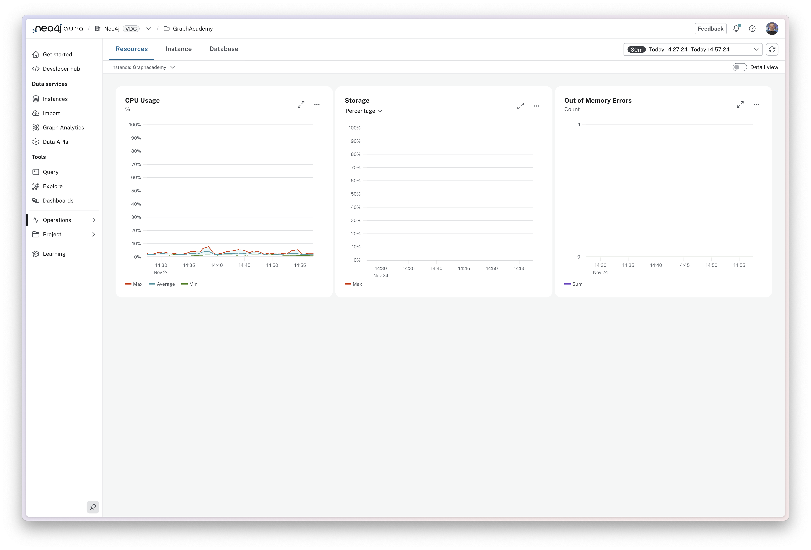
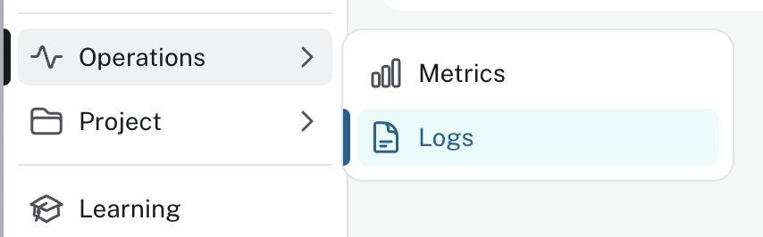
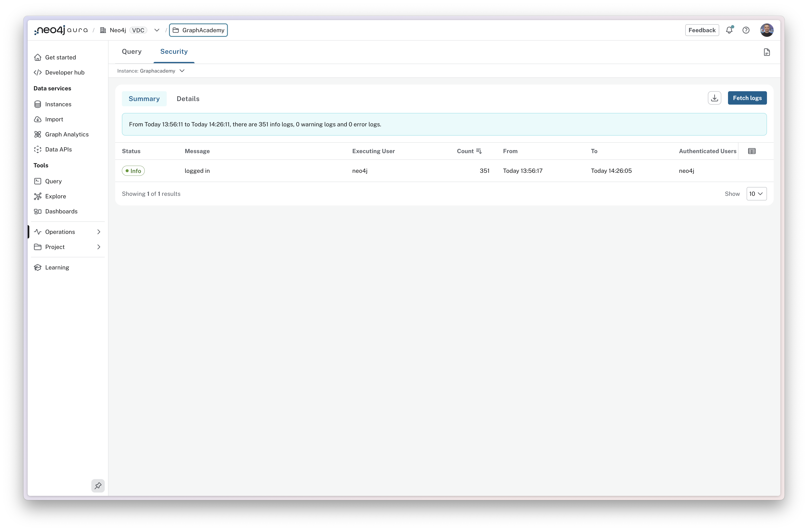
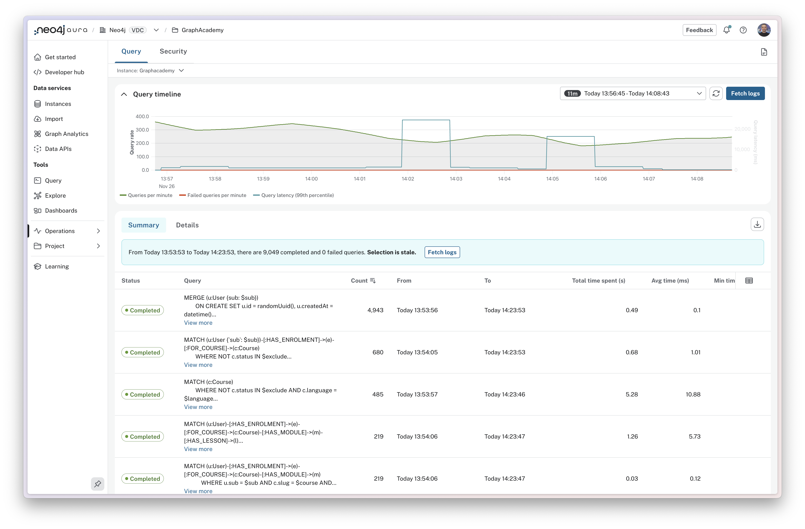
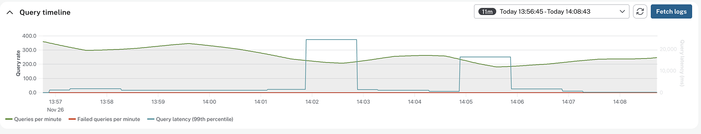
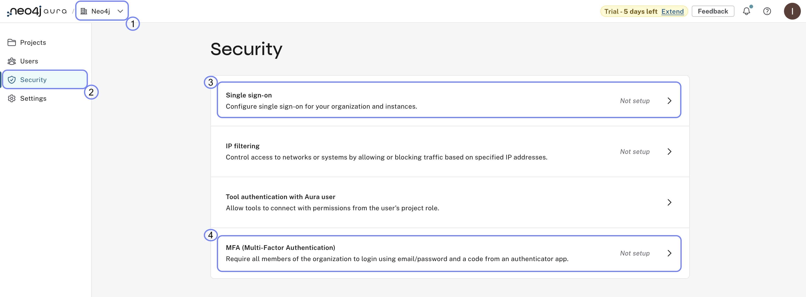
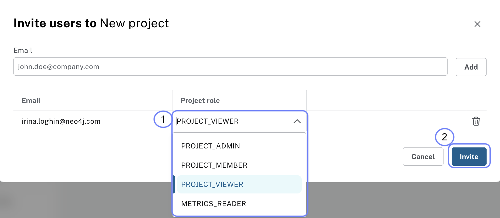

= Snapshots, logs, and access
:type: lesson
:order: 1
:slides: true

[.slide.discrete]
== Introduction

Production work on Aura includes protecting data, observing workload, and controlling who can do what.

The following slides show where to click in the Aura console and what each screen looks like.

[.slide.col-2]
== Open Snapshots

[.col]
====
On your instance card, open the **More** menu (**…**) and choose **Snapshots**.

Scheduled snapshots depend on your tier; you can also take **on-demand** snapshots before risky changes.
====

[.col]
====
image::images/snapshot-menu-annotated.png["More menu with Snapshots highlighted"]
====

[.slide.col-2]
== Snapshot list

[.col]
====
The Snapshots tab lists each snapshot with time, type, and actions.

Use **Take snapshot** when you want a manual backup before a change.
====

[.col]
====

====

[.slide.col-2]
== Take snapshot

[.col]
====
On the Snapshots page, choose **Take snapshot** and wait until the status shows **Complete**.
====

[.col]
====
image::images/snapshot-take-annotated.png["Snapshots page with Take snapshot highlighted"]
====

[.slide.col-2]
== Export a snapshot

[.col]
====
On a **full** snapshot, open the **…** menu to **Export** a backup file when your tier supports it.
====

[.col]
====
image::images/snapshot-export-annotated.png["Export snapshot in the snapshot row menu"]
====

[.slide.col-2]
== Restore from snapshot

[.col]
====
To roll back, use the restore control next to a snapshot row. Confirm the restore carefully; it overwrites the current database.
====

[.col]
====

====

[.slide.col-2.reverse]
== Instance metrics on the card

[.col]
====

====

[.col]
====
Expand **Metrics** on the instance card to see **CPU**, **storage**, and **query rate** for the last 24 hours.
====

[.slide.col-2.reverse]
== Full metrics dashboard

[.col]
====

====

[.col]
====
Open **View all metrics** (or **Operations** → **Metrics**) for the full dashboard: **Resources**, **Instance**, and **Database** tabs.
====

[.slide.col-2]
== Open Logs

[.col]
====
Expand **Operations** and select **Logs** to open query and security log views.
====

[.col]
====

====

[.slide.col-2]
== Query logs and security logs

[.col]
====
Use the tabs at the top to switch between **Query logs** and **Security logs**.
====

[.col]
====

====

[.slide.col-2.reverse]
== Query log summary

[.col]
====

====

[.col]
====
The **Summary** view groups queries so you can spot slow or frequent queries.

**Details** shows individual executions.
====

[.slide]
== Query timeline

The timeline shows aggregated query volume, failures, and latency (for example 99th percentile).

Drag to select a time range to zoom in on a spike.

[.slide.col-2]
== Organization security

[.col]
====
In **Organization** settings, open **Security** for SSO, MFA, and related controls.
====

[.col]
====

====

[.slide.col-2]
== Project users and roles

[.col]
====
**Role-based access control (RBAC)** assigns permissions to people and projects. Open **Project** → **Users** to invite users and set roles (for example viewer, developer, admin).
====

[.col]
====

====

[.slide]
== Deeper operations

For backup schedules, restore from files, log tuning, and metrics interpretation, continue with link:/courses/aura-administration/[Aura In Production^].

For organization security, SSO, and audit log patterns, see link:/courses/aura-fundamentals/4-operations/2-security-and-logs/[Security and logs^] in Aura Fundamentals.

[.next]
== Next

read::Continue[]

[.summary]
== Lesson Summary

In this lesson, you saw snapshots, metrics, query and security logs, and where RBAC and organization security live in the console.

You finished the Zero to Agents in Production (1 hour) workshop.
