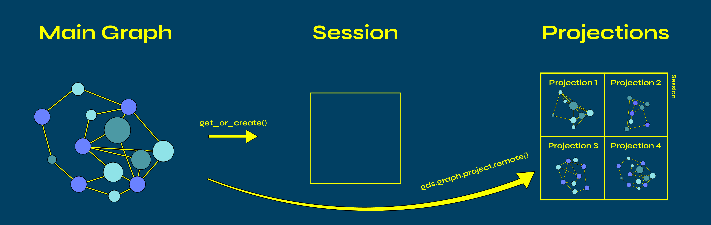
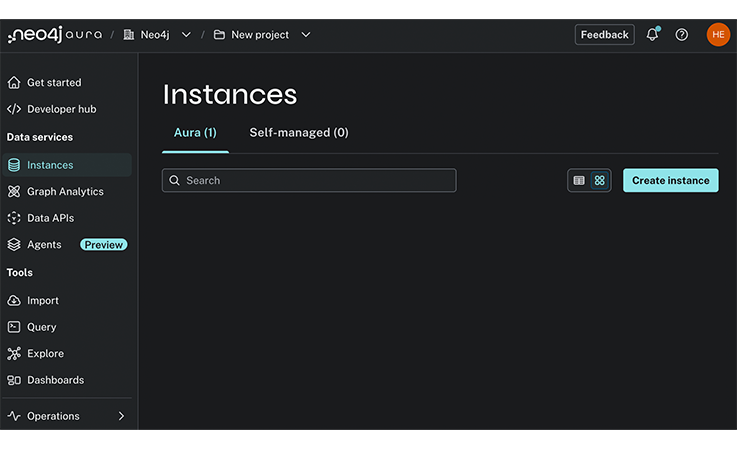
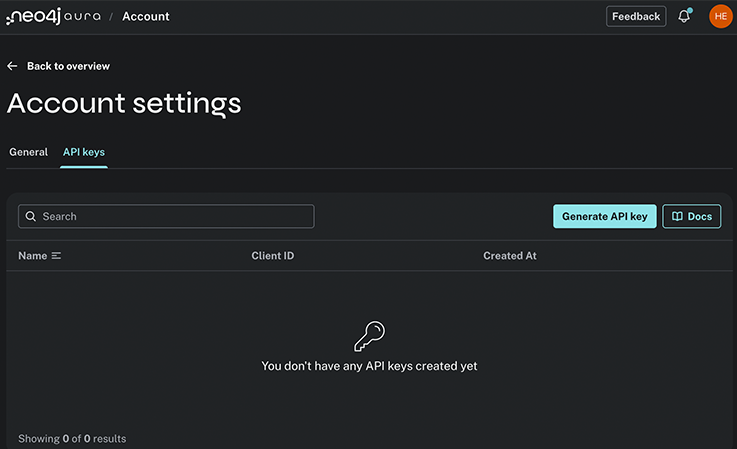
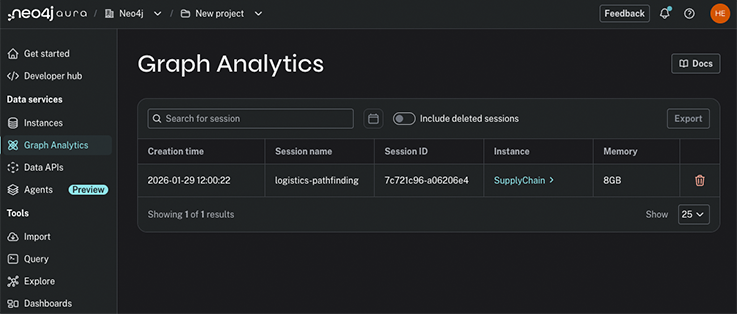

= Introduction to Aura Graph Analytics
:type: lesson
:order: 1

[.slide.discrete]
== Introduction

Aura Graph Analytics is Neo4j's on-demand cloud environment for running Graph Data Science workloads.

[.slide]
== What You'll Learn

By the end of this lesson, you'll be able to:

* Explain when Aura Graph Analytics is preferable to local GDS installations
* Create and manage ephemeral GDS Sessions using the Python client
* Project graphs remotely from AuraDB using `gds.graph.project.remote()`
* Navigate the Cargo 2000 logistics dataset we'll use throughout this module

[.slide]
== The Business Question

We have **5 months of air cargo shipping data** from a real freight forwarding company.

Our goal: **Find inefficiencies in our routing decisions.**

* Are we using the fastest routes?
* What alternatives exist that we've never tried?
* How much time (and money) could we save?

This module teaches you to answer these questions using Graph Data Science.

[.slide]
== Ephemeral compute sessions

Instead of installing GDS on a local database, you spin up ephemeral compute sessions that connect to your data source.

[.slide]
== What you'll learn

Using Aura Graph Analytics, we'll:

* Create and manage GDS Sessions
* Project the logistics network remotely from AuraDB
* Run **pathfinding algorithms** (Dijkstra, Yen's K-Shortest Paths)
* Compare historical routes against optimal paths
* Write results back to the database

_For centrality and community detection algorithms, see the Graph Algorithms module._

[.slide]
== Theory vs practical

Each concept will be framed by our classic Movies dataset with follow-up practical lessons where you'll apply your knowledge to a real-world logistics use-case.

[.slide]
== When to Use Aura Graph Analytics

**Aura Graph Analytics is useful when:**

* Running heavy GDS workloads without impacting your production database
* Scaling compute resources independently from storage
* Working with AuraDB instances that don't have GDS installed locally
* Needing temporary, cost-efficient analytics environments

[.slide]
== GDS Sessions

A GDS Session is an ephemeral compute unit for running GDS workloads. There are three types:

* **Attached**: Data source is an AuraDB instance
* **Self-managed**: Data source is a self-managed Neo4j DBMS
* **Standalone**: Data source is not Neo4j-based (e.g., pandas DataFrames)

Sessions automatically expire after inactivity (default: 1 hour, max: 7 days) and have a hard limit of 7 days total lifetime.

[.slide]
== Get your credentials: Dashboard

To get your credentials, head to Aura:

[.slide]
== Get your credentials: Account Page

Go to your account page, and then the API Keys tab to generate credentials.

[.slide.col-2]
== The GdsSessions Object

With the GDS python client installed, create the entry point for session management:

[.col]
====
[source,python,role=noplay nocopy]
----
from graphdatascience.session import GdsSessions, AuraAPICredentials # <1>

sessions = GdsSessions(
    api_credentials=AuraAPICredentials( # <2>
        client_id="my-aura-api-client-id",
        client_secret="my-aura-api-client-secret"
    )
)
----
====

[.col]
====
<1> Import session management classes from the GDS Python client
<2> Authenticate with your Aura API credentials from the account page
====

[.slide.col-2]
== Creating a GDS Session

Use `get_or_create()` to create or reconnect to a session:

[.col]
====
[source,python,role=noplay nocopy]
----
gds = sessions.get_or_create(
    session_name="my-session", # <1>
    memory=SessionMemory.m_8GB,
    db_connection=DbmsConnectionInfo( # <2>
        aura_instance_id="mydbid",
        username="neo4j",
        password="my-password"
    ),
    ttl=timedelta(hours=2) # <3>
)

# Verify the connection
gds.verify_connectivity()
----
====

[.col]
====
<1> Session name allows you to reconnect to existing sessions
<2> Point the session at your AuraDB instance as the data source
<3> Time-to-live controls automatic expiration to manage costs
====

[.slide]
== The `gds` object

The returned `gds` object works like the standard `GraphDataScience` client.

[.slide.col-2]
== Remote Projection

Projecting a graph into a GDS Session uses `gds.graph.project()` with a Cypher query containing `gds.graph.project.remote()`:

[.col]
====
[source,python,role=noplay nocopy]
----
G_collab, result = gds.graph.project(
    "example-graph",    #Title of the graph
    """
    CALL {
      MATCH (a1:EntryPoint)-[r:HAS_HISTORICAL_ROUTE]->(:HistoricalRoute)-[:TERMINATES_AT]->(a2:Destination) # <1>
      WHERE a1 <> a2
      RETURN a1 AS source,
            a2 AS target,
            type(r) AS relType
    }
    RETURN gds.graph.project.remote(source, target, { # <2>
      sourceNodeLabels: labels(source),
      targetNodeLabels: labels(target),
      relationshipType: relType
    })
    """,
    undirected_relationship_types=["*"] # <3>
)
----
====

[.col]
====
<1> The CALL block defines which nodes and relationships to project from AuraDB
<2> `gds.graph.project.remote()` sends the projection to the GDS Session
<3> Undirected relationship types are specified outside the Cypher query
====

[.slide]
== Managing Sessions

List active sessions:

[source,python,role=noplay nocopy]
----
sessions.list()
----

[.slide]
== View your active sessions

In your Graph Analytics dashboard, you can see which sessions you are currently running.

[.slide]
== Graph vs Session vs Projection

There are three containers here:

1. Main graph (AuraDB)
2. Aura Graph Analytics Session
3. Projected graph

[.slide]
== Projection workflow

Your projection lives inside the session, entirely separate from the main graph.

[.slide]
== Delete a session

Delete a session when finished:

[source,python,role=noplay nocopy]
----
gds.delete()
# or
sessions.delete(session_name="my-session")
----

Deleting releases resources and stops costs. Data not written back is lost.

[.slide]
== The Supply Chain Dataset

Throughout this module, we'll analyze the **Cargo 2000** freight forwarding dataset—real air cargo logistics data from IATA.

The graph contains:

* `EntryPoint` nodes (source airports)
* `Destination` nodes (delivery airports)
* `DepartureWarehouse`, `ArrivalWarehouse`, `TransferPoint` nodes
* `RECEPTION`, `DEPARTURE`, `TRANSPORT`, `DELIVERY` relationships

Each relationship has an `effectiveMinutes` property—actual time for that process step.

Run the notebook cells to get a sense of the data.

[.slide]
== Understanding the Data Model

The Cargo 2000 dataset has two layers:

**Raw Operations Layer:**
`EntryPoint` → `RECEPTION` → `DepartureWarehouse` → `DEPARTURE` → `TransferPoint` → `TRANSPORT` → `ArrivalWarehouse` → `DELIVERY` → `Destination`

**Historical Summary Layer:**
`EntryPoint` -[:HAS_HISTORICAL_ROUTE]→ `HistoricalRoute` -[:TERMINATES_AT]→ `Destination`

The raw layer shows every step. The summary layer captures which origin-destination pairs we've actually shipped.

We'll use **both**: raw operations for finding optimal routes, historical summaries for comparing against past decisions.

read::Mark as read[]

[.summary]
== Summary

Aura Graph Analytics provides:

* On-demand, ephemeral compute for GDS workloads
* Separation of compute from your database
* Automatic session expiration to control costs
* The same algorithm API as the standard GDS client

**Next:** Creating sessions and running complete GDS workflows.
