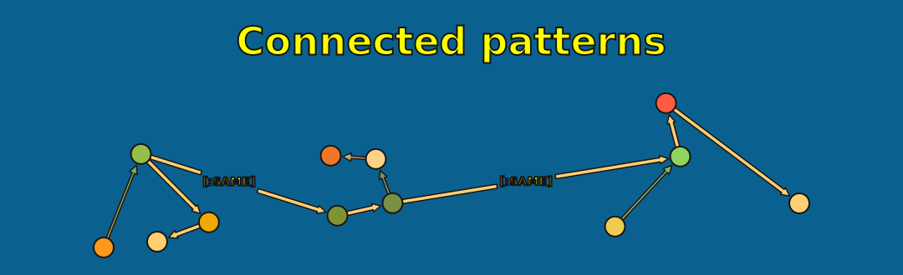
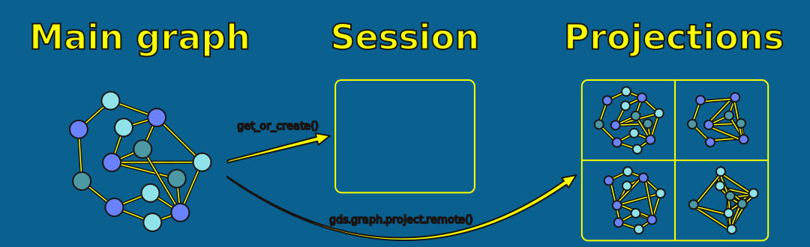
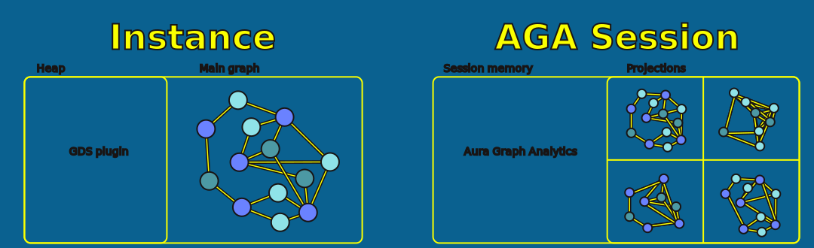

= What is Graph Data Science?
:type: lesson
:order: 1

[.slide.discrete]
== GDS vs Graph data science

Graph data science can refer to both the discipline 'graph data science', and 'Graph Data Science' or 'GDS', the Neo4j plugin.

In this course, we will use 'Graph Data Science' or 'GDS' to refer to the Neo4j product and 'graph data science' when referring to the discipline.

[.slide]
== What You'll Learn

By the end of this lesson, you'll be able to:

* Distinguish between graph data science as a discipline and GDS as a Neo4j plugin
* Explain how graph data science differs from traditional data science approaches
* Identify the key access points for using the GDS library
* Understand when to use Aura Graph Analytics versus GDS

[.slide]
== What is Graph data science?

Graph Data Science applies graph algorithms to graph data to analyze patterns in connected data. These algorithms can help you to both clean your datasets and uncover insights within them.

image::images/analyze_patterns.svg[Left: a graph with many connections. Right: that same graph with communities identified, labeled and circled.,role=nopadding]

[.transcript-only]
====
Graph-specific methods support analyses and insights that would be infeasible or impossible to achieve with tabular data.
====

[.slide.col-2]
== How traditional data science works

Traditional data science looks for patterns in attributes. For example, you might look for users who have used the same card with the same id as another user.

[opts="header"]
|===
| | userId | cardNum

| 1 | "be0222d26897046dc92ae2929d3427e7" | "8a453bce-9023-41e6-ac5c-bb98e3583887"
| 2 | "be0222d26897046dc92ae2929d3427e7" | "29f4ce49-1da1-4ac5-9295-f9f4b3587e02"
| 3 | "be0222d26897046dc92ae2929d3427e7" | "016a5d6a-51d9-4e74-a7d6-ff3ef0786df3"
| 4 | "59515432f0e2e79b83e9524c94f7f86e" | "f1539ff0-36aa-4f30-9fb6-d29538a00305"
| 5 | "ba1f4324c66ee093478d41a6826a3649" | "abcbd8e2-b761-495b-b9c9-990b90038ad6"
| 6 | "ba1f4324c66ee093478d41a6826a3649" | "42b4cf1c-aaa0-44e2-99af-7282e37cffbe"
| 7 | "8a18e1625e35a9f66abfd7bd2d04f0b3" | "79f4e52c-3f3d-4a56-b103-bef1a6f39741"
| 8 | "8a18e1625e35a9f66abfd7bd2d04f0b3" | "2b3779c8-ca85-4136-8a79-7a4bc1e5f959"
|===

[.slide]
== How graph data science works

Graph data science finds patterns in connections between entities _and_ their attributes.

[.slide]
== Example: Traditional fraud detection

Traditional fraud detection flags individual suspicious accounts.

[opts="header"]
|===
| | userId | fraudulentTrue

| 1 | "aa39d3cbfb9f6ed0a48fcc6156bfb693" | 1
| 2 | "6ef023281dac51ea5d1b7c7e0983802c" | 1
| 3 | "d043edac70847500432babb1bff7a9fa" | 1
| 4 | "f2a0e1185a998413c47096d515df3619" | 1
| 5 | "e56b3484e96ecaa878804be4ff650961" | 1
| 6 | "afc653568cd7568b44d8f53e300680d1" | 1
| 7 | "1bfa6765cd18195a075c362a432d339e" | 1
| 8 | "2625d13b4b92c88d839fb517abf06a18" | 1
| 9 | "7b74f224cf2cab0f9c04775974e988ce" | 1
| 10 | "7c0dd04c47f23bb5e121a535d29711c8" | 1
| 11 | "2a2a430336a7bdf343634656e807ac58" | 1
|===

[.slide]
== Example: Graph fraud detection

Graph data science identifies coordinated networks of fraudsters working together.

image::images/fraud_networks.svg[a graph showing a network of fraudsters.]

[.slide]
== Graph algorithms

The Neo4j Graph Data Science (GDS) library contains many graph algorithms.

image::images/project_run_write_finished.svg[three code blocks show the three steps to running a graph algorithm on connected data: Project, Run and Write. Run and write are performed in the same command.]

You can analyze your graph data via a simple, predictable and endlessly repeatable framework.

[.slide]
== Access points

You can access the Graph Data Science library through the:

- Desktop plugin
- Aura plugin
- GDS Python driver

[.slide]
== Aura Graph Analytics

Aura Graph Analytics is an on-demand service that allows you to use the Graph Data Science library regardless of where your source data is stored.

[.slide]
== Dedicated service

It runs in Aura as a dedicated service optimized for analytics workloads, with no memory or compute resources shared with your data store. While functionally similar to GDS, Aura Graph Analytics is a different product.

[.slide.col-2]
== AGA via Python

You can learn how to use Aura Graph Analytics via the Python driver in the link:/courses/workshop-gds-python-aga/[GDS Python Client & Aura Graph Analytics^] workshop. The workflow for using Aura Graph Analytics is only marginally different from that of using GDS.

[.col]
====
[source,python,role=noplay nocopy]
----
from graphdatascience.session import GdsSessions, AuraAPICredentials // <1>

sessions = GdsSessions(
    api_credentials=AuraAPICredentials( // <2>
        client_id="my-aura-api-client-id",
        client_secret="my-aura-api-client-secret"
    )
)
----
====

[.col]
====
<1> Import the session and credential classes from the GDS Python client
<2> Authenticate with your Aura API credentials
====

read::Mark as read[]

[.summary]
== Lesson Summary

In this lesson, you learned to differentiate graph data science from traditional data science approaches. You learned what teh GDS library is, what it does, and its various access points.

In the next lesson, you will learn the basic GDS workflow -- a repeatable pattern you can reuse in any session.
