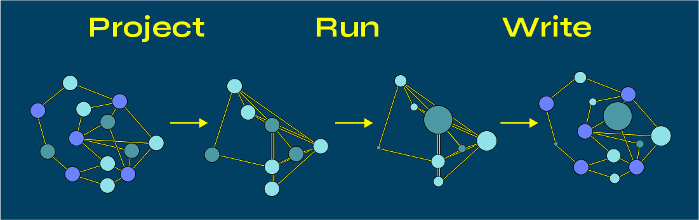
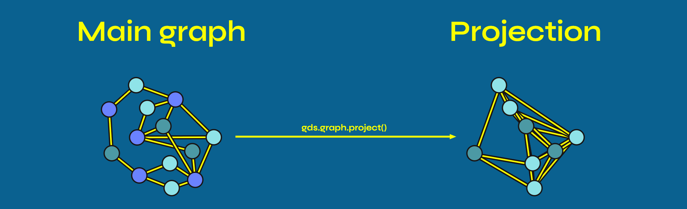

= The GDS Workflow
:type: lesson
:order: 2

[.slide]
== The Three-Step Workflow

Every GDS analysis follows the same basic pattern: **Project -> Run -> Write**

[.transcript-only]

====
This workflow separates your source data from analysis, enabling fast, iterative experimentation without modifying your original graph.

The reason we specify 'two or three' is that you can choose to run an algorithm and write its results in a single operation instead of two. Or, you can chain multiple algorithm results to feed a final algorithm before writing back to the graph.
====

[.slide]
== What You'll Learn

By the end of this lesson, you'll be able to:

* Apply the Project → Run → Write workflow to any GDS analysis
* Create graph projections using Cypher projection syntax
* Run algorithms in different execution modes (stats, stream, mutate, write)
* Manage in-memory projections by listing and dropping graphs

[.slide]
== Why This Workflow?

**Speed:** In-memory projections are faster than querying the database directly.

**Safety:** Your source graph remains unchanged until you explicitly write results back.

**Flexibility:** Run multiple algorithms on the same projection to compare and combine results.

[.slide]

== Step 1: Project

The graph projected by GDS is an in-memory structure containing nodes and relationships — just like your main graph.

[.transcript-only]

====
However, the in-memory graph you create is optimized for topology and property lookup operations.
====

[.slide]

== Projection methods: Cypher

You can project a graph using either Cypher projection or Native projection.

The following is a Cypher projection:

[source,cypher,role=noplay,nocopy]
.Cypher projection example
----
MATCH (source:Actor)-[r:ACTED_IN]->(target:Movie)
WITH gds.graph.project(
  'actors-graph',
  source,
  target
) AS g
RETURN g.graphName AS graph,
  g.nodeCount AS nodes,
  g.relationshipCount AS rels
----

[.transcript-only]

====
The graph projection above has three components:
====

[.slide]

== Cypher query

This works in the same way as any other Cypher query you are used to running. However, instead of returning the graph results in the Neo4j Browser, you send it to GDS as a projection with the line that follows.

[source,cypher,role=noplay,nocopy]
.Cypher MATCH statement
----
MATCH (source:Actor)-[r:ACTED_IN]->(target:Movie)
----

[.slide]

== Call GDS

The GDS WITH statement works the same way as any WITH statement you are used to running in the Neo4j Browser. You call gds.graph.project to create the in-memory graph matched by the preceding Cypher statement.

[source,cypher,role=nocopy,noplay]
.Call gds
----
...
WITH gds.graph.project( // (2)
  'actors-graph',
  source,
  target
) AS g
...
----

[.slide]

== Configuration

In the configuration, you add the name of the graph. Next, you include nodes matched by your source and target variables.

In this basic example, you do not need to explicitly reference their relationships in the configuration — they will be inferred and returned.

[source,cypher,role=nocopy,noplay]
.CALL gds
----
...
WITH gds.graph.project( // (2)
  'actors-graph',
  source,
  target
) AS g
...
----

[.slide]

== Return the stats

The final section returns the stats of the graph that you have projected into memory.

[source,cypher,role=nocopy,noplay]
.CALL gds
----
...
RETURN g.graphName AS graph,
  g.nodeCount AS nodes,
  g.relationshipCount AS rels
----

[.slide]

== Review the projection in full

Now, let's take one last look at the full projection.

See if you can break down and explain each of its constituent parts.

[source,cypher,role=noplay,nocopy]
.Cypher projection example
----
MATCH (source:Actor)-[r:ACTED_IN]->(target:Movie)
WITH gds.graph.project(
  'actors-graph',
  source,
  target
) AS g
RETURN g.graphName AS graph,
  g.nodeCount AS nodes,
  g.relationshipCount AS rels
----

[.slide]
== Projection methods: Native

[source,cypher,role=noplay,nocopy]
.Native projection
----
CALL gds.graph.project(
  'actor-graph-native',
  ['Actor', 'Movie'],
  'ACTED_IN'
)
YIELD graphName AS graph,
    nodeCount AS nodes,
    relationshipCount AS rels
----

[.slide]

== Cypher vs Native

In the early stages of this workshop, we will focus on Cypher projection.

Later, when you become familiar with the Python driver, we will switch to using Native projection.

[.slide]

== Running algorithms

Once you have projected your graph into memory, you can run algorithms on it using the `CALL gds.<algorithm>.<mode>` command.

[source,cypher,role=noplay,nocopy]
.Running an algorithm
----
CALL gds.degree.stream(
  'actors-graph',
  {}
)
YIELD nodeId, score
RETURN gds.util.asNode(nodeId).name AS name, score
ORDER BY score DESC
----

[.slide]

== Algorithm call

First, we `CALL` GDS, declare what algorithm we want to run and then declare what **mode** we would like to run that algorithm in.

Note: We will deal with the different modes in the next section.

[source,cypher,role=noplay,nocopy]
.CALL gds
----
CALL gds.degree.stream(
...
----

[.slide]

== Fetch the named graph

In the next line, we name the graph on which we'd like to run the algorithm.

[source,cypher,role=nocopy,noplay]
.Fetch the named graph
----
...
  'actors-graph',
...
----

[.slide]

== Config maps

Next, if relevant, we can modify the algorithm's behaviour with an optional configuration map.

[source,cypher,role=nocopy,noplay]
.Config map
----
...
    {}
)
...
----

[.slide]

== YIELD and RETURN

Finally, we YIELD the algorithm results, and then we can RETURN them.

[source,cypher,role=nocopy,noplay]
.Config map
----
...
YIELD nodeId, score
RETURN gds.util.asNode(nodeId).name AS name, score
ORDER BY score DESC
----

[.slide]

== Another full look

Now, let's take another look at the full algorithm. See if you can break down and explain the components.

[source,cypher,role=noplay,nocopy]
.Running an algorithm
----
CALL gds.degree.stream(
  'actors-graph',
  {}
)
YIELD nodeId, score
RETURN gds.util.asNode(nodeId).name AS name, score
ORDER BY score DESC
----

[.slide]

== Execution modes

There are four execution modes for algorithm commands:

1. **Stats:** Get summary statistics without viewing individual results
2. **Stream:** View results directly without storing
3. **Mutate:** Store results in the projection
4. **Write:** Persist results to your database
5. **Estimate:** Check memory requirements before running

[.slide]
== You can simply sub these components into the algorithm call:

[source,cypher,role=noplay,nocopy]
.Algorithm modes
----
CALL gds.degree.stats

CALL gds.degree.stream

CALL gds.degree.mutate

CALL gds.degree.write

CALL gds.degree.stream.estimate
----

[.slide]

== Estimate mode

Bear in mind, the `estimate` mode is used to estimate any of the other four -- added as an addendum:

[source,cypher,role=noplay,nocopy]
.Estimate mode
----
CALL gds.degree.stats.estimate

CALL gds.degree.stream.estimate

CALL gds.degree.mutate.estimate

CALL gds.degree.write.estimate
----

[.transcript-only]

====
You will learn how and when to use each of these modes throughout this workshop.
====

[.slide]

== Write from algorithm

Ultimately, you will end most GDS sessions by writing your results back to the graph. The `CALL gds.<algorithm>.write` will run the algorithm directly, and then write results.

[source,cypher,role=noplay,nocopy]
.Running an algorithm
----
CALL gds.degree.write(
  'actors-graph',
  {
    writeProperty: 'degree'
  }
)
YIELD centralityDistribution, nodePropertiesWritten
RETURN centralityDistribution.min AS minimumScore,
    centralityDistribution.mean AS meanScore,
    nodePropertiesWritten
----

[.slide]

== Write from projection

You can also write results to your graph projection first, using `mutate` mode:

[source,cypher,role=noplay,nocopy]
.Mutate mode
----
CALL gds.degree.mutate(
  'actors-graph',
  {
    mutateProperty: 'degree'
  }
)
YIELD centralityDistribution, nodePropertiesWritten
----

[.slide]

== Write from graph

and then write from the graph projection back to your main graph.

[source,cypher,role=noplay,nocopy]
.Write from projection
----
CALL gds.graph.nodeProperties.write(
  'actors-graph',
  ['degree']
)
YIELD propertiesWritten
----

[.slide]

== List graphs

Even when you've finished working on a projection, it will continue to hang around in memory until you either stop the server, or explicitly drop it.

You can see which graphs you have in memory with the `gds.graph.list()` command:

[source,cypher]
.List graphs
----
CALL gds.graph.list()
YIELD graphName
RETURN graphName
----

[.slide]

== Dropping graphs

Once you've finished working on your projection, you can drop it from memory.

[source,cypher]
.Drop graphs
----
CALL gds.graph.drop('actors-graph')
----

The entire graph will disappear, including any data within it -- always make sure to write important information back to your main graph before dropping.

[.slide]

== Drop all

Sometimes, you might end up with a bunch of graphs in memory. You can drop them all at once with this pattern.

[source,cypher]
.Drop all graphs
----
CALL gds.graph.list()
YIELD graphName
CALL gds.graph.drop(graphName)
YIELD graphName AS droppedGraphs
RETURN droppedGraphs
----

read::Mark as read[]

[.summary]
== Lesson Summary

In this lesson, you got to grips with the general GDS workflow: project -> Run -> Write.

In the next lesson, you'll learn how to project a graph and run your first graph projection.

