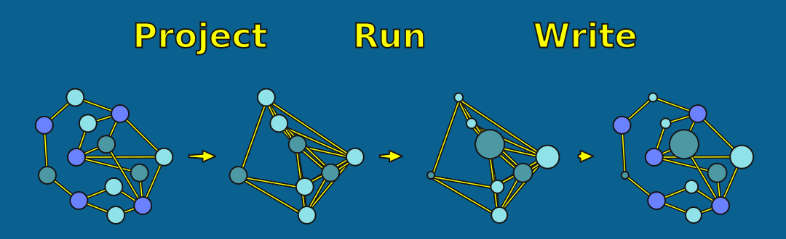
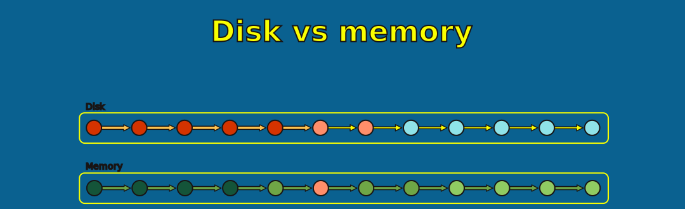
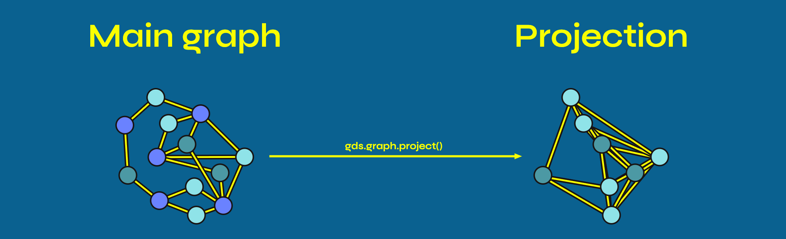
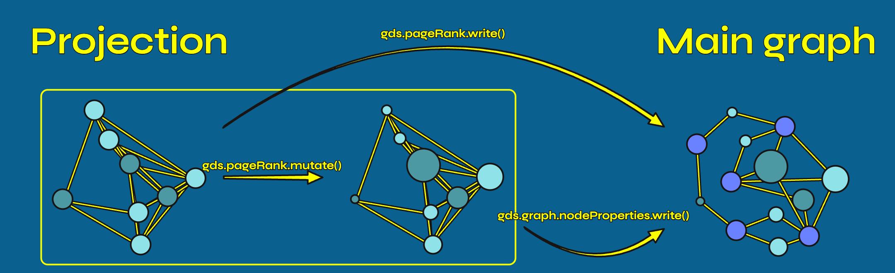
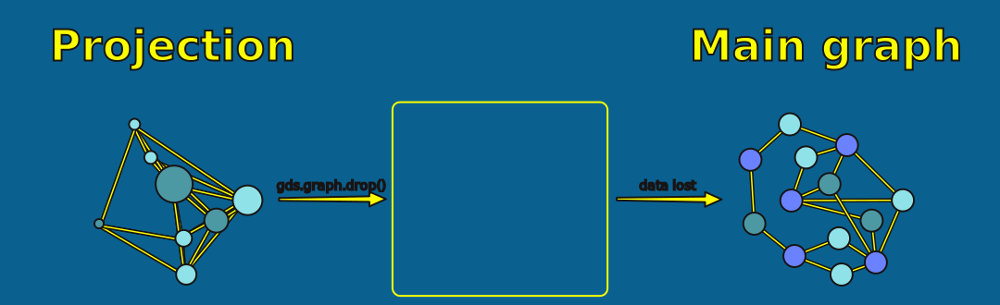

= The GDS Workflow
:type: lesson
:order: 2

[.slide]
== The Three-Step Workflow

Every GDS analysis follows the same basic pattern: **Project -> Run -> Write**

[.transcript-only]
====
This workflow separates your source data from analysis, enabling fast, iterative experimentation on an _in-memory projection_ of your graph without modifying your original graph.

You can choose to run an algorithm and write its results in a single operation instead of two. Or, you can chain multiple algorithm results to feed a final algorithm before writing back to the graph.
====

[.slide]
== What You'll Learn

By the end of this lesson, you'll be able to:

* Apply the Project -> Run -> Write workflow to any GDS analysis
* Create graph projections using Cypher projection syntax
* Run algorithms in different execution modes (stats, stream, mutate, write)
* Manage in-memory projections by listing and dropping graphs

[.slide]
== Why This Workflow?

* **Speed:** In-memory projections are faster than querying the database directly.
* **Safety:** Your source graph remains unchanged until you explicitly write results back.
* **Flexibility:** Run multiple algorithms on the same projection to compare and combine results.

[.slide]
== Step 1: Project

The graph projected by GDS is an in-memory structure containing nodes and relationships -- just like your main graph.

[.transcript-only]
====
However, the in-memory graph you create is optimized for topology and property lookup operations.
====

[.slide.col-2]
== Projecting graphs

You can create a projection of your graph using Cypher or Native projection.

[.col]
.Cypher Projection
[source,cypher,role="noplay nocopy"]
----
MATCH (source:Actor)-[r:ACTED_IN]->(target:Movie)
WITH gds.graph.project(
  'actors-graph',
  source,
  target
) AS g
RETURN g.graphName AS graph,
      g.nodeCount AS nodes,
      g.relationshipCount AS rels
----

[.col]
.Native Projection
[source,cypher,role="noplay nocopy"]
----
CALL gds.graph.project(
  'actors-graph-native',
  ['Actor', 'Movie'],
  'ACTED_IN'
)
YIELD graphName AS graph,
      nodeCount AS nodes,
      relationshipCount AS rels
----

[.slide]
== Cypher vs Native context

*Cypher projection* is more flexible and more readily available across Neo4j products. It is primarily used in the Neo4j Browser but you can also use it via the Python driver.

*Native projection* is ostensibly simpler, and mimics the syntax of Python environments. It is primarily used in the Python driver, but you can also use it via the Neo4j Browser.

Generally, you will use Cypher projection in the Neo4j Browser and Native projection in the Python driver.

In this workshop, we will focus on Cypher projection first, and then introduce Native projection later.

[.slide]
== Cypher projection

A Cypher projection follows the same pattern as any other Cypher query you are used to running. However, instead of returning results, the `gds.graph.project()` procedure creates an in-memory representation based on the `MATCH` clause.

[.col]
====

[source,cypher,role="noplay nocopy"]
.Cypher projection example
----
MATCH (source:Actor)-[r:ACTED_IN]->(target:Movie) // <1>
WITH gds.graph.project( // <2>
  'actors-graph',
  source,
  target
) AS g
RETURN g.graphName AS graph, // <3>
  g.nodeCount AS nodes,
  g.relationshipCount AS rels
----

====

[.col]
====
The Cypher projection [transcript-only]#above# has three components:

<1> **Cypher query** - The `MATCH` clause defines which nodes and relationships to include.
<2> **Projection call** - The `gds.graph.project()` procedure creates the projection with a unique name, and defines the source and target nodes.
<3> **Return statement** - The `RETURN` clause returns metadata about the created projection, aliased as `g`.
====

[.slide.col-2]
== Using Native projections

The native projection below produces the same result, and is more concise, but is less flexible.
To create a native production, use the `CALL` keyword to invoke the `gds.graph.project()` procedure and `YIELD` the metadata.

[.col]
====

[source,cypher,role="noplay nocopy"]
.Native projection
----
CALL gds.graph.project(
  'actor-graph-native',
  ['Actor', 'Movie'],   // <1>
  'ACTED_IN'            // <2>
)
YIELD graphName AS graph, // <3>
    nodeCount AS nodes,
    relationshipCount AS rels
----
====

[.col]
====

The native projection:

<1> Loads the provided labels into the project.
<2> Connects those nodes with the provided relationship types.
<3> Provides the same metadata, which are accessed using the `YIELD` clause.
====

[.slide]
== Cypher vs Native

In the early stages of this workshop, we will focus on Cypher projection.

Later, when you become familiar with the Python driver, we will switch to using Native projection.

[.slide.col-2]
== Running algorithms

Once you have projected your graph into memory, you can run algorithms on it using the `CALL gds.<algorithm>.<mode>` command.

Ignore the `mode` for now. We will cover it in more detail in a moment.

[.col]
====
[source,cypher,role="noplay nocopy"]
.Running an algorithm
----
CALL gds.degree.stream( // <1>
  'actors-graph', // <2>
  {} // <3>
)
YIELD nodeId, score // <4>
RETURN gds.util.asNode(nodeId).name AS name, score
ORDER BY score DESC
----
====

[.col]
====
<1> The **degree centrality** algorithm is called in **stream** mode.
<2> The algorithm is run on the `actors-graph` projection.
<3> A map of configuration options can be provided as the third argument.
<4> Each algorithm yields a unique set of results, which can be processed with Cypher.
====

[.slide]
== Execution modes

There are five execution modes for algorithm commands:

1. **Stats:** Get summary statistics without viewing individual results
2. **Stream:** View results directly without storing
3. **Mutate:** Store results in the projection
4. **Write:** Persist results to your database
5. **Estimate:** Check memory requirements before running

You can invoke each of these modes by appending the mode to the algorithm name.

[source,cypher,role="noplay nocopy"]
.Invoking the stats mode
----
CALL gds.degree.stats('actor-graph-native')
----

[.slide.col-2]
== Estimate mode

The `estimate` mode is used to estimate the memory requirements for an algorithm.

[.col]
====
[source,cypher,role="noplay nocopy"]
.Estimate mode
----
CALL gds.degree.stats.estimate('actors-graph', {}) // <1>
YIELD nodeCount, relationshipCount, // <2>
      bytesMin, bytesMax, requiredMemory
----
====

[.col]
====
<1> Append `.estimate` to any execution mode
<2> Returns graph size and memory requirements
====

[.transcript-only]
====
You will learn how and when to use each of these modes throughout this workshop.
====

[.slide.col-2]
== Write from algorithm

Ultimately, you will end most GDS sessions by writing your results back to the graph. The `CALL gds.<algorithm>.write` will run the algorithm directly, and then write results.

[.col]
====
[source,cypher,role="noplay nocopy"]
.Writing algorithm results directly to the database
----
CALL gds.degree.write(
  'actors-graph',
  {
    writeProperty: 'degree' // <1>
  }
)
YIELD centralityDistribution, nodePropertiesWritten // <2>
RETURN centralityDistribution.min AS minimumScore,
    centralityDistribution.mean AS meanScore,
    nodePropertiesWritten
----
====

[.col]
====
<1> Specify the property name for storing results in the database
<2> Write mode yields summary statistics about what was written
====

[.slide.col-2]
== Write from projection

You can also write results to your graph projection first, using `mutate` mode:

[.col]
====
[source,cypher,role="noplay nocopy"]
.Storing results in the projection using mutate mode
----
CALL gds.degree.mutate(
  'actors-graph',
  {
    mutateProperty: 'degree' // <1>
  }
)
YIELD centralityDistribution, nodePropertiesWritten // <2>
----
====

[.col]
====
<1> Store results in the projection under this property name
<2> Results stay in the projection only--not persisted to the database
====

[.slide]
== Write from graph

Then write from the graph projection back to your main graph.

[.slide.col-2]
== Write from graph

[.col]
====
[source,cypher,role="noplay nocopy"]
.Writing node properties from projection to database
----
CALL gds.graph.nodeProperties.write(
  'actors-graph', // <1>
  ['degree'] // <2>
)
YIELD propertiesWritten
----
====

[.col]
====
<1> Name of the projection to write from
<2> List of properties to write back to the database
====

[.slide.col-2]
== List graphs

Even when you've finished working on a projection, it will continue to hang around in memory until you either stop the server, or explicitly drop it.

You can see which graphs you have in memory with the `gds.graph.list()` command:

[.col]
====
[source,cypher]
.List graphs
----
CALL gds.graph.list() // <1>
YIELD graphName
RETURN graphName
----
====

[.col]
====
<1> Returns all in-memory projections and their metadata
====

[.slide]
== Dropping graphs

Once you've finished working on your projection, you can drop it from memory.

[source,cypher]
.Drop graphs
----
CALL gds.graph.drop('actors-graph')
----

[.slide]
== Dropping graphs

The entire graph will disappear, including any data within it -- always make sure to write important information back to your main graph before dropping.

[.slide.col-2]
== Drop all

Sometimes, you might end up with a bunch of graphs in memory. You can drop them all at once with this pattern.

[.col]
====
[source,cypher]
.Drop all graphs
----
CALL gds.graph.list()
YIELD graphName // <1>
CALL gds.graph.drop(graphName) // <2>
YIELD graphName AS droppedGraphs
RETURN droppedGraphs
----
====

[.col]
====
<1> List all projection names
<2> Drop each projection by name
====

read::Mark as read[]

[.summary]
== Lesson Summary

In this lesson, you got to grips with the general GDS workflow: project -> Run -> Write.

In the next lesson, you'll learn how to project a graph and run your first graph projection.
